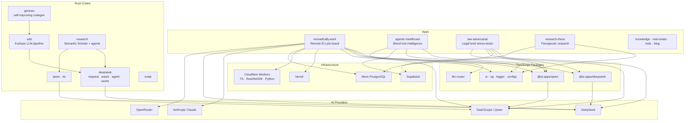
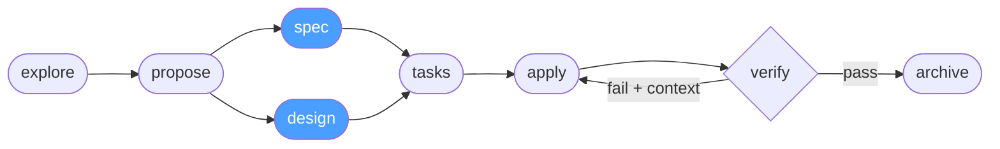

# ai-apps

A pnpm + Turborepo monorepo containing AI-powered web apps, shared Rust crates, and TypeScript packages.

## Monorepo Structure



## SDD Pipeline

The [`crates/sdd`](crates/sdd) crate powers spec-driven development across the whole repo — every change flows through an 8-phase LLM orchestrator:



`spec` and `design` run in parallel. On verify failure, the failure summary is injected as context and `apply` retries automatically.

## Apps

| App | Description | Stack |
|-----|-------------|-------|
| [`nomadically.work`](apps/nomadically.work) | Remote EU job board aggregator with AI classification, CRM, and a multi-worker pipeline | Next.js 16, Neon PostgreSQL, Apollo/GraphQL, CF Workers (TS + Rust/WASM + Python) |
| [`agentic-healthcare`](apps/agentic-healthcare) | Longitudinal blood test intelligence — clinical ratio tracking, health trajectories, AI Q&A | Next.js, Supabase pgvector, Qwen |
| [`law-adversarial`](apps/law-adversarial) | Legal brief stress-tester with adversarial multi-agent debate (Attacker → Defender → Judge) | Next.js, Supabase, DeepSeek R1 + Qwen Plus |
| [`research-thera`](apps/research-thera) | Therapeutic research platform | Next.js, Apollo/GraphQL, better-auth |
| [`vadim.blog`](apps/vadim.blog) | Personal blog | Docusaurus |
| `knowledge` | Knowledge management app | Next.js, Drizzle |
| `real-estate` | Real estate app | Next.js |
| `todo` | Todo app | Next.js, Drizzle |

## Rust Crates

| Crate | Description |
|-------|-------------|
| [`crates/deepseek`](crates/deepseek) | Shared DeepSeek API client — reqwest, WASM, agent loop, TTL cache |
| [`crates/qwen`](crates/qwen) | Shared Qwen/DashScope client |
| [`crates/sdd`](crates/sdd) | Spec-Driven Development pipeline — 8-phase LLM orchestrator (explore → archive) |
| [`crates/genesis`](crates/genesis) | Self-improving code generation — wraps SDD in a learning layer |
| [`crates/research`](crates/research) | Semantic Scholar client + DeepSeek/Qwen dual-model agent framework |
| [`crates/tts`](crates/tts) | Async Qwen TTS client (DashScope API, optional R2 storage) |
| [`crates/evals`](crates/evals) | Eval framework (rig-core) |

## TypeScript Packages

| Package | Description |
|---------|-------------|
| [`packages/deepseek`](packages/deepseek) | `@ai-apps/deepseek` — TypeScript DeepSeek client |
| [`packages/qwen`](packages/qwen) | `@ai-apps/qwen` — TypeScript Qwen/DashScope client |
| [`packages/llm-router`](packages/llm-router) | LLM routing across providers |
| `packages/ui` | Shared React components |
| `packages/og` | Open Graph image generation |
| `packages/logger` | Isomorphic logger |
| `packages/config-eslint` | Shared ESLint config |
| `packages/config-typescript` | Shared tsconfig |
| `packages/jest-presets` | Shared Jest config |

## Getting Started

```bash
pnpm install

# Run Nomadically dev server
pnpm dev:n          # http://localhost:3000

# Run any app directly
cd apps/nomadically.work && pnpm dev
```

## Tech Stack

- **Package manager** — pnpm 10 + Turborepo
- **Languages** — TypeScript 5.9, Rust (2021 edition)
- **AI providers** — Anthropic Claude, DeepSeek, Qwen (DashScope), OpenRouter
- **Databases** — Neon PostgreSQL, Cloudflare D1, Supabase
- **Deployment** — Vercel (Next.js apps), Cloudflare Workers (workers/WASM)
