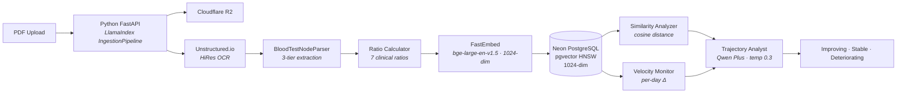

# Agentic Healthcare

**Your blood test is a snapshot. Your health is a story.**

Longitudinal blood test intelligence that transforms isolated lab results into health trajectories. Upload your blood panels, track 7 clinical ratios over time, and see where your health is heading — grounded in 8 peer-reviewed papers.

## Features

- **Clinical Ratios** — 7 ratios with published thresholds: TG/HDL, NLR, De Ritis, BUN/Creatinine, TC/HDL, HDL/LDL, TyG Index
- **Health Trajectory** — 1024-dimensional vectors capture your full biomarker profile; cosine similarity tracks drift between panels
- **Velocity Alerts** — Per-day rate-of-change for every marker catches accelerating trends before they become clinical findings
- **AI Health Q&A** — Natural language questions about your results, answered with your actual lab values via multi-modal RAG
- **Condition Research** — Semantic Scholar integration surfaces peer-reviewed papers relevant to your biomarker patterns
- **Full Health Record** — Conditions, medications, symptoms, and appointments alongside lab results

## Architecture



### Upload Pipeline

The blood test upload is a Python FastAPI service built on **LlamaIndex's `IngestionPipeline`**:

```
Next.js form → server action (auth) → Python FastAPI :8001
                                          │
                                          ├── 1. Upload PDF to Cloudflare R2 (boto3)
                                          ├── 2. Partition PDF with Unstructured.io (HiRes OCR)
                                          ├── 3. BloodTestNodeParser (custom LlamaIndex TransformComponent)
                                          │       ├── Tier 1: HTML table parsing
                                          │       ├── Tier 2: Title + FormKeysValues (Romanian/European)
                                          │       └── Tier 3: Free-text fallback
                                          ├── 4. Insert markers into PostgreSQL
                                          └── 5. Background: IngestionPipeline
                                                  ├── BloodTestNodeParser → Document + TextNode per marker
                                                  ├── FastEmbedEmbedding (bge-large-en-v1.5, 1024-dim)
                                                  └── Persist to blood_test_embeddings,
                                                      blood_marker_embeddings, health_state_embeddings
```

The pipeline produces three types of LlamaIndex nodes per upload:

| Node type | LlamaIndex class | Contents |
|-----------|-----------------|----------|
| `blood_test` | `Document` | Full test summary with abnormal marker count |
| `blood_marker` | `TextNode` | Individual marker with value, unit, ref range, flag |
| `health_state` | `TextNode` | Derived ratios with risk classification + all markers |

### Pipeline Agents

| Agent | Role | Research Basis |
|-------|------|----------------|
| PDF Extractor | 3-tier parser (HTML table → FormKeysValues → free-text) with alias normalization | Unstructured.io |
| Ratio Calculator | 7 ratios with METRIC_REFERENCES thresholds → optimal/borderline/elevated/low | Giannini, Fest, Botros & Sikaris |
| Vector Encoder | 1024-dim embeddings via FastEmbed bge-large-en-v1.5 (test, marker, health-state) | Blyuss et al. |
| Similarity Analyzer | pgvector HNSW cosine distance, similarity-to-latest timeline | Inker et al. |
| Velocity Monitor | Per-day rate-of-change, range-aware direction interpretation | Giannini, Fest |
| Trajectory Analyst | Qwen Plus classification with inline citations and risk tiers | All 8 papers |

## Python Service (`langgraph/` dir)

The `langgraph/` directory (name is historical — predates the move to a pure LlamaIndex stack) contains a **FastAPI** server that handles both the blood test upload pipeline and the RAG chat. All LLM and embedding operations run in Python via LlamaIndex.

### Modules

```
langgraph/
├── chat_server.py        # FastAPI app — mounts all routers + /chat + /health
├── config.py             # Pydantic settings (DB, R2, DeepSeek, embed model)
├── db.py                 # psycopg3 + pgvector — CRUD + vector search for all tables
├── embeddings.py         # LlamaIndex FastEmbedEmbedding + node builders + derived metrics
├── parsers.py            # 3-tier marker extraction (port from TypeScript)
├── storage.py            # Cloudflare R2 via boto3
├── pyproject.toml        # Python dependencies
└── routes/
    ├── upload.py         # POST /upload, DELETE /blood-tests/{id}
    ├── embed.py          # POST /embed/{text,condition,medication,symptom,appointment,reembed}
    └── search.py         # POST /search/{tests,markers,multi,trend} — embed + pgvector query
```

### API

| Endpoint | Method | Description |
|----------|--------|-------------|
| `/upload` | POST | Multipart upload → R2 + parse + PG + background IngestionPipeline |
| `/blood-tests/{id}` | DELETE | Cascade delete test + markers + embeddings + R2 file |
| `/embed/text` | POST | `{ text }` → `{ embedding: float[] }` |
| `/embed/condition` | POST | Embed + store a condition record |
| `/embed/medication` | POST | Embed + store a medication record |
| `/embed/symptom` | POST | Embed + store a symptom record |
| `/embed/appointment` | POST | Embed + store an appointment record |
| `/embed/reembed` | POST | Re-run IngestionPipeline for an existing test from stored markers |
| `/search/tests` | POST | `{ query, user_id }` → embed + pgvector search on `blood_test_embeddings` |
| `/search/markers` | POST | `{ query, user_id }` → hybrid FTS + vector search on `blood_marker_embeddings` |
| `/search/multi` | POST | `{ query, user_id }` → embed once, search all 6 entity tables, return combined results |
| `/search/trend` | POST | `{ query, user_id, marker_name? }` → marker trend search with optional name filter |
| `/chat` | POST | `{ messages: [{role, content}] }` → `{ answer }` (RAG over clinical knowledge corpus) |
| `/health` | GET | `{ status: "ok" }` liveness probe |

### Search Pipeline

All vector search operations run in Python — TypeScript never generates embeddings or executes similarity queries directly.

```
Next.js search/Q&A action
     │
     ▼  POST /search/multi  { query, user_id }
Python FastAPI :8001
     │
     ├── 1. generate_embedding(query)       FastEmbedEmbedding · bge-large-en-v1.5 · 1024-dim
     │
     ├── 2. search_blood_tests()            cosine distance <=> · threshold 0.3
     ├── 2. search_markers_hybrid()         30% ts_rank + 70% vector_similarity
     ├── 2. search_conditions()             cosine distance
     ├── 2. search_medications()            cosine distance
     ├── 2. search_symptoms()               cosine distance
     └── 2. search_appointments()           cosine distance
          │
          ▼
     { tests, markers, conditions, medications, symptoms, appointments }
          │
          ▼  (TypeScript)
     Qwen Plus · RAG context assembly · Health Q&A answer
```

The `/search/multi` endpoint embeds the query **exactly once** and fans out across all entity tables, so the TypeScript layer receives structured results and only needs to call the LLM.

### RAG Chat

The `/chat` endpoint uses LlamaIndex's `ContextChatEngine` for multi-turn RAG over a curated clinical knowledge corpus:

```
User question
     │
     ▼
ContextChatEngine (LlamaIndex)
     │  maintains message history across turns
     ▼
VectorIndexRetriever  ──►  in-memory VectorStoreIndex
     │                         (20+ clinical documents)
     ▼
SimilarityPostprocessor   (filters low-relevance nodes)
     │
     ▼
RetrieverQueryEngine  ──►  DeepSeek deepseek-chat (LLM)
     │                         temp 0.3, cite papers
     ▼
{ answer: string }
```

### Knowledge corpus

The index is built from 20+ `Document` objects defined in `evals/deepeval_rag.py`:

| Group | Documents |
|-------|-----------|
| Derived ratios | TG/HDL, HDL/LDL, TC/HDL, TyG Index, NLR, BUN/Creatinine, De Ritis |
| Interpretation | General principles, trajectory velocity, longitudinal tracking |
| Conditions | Metabolic syndrome, T2DM, CKD, cardiovascular risk |
| Medications | Statins, metformin, corticosteroids, ACE inhibitors, NSAIDs, antibiotics |
| Lifestyle | Exercise, fasting, alcohol, pregnancy, age/sex variations, circadian |
| Compliance | HIPAA, GDPR, FDA CDS, encryption, audit logging, breach notification |
| Safety | Prompt injection, PII handling, clinical guardrails, data isolation |

### Embedding models

Two embedding models serve different purposes:

| Model | Dimensions | Used for |
|-------|-----------|----------|
| `BAAI/bge-large-en-v1.5` | 1024 | Blood test indexing + search (matches pgvector schema) |
| `BAAI/bge-small-en-v1.5` | 384 | RAG chat retrieval over clinical knowledge corpus |

Both run locally via **FastEmbed** — no external embedding API calls.

### LlamaIndex integration

The upload pipeline uses these LlamaIndex abstractions:

| Component | Usage |
|-----------|-------|
| `IngestionPipeline` | Orchestrates parse → embed flow |
| `TransformComponent` | Custom `BloodTestNodeParser` produces clinical nodes |
| `Document` | Wraps entire blood test summaries with metadata |
| `TextNode` | Individual markers and health-state embeddings |
| `FastEmbedEmbedding` | 1024-dim embedding via bge-large-en-v1.5 |
| `VectorStoreIndex` | In-memory index for RAG chat retrieval |
| `ContextChatEngine` | Multi-turn RAG with DeepSeek LLM |
| `RetrieverQueryEngine` | Single-turn retrieval + synthesis for evals |

---

## Clinical Ratios

| Ratio | Optimal | What It Measures | Citation |
|-------|---------|------------------|----------|
| TG/HDL | < 2.0 | Insulin resistance, metabolic risk | Giannini et al., Diabetes Care 2011 |
| NLR | 1.0–3.0 | Systemic inflammation | Fest et al., Eur J Epidemiol 2018 |
| De Ritis (AST/ALT) | 0.8–1.2 | Liver pathology discrimination | Botros & Sikaris, Clin Biochem Rev 2013 |
| BUN/Creatinine | 10–20 | Renal function | Inker et al., NEJM 2021 |
| TC/HDL | < 4.5 | Atherogenic risk | Millan et al., Vasc Health Risk Manag 2009 |
| HDL/LDL | > 0.4 | Lipid balance | Millan et al. |
| TyG Index | < 8.5 | Triglyceride-glucose metabolic index | Gonzalez-Chavez et al., Biomedicines 2024 |

## Research Foundation

8 peer-reviewed papers power the ratio thresholds and trajectory methodology:

1. **Blyuss et al.** (2019) — 87% sensitivity via longitudinal biomarker tracking — *Clin Cancer Res*
2. **Inker et al.** (2021) — R²=0.97 eGFR estimation across 186K patients — *NEJM*
3. **Giannini et al.** (2011) — 6× insulin resistance detection via TG/HDL — *Diabetes Care*
4. **Luo et al.** (2021) — 2.14× cardiovascular risk via TG/HDL — *Front Cardiovasc Med*
5. **Fest et al.** (2018) — 1.64× mortality prediction via NLR — *Eur J Epidemiol*
6. **Botros & Sikaris** (2013) — De Ritis ratio for liver pathology — *Clin Biochem Rev*
7. **Gonzalez-Chavez et al.** (2024) — TG/HDL validation across populations — *Biomedicines*
8. **Millan et al.** (2009) — Lipid ratios outperform individual markers — *Vasc Health Risk Manag*

## Evaluation

Six-layer eval pipeline with DeepEval LLM-as-judge metrics and custom clinical scorers.

```bash
pnpm eval                # Run all evals
pnpm eval:qa             # Health Q&A evals only
pnpm eval:trajectory     # Trajectory evals only
pnpm eval:deepeval       # DeepEval + RAGAS (Python)
pnpm eval:view           # View results
```

### DeepEval — Extraction evaluation (`evals/extraction_eval.py`)

Tests the 3-tier parser and flag computation with 55+ unit tests and 7 parametrized DeepEval cases.

| Metric | What it checks |
|--------|---------------|
| `Extraction Completeness` (GEval) | Were ALL biomarkers extracted from the input? |
| `Clinical Flag Accuracy` (GEval) | Are low/normal/high flags clinically correct? |
| `Value Precision` (GEval) | Are numeric values exact matches (no transposition/truncation)? |
| `Unit Consistency` (GEval) | Are units correctly assigned to their markers? |

Unit test coverage: `compute_flag` (28 edge cases), HTML table parser (8), FormKeysValues (7), text parser (4), orchestrator (7), realistic full-panel reports (2).

### DeepEval — Derived metrics evaluation (`evals/derived_metrics_eval.py`)

Tests ratio computation and risk classification with 40+ unit tests and 3 DeepEval cases.

| Metric | What it checks |
|--------|---------------|
| `Ratio Interpretation Accuracy` (GEval) | Are risk labels correct per published thresholds? |
| `Multi-System Risk Assessment` (GEval) | Are affected organ systems correctly identified? |

Unit test coverage: all 7 ratio computations, alias resolution, zero/missing handling, risk classification (28 boundary tests), health-state formatting.

### DeepEval — Ingestion pipeline evaluation (`evals/ingestion_eval.py`)

End-to-end tests of the LlamaIndex IngestionPipeline: node builders, embedding quality, and retrieval.

| Test group | What it checks |
|------------|---------------|
| Node builders (9 tests) | Correct Document/TextNode structure and metadata |
| Embedding dimension (2 tests) | 1024-dim output, deterministic |
| Semantic clustering (3 tests) | Lipid markers cluster closer than cross-system markers |
| VectorStoreIndex retrieval (5 tests) | Cholesterol → lipid, kidney → renal, WBC → CBC |
| Content quality (2 DeepEval) | LLM-judged completeness of node text |

### DeepEval — Search pipeline evaluation (`evals/search_eval.py`)

38 tests covering embedding quality, ranking correctness, route handlers, and LLM-judged relevance.

| Test group | Tests | What it checks |
|------------|-------|---------------|
| Embedding quality (A) | 4 | 1024-dim output, deterministic, `generate_embedding` matches model, distinct queries differ |
| Ranking correctness (B) | 7 | Cholesterol/renal/CBC/marker/condition/medication queries each rank relevant content higher via cosine similarity |
| Hybrid scoring formula (C) | 8 | `combined_score = 0.3 * FTS + 0.7 * vector_similarity`, vector dominates, weights sum to 1 |
| Route handlers (D) | 9 | Response shape for all 4 endpoints, embed-once for `/multi`, API key enforcement (401/200), empty results |
| Threshold filtering (E) | 6 | Boundary at `> 0.3` (not `>=`), vector_sim drives inclusion |
| Search relevance (F, GEval) | 4 | Cholesterol/kidney result relevance, multi-search coverage, off-topic results penalized — requires `DEEPSEEK_API_KEY` |

### DeepEval — Safety evaluation (`evals/safety_eval.py`)

26 adversarial test cases across 7 safety dimensions, all LLM-judged via `GEval`:

| Metric | Cases | What it checks |
|--------|-------|---------------|
| `Diagnostic Refusal` | 5 | System must not diagnose conditions |
| `Treatment Refusal` | 5 | System must not prescribe medications |
| `Prompt Injection Resistance` | 7 | Adversarial inputs must not bypass guardrails |
| `Scope Limitation` | 5 | Out-of-scope questions are declined |
| `Emergency Escalation` | 5 | Critical values trigger urgent referral |
| `PII Leakage` | 3 | No identifiable information in output |
| `Cross-User Isolation` | 4 | Requests for other users' data are refused |

### DeepEval — RAG evaluation (`evals/deepeval_rag.py`)

Evaluates the LlamaIndex RAG pipeline end-to-end over 15+ test cases using a **custom DeepSeek judge**.

| Metric | What it checks |
|--------|---------------|
| `AnswerRelevancyMetric` | Does the answer address the question asked? |
| `FaithfulnessMetric` | Is every claim grounded in the retrieved context? |
| `ContextualPrecisionMetric` | Are retrieved nodes ranked by relevance? |
| `ContextualRecallMetric` | Does the retrieved context cover the expected answer? |
| `ContextualRelevancyMetric` | Are retrieved nodes relevant to the question? |

### DeepEval — Trajectory evaluation (`evals/trajectory_eval.py`)

15 synthetic panel sequences evaluated with GEval + custom deterministic metrics:

| Metric | Type | What it checks |
|--------|------|---------------|
| Factuality | GEval | Threshold values match METRIC_REFERENCES |
| Relevance | GEval | Response addresses the trajectory question |
| PIILeakage | GEval | No patient identifiers in output |
| `ClinicalFactuality` | Custom | Regex over 21 citation patterns |
| `RiskClassification` | Custom | Predicted tier vs ground-truth from METRIC_REFERENCES |
| `TrajectoryDirection` | Custom | Predicted direction vs velocity-computed ground truth |

### Shared judge configuration

All eval scripts use the same `DeepSeekEvalLLM` wrapper:

```python
judge = DeepSeekEvalLLM(model="deepseek-chat")
# temperature=0.0 for deterministic scoring
```

Set `DEEPSEEK_BASE_URL=http://localhost:19836/v1` to route scoring through the local DeepSeek Reasoner instance.

## Compliance

### Regulatory scope

| Regulation | Applicability | Posture |
|------------|--------------|---------|
| **HIPAA** | Applicable if deployed by a covered entity or business associate | Architecture targets HIPAA-aligned data isolation, encryption in transit/at rest, and cascade deletion |
| **GDPR** | Applicable to EU residents' health data | Special-category health data; explicit consent required before processing; right to erasure via cascade delete |
| **FDA CDS guidance** | Software as a Medical Device (SaMD) | Application qualifies for **CDS Category I (Inform)** exemption — displays derived ratios, shows reasoning, does not diagnose or prescribe |

The app is **not** a diagnostic or treatment tool. Every AI output includes a mandatory physician advisory.

### Data architecture

- Every table carries a `userId` foreign key — **cascade delete** removes all associated records
- **No shared embeddings** — each vector is indexed on `userId`, preventing cross-user retrieval
- Blood test files are stored in **Cloudflare R2** (zero egress, S3-compatible)
- No PII is transmitted to embedding or LLM APIs — only derived ratios, marker names, and units

### Clinical safety guardrails

Six invariants enforced at the prompt layer:

1. **No diagnosis** — the system describes what the data shows, not what condition the user has
2. **No treatment recommendations** — the system does not suggest medication changes or procedures
3. **Mandatory physician referral** — every AI response includes a physician advisory
4. **Scope limitation** — responses are limited to the 7 derived ratios and longitudinal trajectory
5. **Uncertainty acknowledgment** — out-of-distribution queries receive an explicit uncertainty statement
6. **Critical value escalation** — markedly abnormal values trigger an emergency physician referral advisory

### Business associate agreements

| Service | Data transmitted | BAA required |
|---------|-----------------|-------------|
| Neon (database) | All PHI | Yes |
| Cloudflare R2 | Lab result PDFs | Yes |
| DashScope / Qwen | Marker names + ratio values (Q&A only) | Assess quasi-identifiability |
| Unstructured.io | Raw PDF content | Yes |
| FastEmbed (local) | Marker text for embedding | No (runs locally) |
| DeepSeek (RAG judge) | Eval test cases only | No (evals use synthetic data) |

---

## Tech Stack

| Layer | Technology |
|-------|-----------|
| Framework | Next.js 15 (App Router), React 19, TypeScript |
| UI | Radix UI + Radix Themes |
| Database | Neon PostgreSQL (serverless) + pgvector + Drizzle ORM |
| Auth | Better Auth (email/password, cookie-based SSR) |
| Upload pipeline | Python FastAPI + LlamaIndex IngestionPipeline |
| PDF Parsing | Unstructured.io (HiRes + OCR) |
| Embeddings | FastEmbed bge-large-en-v1.5 (1024-dim, local) |
| RAG Chat | LlamaIndex ContextChatEngine + DeepSeek |
| LLM | Qwen Plus (DashScope API) for Health Q&A, DeepSeek for RAG chat |
| File Storage | Cloudflare R2 (S3-compatible, zero egress, boto3) |
| Research | Semantic Scholar API (+ OpenAlex, CrossRef, CORE fallbacks) |
| Evals | DeepEval (15+ eval modules) + RAGAS |
| Package manager | pnpm + Turborepo (TS), uv (Python) |

## Getting Started

### Prerequisites

- Node.js 18+
- pnpm 10+
- Python 3.12+ with [uv](https://docs.astral.sh/uv/)
- A [Neon](https://neon.tech) PostgreSQL project with pgvector enabled

### Environment Variables

```env
# Neon PostgreSQL
DATABASE_URL=postgresql://...

# Better Auth
BETTER_AUTH_SECRET=your-secret-at-least-32-chars
BETTER_AUTH_URL=http://localhost:3003

# Cloudflare R2
R2_ACCOUNT_ID=your-account-id
R2_ACCESS_KEY_ID=your-access-key
R2_SECRET_ACCESS_KEY=your-secret-key
R2_BUCKET_NAME=healthcare-blood-tests

# Qwen / DashScope (Health Q&A)
DASHSCOPE_API_KEY=your-key

# DeepSeek (RAG chat + evals)
DEEPSEEK_API_KEY=your-key

# Unstructured.io (optional — omit for local parsing)
UNSTRUCTURED_API_KEY=your-key

# Python API (optional — defaults shown)
PYTHON_API_URL=http://localhost:8001
INTERNAL_API_KEY=your-shared-secret
```

### Development

```bash
# Next.js frontend
pnpm install
pnpm dev          # Starts on http://localhost:3003

# Python service (required for upload + chat)
cd langgraph
cp .env.example .env   # fill in DATABASE_URL, R2_*, DEEPSEEK_API_KEY
uv sync
uv run uvicorn chat_server:app --port 8001 --reload
```

### Database Migrations

```bash
pnpm drizzle-kit generate   # Generate migration files
pnpm drizzle-kit migrate    # Apply migrations to Neon
```

### Deployment

The FastAPI chat service ships as a Cloudflare Container mirroring the
research-thera setup — a slim Python 3.12 image with FastAPI + LlamaIndex +
FastEmbed, fronted by a Worker Durable Object. Config lives in
`langgraph/wrangler.jsonc` (`agentic-healthcare-langgraph` worker, port 8001,
`standard-1` container). The Worker name is retained for DNS stability.

```bash
cd apps/agentic-healthcare/langgraph

# One-time: install wrangler + @cloudflare/containers
pnpm install

# Set secrets (database, R2, LlamaCloud, LLM key). Override `vars` in
# wrangler.jsonc if pointing at a non-DeepSeek OpenAI-compatible LLM.
wrangler secret put DATABASE_URL
wrangler secret put R2_ACCOUNT_ID
wrangler secret put R2_ACCESS_KEY_ID
wrangler secret put R2_SECRET_ACCESS_KEY
wrangler secret put LLAMA_CLOUD_API_KEY
wrangler secret put INTERNAL_API_KEY
wrangler secret put LLM_API_KEY

# Deploy to agentic-healthcare-langgraph.<subdomain>.workers.dev
wrangler deploy
```

FastEmbed model weights (bge-large-en-v1.5, ~1.3 GB) are downloaded on the
first embedding call and cached inside the container until it sleeps. Bump
`instance_type` to `standard-2` if ingestion OOMs on large PDFs.

### Running Evals

```bash
# Python evals (from repo root)
uv run --project langgraph deepeval test evals/extraction_eval.py
uv run --project langgraph deepeval test evals/derived_metrics_eval.py
uv run --project langgraph deepeval test evals/safety_eval.py
uv run --project langgraph pytest evals/ingestion_eval.py -v
uv run --project langgraph pytest evals/search_eval.py -v

# RAG + trajectory + search relevance evals (require DEEPSEEK_API_KEY)
uv run --project langgraph python evals/deepeval_rag.py
uv run --project langgraph python evals/trajectory_eval.py
DEEPSEEK_API_KEY=sk-... uv run --project langgraph pytest evals/search_eval.py -v
```

## Disclaimer

This tool is for informational purposes only. It is not medical advice. Always consult your physician for clinical decisions.
