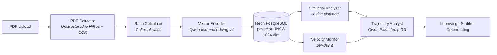

# Agentic Healthcare

**Your blood test is a snapshot. Your health is a story.**

Longitudinal blood test intelligence that transforms isolated lab results into health trajectories. Upload your blood panels, track 7 clinical ratios over time, and see where your health is heading — grounded in 8 peer-reviewed papers.

## Features

- **Clinical Ratios** — 7 ratios with published thresholds: TG/HDL, NLR, De Ritis, BUN/Creatinine, TC/HDL, HDL/LDL, TyG Index
- **Health Trajectory** — 1024-dimensional vectors capture your full biomarker profile; cosine similarity tracks drift between panels
- **Velocity Alerts** — Per-day rate-of-change for every marker catches accelerating trends before they become clinical findings
- **AI Health Q&A** — Natural language questions about your results, answered with your actual lab values via multi-modal RAG
- **Condition Research** — Semantic Scholar integration surfaces peer-reviewed papers relevant to your biomarker patterns
- **Full Health Record** — Conditions, medications, symptoms, and appointments alongside lab results

## Architecture



### Pipeline Agents

| Agent | Role | Research Basis |
|-------|------|----------------|
| PDF Extractor | 3-tier parser (HTML table → FormKeysValues → free-text) with alias normalization | Unstructured.io |
| Ratio Calculator | 7 ratios with METRIC_REFERENCES thresholds → optimal/borderline/elevated/low | Giannini, Fest, Botros & Sikaris |
| Vector Encoder | 1024-dim embeddings via Qwen text-embedding-v4 (test, marker, health-state) | Blyuss et al. |
| Similarity Analyzer | pgvector HNSW cosine distance, similarity-to-latest timeline | Inker et al. |
| Velocity Monitor | Per-day rate-of-change, range-aware direction interpretation | Giannini, Fest |
| Trajectory Analyst | Qwen Plus classification with inline citations and risk tiers | All 8 papers |

## RAG Chat Server

The `langgraph/` directory contains a FastAPI server that powers the AI Health Q&A feature. It uses LlamaIndex's `ContextChatEngine` to run multi-turn RAG conversations over a curated clinical knowledge corpus.

### How it works

```
User question
     │
     ▼
ContextChatEngine (LlamaIndex)
     │  maintains message history across turns
     ▼
VectorIndexRetriever  ──►  in-memory VectorStoreIndex
     │                         (7 ratio docs + interpretation
     │                          + conditions / medications)
     ▼
SimilarityPostprocessor   (filters low-relevance nodes)
     │
     ▼
RetrieverQueryEngine  ──►  DeepSeek deepseek-chat (LLM)
     │                         temp 0.3, cite papers
     ▼
/chat  →  { answer: string }
```

### Knowledge corpus

The index is built from 20+ `Document` objects defined in `evals/ragas_eval.py` and shared with the chat server:

| Group | Documents |
|-------|-----------|
| Derived ratios | TG/HDL, HDL/LDL, TC/HDL, TyG Index, NLR, BUN/Creatinine, De Ritis |
| Interpretation | General principles, trajectory velocity, longitudinal tracking |
| Conditions | Metabolic syndrome, NAFLD, CKD, anaemia |
| Medications | Statins, metformin, corticosteroids effect on markers |
| Multi-organ | Cardio-renal, liver-immune cross-effects |

Embeddings use **FastEmbed** (`BAAI/bge-small-en-v1.5`) running entirely locally — no external embedding API call at inference time.

### System prompt

The chat engine enforces two invariants:

1. Answers are grounded in the retrieved context only (no hallucinated ranges)
2. Every response ends with a physician advisory and cites the relevant paper when available

### API

| Endpoint | Description |
|----------|-------------|
| `POST /chat` | `{ messages: [{role, content}] }` → `{ answer }` |
| `GET /health` | `{ status: "ok" }` liveness probe |

### Stack

| Component | Library |
|-----------|---------|
| Server | FastAPI + uvicorn |
| RAG engine | LlamaIndex `ContextChatEngine` |
| Embeddings | FastEmbed `BAAI/bge-small-en-v1.5` (local) |
| LLM | DeepSeek `deepseek-chat` (OpenAI-compatible) |
| Package manager | `uv` |

---

## Clinical Ratios

| Ratio | Optimal | What It Measures | Citation |
|-------|---------|------------------|----------|
| TG/HDL | < 2.0 | Insulin resistance, metabolic risk | Giannini et al., Diabetes Care 2011 |
| NLR | 1.0–3.0 | Systemic inflammation | Fest et al., Eur J Epidemiol 2018 |
| De Ritis (AST/ALT) | 0.8–1.2 | Liver pathology discrimination | Botros & Sikaris, Clin Biochem Rev 2013 |
| BUN/Creatinine | 10–20 | Renal function | Inker et al., NEJM 2021 |
| TC/HDL | < 4.5 | Atherogenic risk | Millan et al., Vasc Health Risk Manag 2009 |
| HDL/LDL | > 0.4 | Lipid balance | Millan et al. |
| TyG Index | < 8.5 | Triglyceride-glucose metabolic index | Gonzalez-Chavez et al., Biomedicines 2024 |

## Research Foundation

8 peer-reviewed papers power the ratio thresholds and trajectory methodology:

1. **Blyuss et al.** (2019) — 87% sensitivity via longitudinal biomarker tracking — *Clin Cancer Res*
2. **Inker et al.** (2021) — R²=0.97 eGFR estimation across 186K patients — *NEJM*
3. **Giannini et al.** (2011) — 6× insulin resistance detection via TG/HDL — *Diabetes Care*
4. **Luo et al.** (2021) — 2.14× cardiovascular risk via TG/HDL — *Front Cardiovasc Med*
5. **Fest et al.** (2018) — 1.64× mortality prediction via NLR — *Eur J Epidemiol*
6. **Botros & Sikaris** (2013) — De Ritis ratio for liver pathology — *Clin Biochem Rev*
7. **Gonzalez-Chavez et al.** (2024) — TG/HDL validation across populations — *Biomedicines*
8. **Millan et al.** (2009) — Lipid ratios outperform individual markers — *Vasc Health Risk Manag*

## Evaluation

Three-layer eval pipeline with custom clinical scorers.

```bash
pnpm eval              # Run all evals
pnpm eval:qa           # Health Q&A evals only
pnpm eval:trajectory   # Trajectory evals only
pnpm eval:deepeval     # DeepEval + RAGAS (Python)
pnpm eval:view         # View results
```

### Promptfoo

Evaluates the Next.js prompt templates for Health Q&A and trajectory analysis against golden outputs. Runs entirely in TypeScript with the custom scorers below.

### DeepEval — RAG evaluation (`evals/ragas_eval.py`)

Evaluates the LlamaIndex RAG pipeline end-to-end over 15 test cases using a **custom DeepSeek judge** (`DeepSeekEvalLLM`) backed by `deepseek-chat` at temperature 0.0 via the OpenAI-compatible API.

| Metric | What it checks |
|--------|---------------|
| `AnswerRelevancyMetric` | Does the answer address the question asked? |
| `FaithfulnessMetric` | Is every claim grounded in the retrieved context? |
| `ContextualPrecisionMetric` | Are retrieved nodes ranked by relevance? |
| `ContextualRecallMetric` | Does the retrieved context cover the expected answer? |
| `ContextualRelevancyMetric` | Are retrieved nodes relevant to the question? |

The script also runs an **optimization loop**: it re-runs failing cases with `deepseek-reasoner` to compare scores between the fast and reasoning model variants.

### DeepEval — Trajectory evaluation (`evals/trajectory_eval.py`)

Evaluates the Qwen trajectory analyst on 15 synthetic panel sequences. Uses the same `DeepSeekEvalLLM` judge and splits metrics into two groups:

**GEval metrics** (LLM-as-judge, natural language criteria):

| Metric | Criteria |
|--------|----------|
| Factuality | Threshold values match METRIC_REFERENCES exactly |
| Relevance | Response addresses the trajectory question without off-topic content |
| PIILeakage | No patient name / DOB / identifier appears in the output |

**Custom deterministic metrics** (rule-based, no judge LLM needed):

| Metric | How it works |
|--------|-------------|
| `ClinicalFactuality` | Regex over 21 citation patterns — checks that published thresholds (e.g. "TG/HDL < 2.0") appear verbatim |
| `RiskClassification` | Compares predicted tier (optimal / borderline / elevated / low) against ground-truth tier derived from `METRIC_REFERENCES` |
| `TrajectoryDirection` | Compares predicted direction (improving / stable / deteriorating) against velocity-computed ground truth |

All three custom metrics extend `deepeval.metrics.BaseMetric` and integrate with `deepeval.evaluate()`, so results appear in the same report as the GEval scores.

### Shared judge configuration

Both eval scripts use the same `DeepSeekEvalLLM` wrapper pattern:

```python
judge = DeepSeekEvalLLM(model="deepseek-chat")
# temperature=0.0 for deterministic scoring
# supports both generate() and a_generate() (async)
```

Set `DEEPSEEK_BASE_URL=http://localhost:19836/v1` to route scoring through the local DeepSeek Reasoner instance instead of the remote API.

## Compliance

This section documents the regulatory posture, data architecture decisions, and clinical safety guardrails built into the application.

### Regulatory scope

| Regulation | Applicability | Posture |
|------------|--------------|---------|
| **HIPAA** | Applicable if deployed by a covered entity or business associate | Architecture targets HIPAA-aligned data isolation, encryption in transit/at rest, and cascade deletion |
| **GDPR** | Applicable to EU residents' health data | Special-category health data; explicit consent required before processing; right to erasure via cascade delete |
| **FDA CDS guidance** | Software as a Medical Device (SaMD) | Application qualifies for **CDS Category I (Inform)** exemption — displays derived ratios, shows reasoning, does not diagnose or prescribe |

The app is **not** a diagnostic or treatment tool. Every AI output includes a mandatory physician advisory. The system prompt and trajectory prompts explicitly prohibit diagnosis.

### Data architecture

All personal health information is scoped to the authenticated user at the database level:

- Every table (`bloodTests`, `bloodMarkers`, `conditions`, `medications`, `symptoms`, `appointments`, and all embedding tables) carries a `userId` foreign key
- **Cascade delete** — deleting a user removes all associated health records and embeddings
- **No shared embeddings** — each vector is indexed on `userId`, preventing cross-user retrieval
- Blood test files are stored in **Cloudflare R2** (zero egress, S3-compatible); only the file path is stored in the database
- No PII is transmitted to the embedding or LLM APIs — only derived ratios, marker names, and units are embedded

### HIPAA PHI handling

The 18 HIPAA-defined identifiers (name, DOB, SSN, MRN, phone, email, etc.) are not collected by the application beyond what Better Auth requires for account creation (email + password). Lab result files uploaded by the user are stored in R2 under a UUID key; the original filename is retained in the database but not transmitted to downstream AI services.

**Minimum necessary principle** — the RAG pipeline retrieves only the context nodes relevant to the active query. The trajectory analyst receives only derived ratio values and panel dates, not raw demographic data.

**Audit logging requirements** — HIPAA requires 6-year retention of access logs (timestamp, user ID, action, resource, outcome, IP). The current schema does not include a dedicated audit table; operators must enable database-level access logging at the Neon / infrastructure layer.

**Breach notification** — under HIPAA's encryption safe harbour, data encrypted with AES-256 at rest and TLS 1.2+ in transit that is subsequently accessed without authorisation does not trigger the 60-day breach notification obligation, provided the encryption keys are not also compromised.

### GDPR specifics

Health data is **special-category data** under GDPR Article 9, requiring explicit consent and heightened protection:

| Right | Implementation |
|-------|---------------|
| Right of access | Users can view all stored markers, conditions, medications, and appointments in the UI |
| Right to erasure | Account deletion cascades to all health tables and embeddings |
| Data portability | GDPR Article 20 requires export in JSON / CSV / FHIR format — not yet implemented |
| Breach notification | 72-hour supervisory authority notification (stricter than HIPAA's 60 days) |

GDPR imposes penalties up to €20M or 4% of global annual revenue; HIPAA civil penalties reach $1.9M per category per year.

### Authentication & session security

| Control | Implementation |
|---------|---------------|
| Authentication | Better Auth — email/password, cookie-based SSR sessions |
| Route protection | Next.js middleware validates session cookie on every protected route; unauthenticated requests redirect to `/auth/login` |
| Server-side enforcement | `withAuth()` helper in `lib/auth-helpers.ts` checks session on every server action |
| Transport | `DATABASE_URL` requires `sslmode=require`; all external API calls use HTTPS |
| Secret rotation | `BETTER_AUTH_SECRET` must be ≥ 32 characters; rotation requires invalidating all active sessions |
| MFA | Not currently implemented — recommended before production deployment handling real PHI |
| Session timeout | Not enforced at the app layer — HIPAA recommends 15–30 min idle timeout |

### Encryption

| Layer | Standard |
|-------|---------|
| Database at rest | AES-256 (Neon managed encryption, NIST SP 800-111) |
| Data in transit | TLS 1.2+ for all connections (NIST SP 800-52) |
| File storage | Cloudflare R2 server-side encryption |
| Session tokens | Hashed and stored as unique indexed tokens via Better Auth |
| Vector embeddings | 1024-dim floats — note that embedding inversion attacks can partially reconstruct source text; no additional re-identification mitigations are applied |

### Clinical safety guardrails

Six invariants are enforced at the prompt layer and cannot be overridden by user input:

1. **No diagnosis** — the system describes what the data shows, not what condition the user has
2. **No treatment recommendations** — the system does not suggest medication changes or procedures
3. **Mandatory physician referral** — every AI response includes a physician advisory
4. **Scope limitation** — responses are limited to the 7 derived ratios and longitudinal trajectory
5. **Uncertainty acknowledgment** — out-of-distribution queries receive an explicit uncertainty statement
6. **Critical value escalation** — markedly abnormal values trigger an emergency physician referral advisory

The trajectory analyst runs at **temperature 0.3** and the RAG chat at **temperature 0.3** to reduce creative deviation from grounded clinical facts.

### PII leakage testing

The DeepEval trajectory eval (`evals/trajectory_eval.py`) includes a dedicated **PIILeakage GEval metric** that runs on every test case. It checks:

- Whether the output contains real or plausible personal information (names, phone numbers, emails)
- Whether hallucinated PII or training-data artifacts appear in the response
- Whether placeholders and anonymised data are used consistently

Threshold: 0.5 (score below 0.5 fails the test case).

### Business associate agreements

The following external services receive or process health-related data and require a BAA before use with real PHI in a covered-entity deployment:

| Service | Data transmitted | BAA required |
|---------|-----------------|-------------|
| Neon (database) | All PHI | Yes |
| Cloudflare R2 | Lab result PDFs | Yes |
| DashScope / Qwen | Marker names + ratio values | Assess quasi-identifiability |
| Unstructured.io | Raw PDF content | Yes |
| DeepSeek (RAG judge) | Eval test cases only | No (evals use synthetic data) |

### Incident categories

Five incident types are modelled in the evaluation knowledge corpus:

| Category | Example | First response |
|----------|---------|---------------|
| PHI access violation | RLS bypass, privilege escalation | Revoke session, rotate credentials |
| Data exfiltration | Bulk API abuse | Rate-limit, audit log review |
| Prompt injection | PHI leakage via retrieval context | Input sanitisation, output filtering |
| Embedding inversion | Vector → source text reconstruction | No user-identifiable text in embeddings |
| API key compromise | External service unauthorised access | Immediate rotation, provider notification |

---

## Tech Stack

| Layer | Technology |
|-------|-----------|
| Framework | Next.js 15 (App Router), React 19, TypeScript |
| UI | Radix UI + Radix Themes |
| Database | Neon PostgreSQL (serverless) + pgvector + Drizzle ORM |
| Auth | Better Auth (email/password, cookie-based SSR) |
| LLM | Qwen Plus (DashScope API) |
| Embeddings | Qwen text-embedding-v4 (1024-dim) |
| PDF Parsing | Unstructured.io (HiRes + OCR) |
| File Storage | Cloudflare R2 (S3-compatible, zero egress) |
| RAG Chat | LlamaIndex + DeepSeek (FastAPI server) |
| Research | Semantic Scholar API (+ OpenAlex, CrossRef, CORE fallbacks) |
| Evals | Promptfoo + DeepEval + RAGAS (Python) |
| Monorepo | pnpm + Turborepo |

## Getting Started

### Prerequisites

- Node.js 18+
- pnpm 10+
- A [Neon](https://neon.tech) PostgreSQL project with pgvector enabled

### Environment Variables

```env
# Neon PostgreSQL
DATABASE_URL=postgresql://...

# Better Auth
BETTER_AUTH_SECRET=your-secret-at-least-32-chars
BETTER_AUTH_URL=http://localhost:3003

# Cloudflare R2
R2_ACCOUNT_ID=your-account-id
R2_ACCESS_KEY_ID=your-access-key
R2_SECRET_ACCESS_KEY=your-secret-key
R2_BUCKET_NAME=healthcare-blood-tests

# Qwen / DashScope
DASHSCOPE_API_KEY=your-key

# Unstructured.io
UNSTRUCTURED_API_KEY=your-key
```

### Development

```bash
pnpm install
pnpm dev          # Starts on http://localhost:3003
pnpm test         # Run unit tests
pnpm eval         # Run evaluation suite
```

### Database Migrations

```bash
pnpm drizzle-kit generate   # Generate migration files
pnpm drizzle-kit migrate    # Apply migrations to Neon
```

### RAG Chat Server

The AI Q&A feature requires the LlamaIndex chat server running locally:

```bash
cd langgraph
cp .env.example .env   # fill DEEPSEEK_API_KEY
uv run uvicorn chat_server:app --port 8001 --reload
```

## Disclaimer

This tool is for informational purposes only. It is not medical advice. Always consult your physician for clinical decisions.
