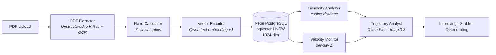

# Agentic Healthcare

**Your blood test is a snapshot. Your health is a story.**

Longitudinal blood test intelligence that transforms isolated lab results into health trajectories. Upload your blood panels, track 7 clinical ratios over time, and see where your health is heading — grounded in 8 peer-reviewed papers.

## Features

- **Clinical Ratios** — 7 ratios with published thresholds: TG/HDL, NLR, De Ritis, BUN/Creatinine, TC/HDL, HDL/LDL, TyG Index
- **Health Trajectory** — 1024-dimensional vectors capture your full biomarker profile; cosine similarity tracks drift between panels
- **Velocity Alerts** — Per-day rate-of-change for every marker catches accelerating trends before they become clinical findings
- **AI Health Q&A** — Natural language questions about your results, answered with your actual lab values via multi-modal RAG
- **Condition Research** — Semantic Scholar integration surfaces peer-reviewed papers relevant to your biomarker patterns
- **Full Health Record** — Conditions, medications, symptoms, and appointments alongside lab results

## Architecture



### Pipeline Agents

| Agent | Role | Research Basis |
|-------|------|----------------|
| PDF Extractor | 3-tier parser (HTML table → FormKeysValues → free-text) with alias normalization | Unstructured.io |
| Ratio Calculator | 7 ratios with METRIC_REFERENCES thresholds → optimal/borderline/elevated/low | Giannini, Fest, Botros & Sikaris |
| Vector Encoder | 1024-dim embeddings via Qwen text-embedding-v4 (test, marker, health-state) | Blyuss et al. |
| Similarity Analyzer | pgvector HNSW cosine distance, similarity-to-latest timeline | Inker et al. |
| Velocity Monitor | Per-day rate-of-change, range-aware direction interpretation | Giannini, Fest |
| Trajectory Analyst | Qwen Plus classification with inline citations and risk tiers | All 8 papers |

## Clinical Ratios

| Ratio | Optimal | What It Measures | Citation |
|-------|---------|------------------|----------|
| TG/HDL | < 2.0 | Insulin resistance, metabolic risk | Giannini et al., Diabetes Care 2011 |
| NLR | 1.0–3.0 | Systemic inflammation | Fest et al., Eur J Epidemiol 2018 |
| De Ritis (AST/ALT) | 0.8–1.2 | Liver pathology discrimination | Botros & Sikaris, Clin Biochem Rev 2013 |
| BUN/Creatinine | 10–20 | Renal function | Inker et al., NEJM 2021 |
| TC/HDL | < 4.5 | Atherogenic risk | Millan et al., Vasc Health Risk Manag 2009 |
| HDL/LDL | > 0.4 | Lipid balance | Millan et al. |
| TyG Index | < 8.5 | Triglyceride-glucose metabolic index | Gonzalez-Chavez et al., Biomedicines 2024 |

## Research Foundation

8 peer-reviewed papers power the ratio thresholds and trajectory methodology:

1. **Blyuss et al.** (2019) — 87% sensitivity via longitudinal biomarker tracking — *Clin Cancer Res*
2. **Inker et al.** (2021) — R²=0.97 eGFR estimation across 186K patients — *NEJM*
3. **Giannini et al.** (2011) — 6× insulin resistance detection via TG/HDL — *Diabetes Care*
4. **Luo et al.** (2021) — 2.14× cardiovascular risk via TG/HDL — *Front Cardiovasc Med*
5. **Fest et al.** (2018) — 1.64× mortality prediction via NLR — *Eur J Epidemiol*
6. **Botros & Sikaris** (2013) — De Ritis ratio for liver pathology — *Clin Biochem Rev*
7. **Gonzalez-Chavez et al.** (2024) — TG/HDL validation across populations — *Biomedicines*
8. **Millan et al.** (2009) — Lipid ratios outperform individual markers — *Vasc Health Risk Manag*

## Evaluation

Three-layer eval pipeline with custom clinical scorers:

- **Promptfoo** — Health Q&A + trajectory prompt evaluation
- **DeepEval + RAGAS** — RAG evaluation with factuality, relevance, faithfulness, and contextual precision metrics across 15 test cases
- **Custom Scorers** — `RiskClassification` (metric tiers vs METRIC_REFERENCES), `TrajectoryDirection` (improving/stable/deteriorating vs velocity), `ClinicalFactuality` (21 citation pattern regex)

```bash
pnpm eval              # Run all evals
pnpm eval:qa           # Health Q&A evals only
pnpm eval:trajectory   # Trajectory evals only
pnpm eval:deepeval     # DeepEval + RAGAS (Python)
pnpm eval:view         # View results
```

## Tech Stack

| Layer | Technology |
|-------|-----------|
| Framework | Next.js 15 (App Router), React 19, TypeScript |
| UI | Radix UI + Radix Themes |
| Database | Neon PostgreSQL (serverless) + pgvector + Drizzle ORM |
| Auth | Better Auth (email/password, cookie-based SSR) |
| LLM | Qwen Plus (DashScope API) |
| Embeddings | Qwen text-embedding-v4 (1024-dim) |
| PDF Parsing | Unstructured.io (HiRes + OCR) |
| File Storage | Cloudflare R2 (S3-compatible, zero egress) |
| RAG Chat | LlamaIndex + DeepSeek (FastAPI server) |
| Research | Semantic Scholar API (+ OpenAlex, CrossRef, CORE fallbacks) |
| Evals | Promptfoo + DeepEval + RAGAS (Python) |
| Monorepo | pnpm + Turborepo |

## Getting Started

### Prerequisites

- Node.js 18+
- pnpm 10+
- A [Neon](https://neon.tech) PostgreSQL project with pgvector enabled

### Environment Variables

```env
# Neon PostgreSQL
DATABASE_URL=postgresql://...

# Better Auth
BETTER_AUTH_SECRET=your-secret-at-least-32-chars
BETTER_AUTH_URL=http://localhost:3003

# Cloudflare R2
R2_ACCOUNT_ID=your-account-id
R2_ACCESS_KEY_ID=your-access-key
R2_SECRET_ACCESS_KEY=your-secret-key
R2_BUCKET_NAME=healthcare-blood-tests

# Qwen / DashScope
DASHSCOPE_API_KEY=your-key

# Unstructured.io
UNSTRUCTURED_API_KEY=your-key
```

### Development

```bash
pnpm install
pnpm dev          # Starts on http://localhost:3003
pnpm test         # Run unit tests
pnpm eval         # Run evaluation suite
```

### Database Migrations

```bash
pnpm drizzle-kit generate   # Generate migration files
pnpm drizzle-kit migrate    # Apply migrations to Neon
```

### RAG Chat Server

The AI Q&A feature requires the LlamaIndex chat server running locally:

```bash
cd langgraph
cp .env.example .env   # fill DEEPSEEK_API_KEY
uv run uvicorn chat_server:app --port 8001 --reload
```

## Disclaimer

This tool is for informational purposes only. It is not medical advice. Always consult your physician for clinical decisions.
