# Knowledge

AI engineering educational platform — 91 lessons across 15 categories with search, audio, knowledge graphs, and learning analytics.

## Stack

- **Framework**: Next.js 15 (App Router, Turbopack)
- **Database**: Neon PostgreSQL + pgvector
- **ORM**: Drizzle ORM
- **UI**: Radix UI Themes
- **AI**: OpenAI, DeepSeek
- **Content Generation**: LangGraph (Python backend)
- **Deployment**: Vercel

## Architecture

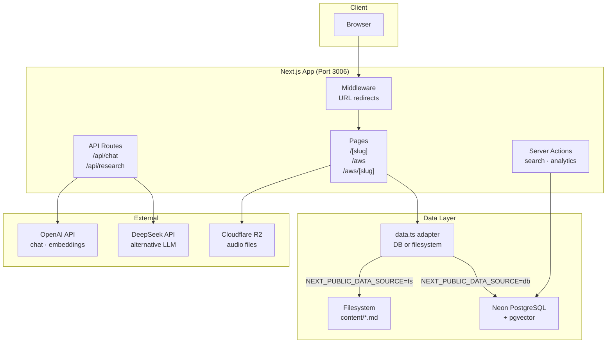

## Database Schema

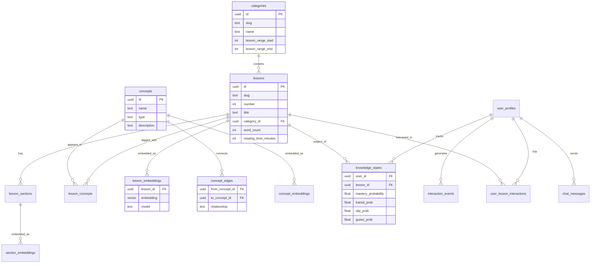

## Data Flow — Lesson Page

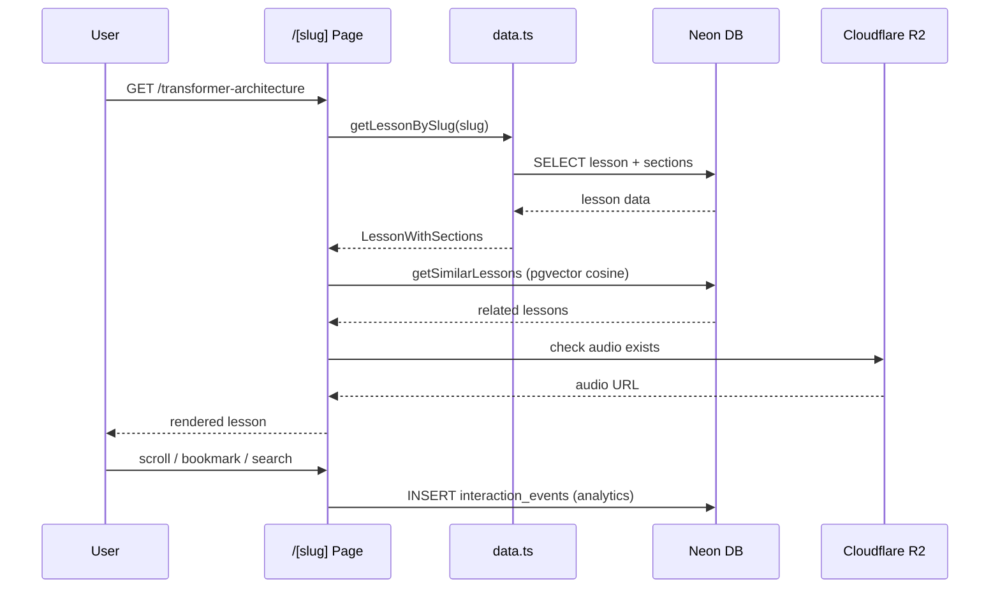

## Data Flow — Chat

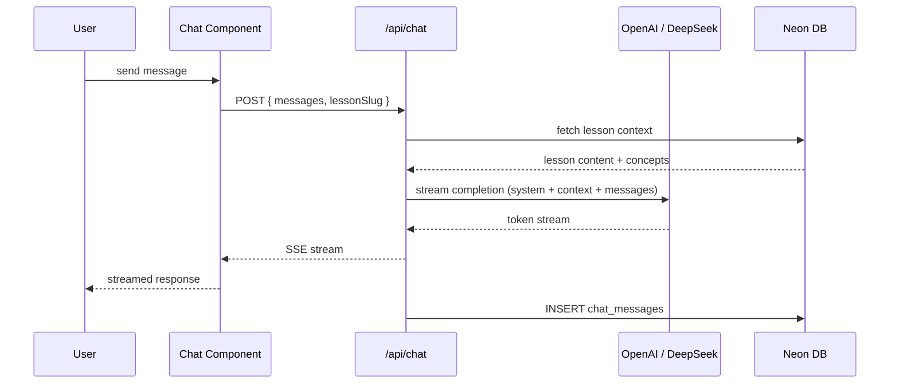

## Knowledge Graph

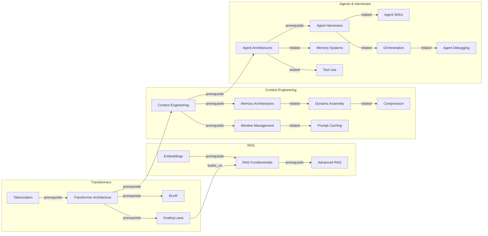

## Eval Pipeline

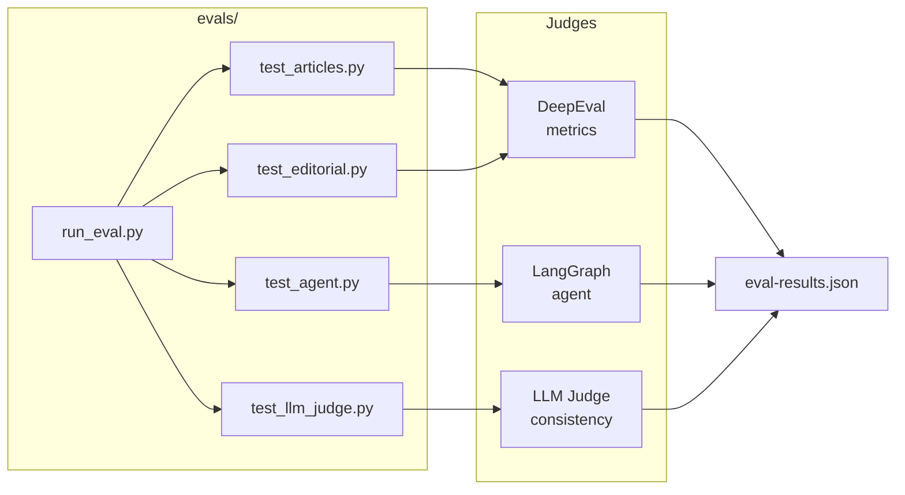

## LangGraph Pipelines

Three LangGraph StateGraphs power the eval and content generation layer.

### Editorial Pipeline

Fan-out research to three specialists in parallel, fan-in to writer, then editor revision loop (max 2 rounds). Supports optional MemorySaver checkpointing for resumable runs.

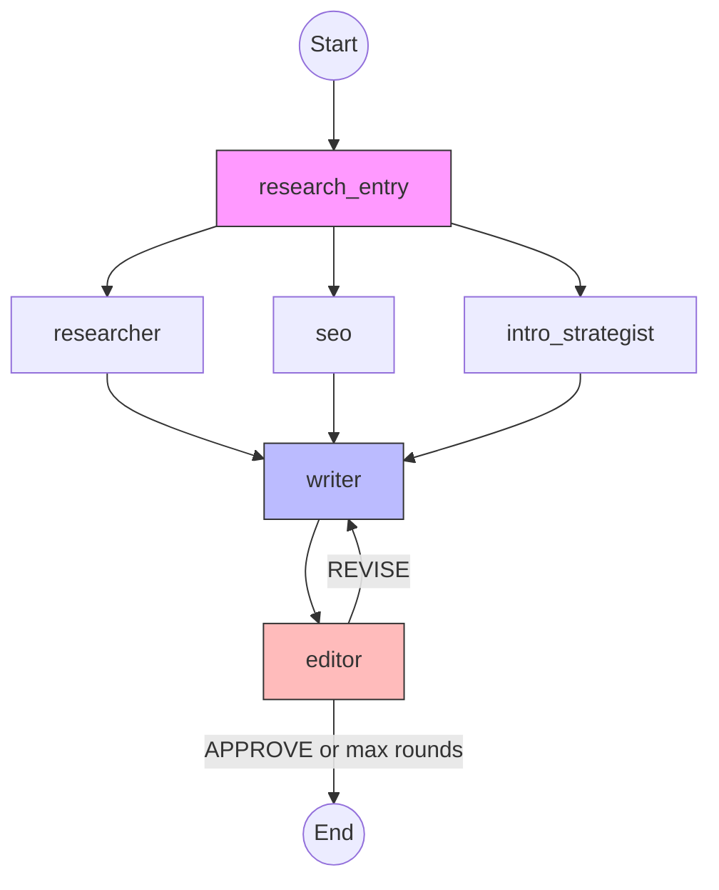

### Red-Team Orchestrator

Plans attacks from a profile, fans out via `Send()` to parallel workers with retry, collects results via `operator.add` reducer, and generates a report.

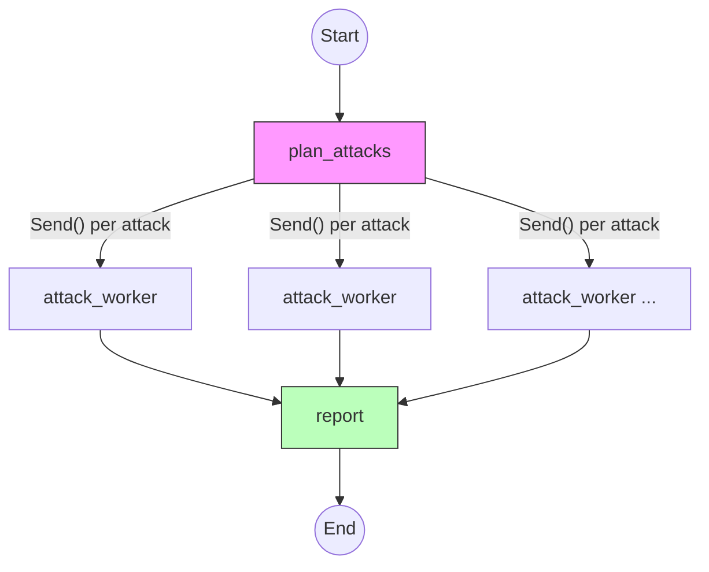

### Crescendo Multi-Turn Attack

Cyclic graph for escalating multi-turn attacks. Sends progressively adversarial prompts and evaluates after each turn.

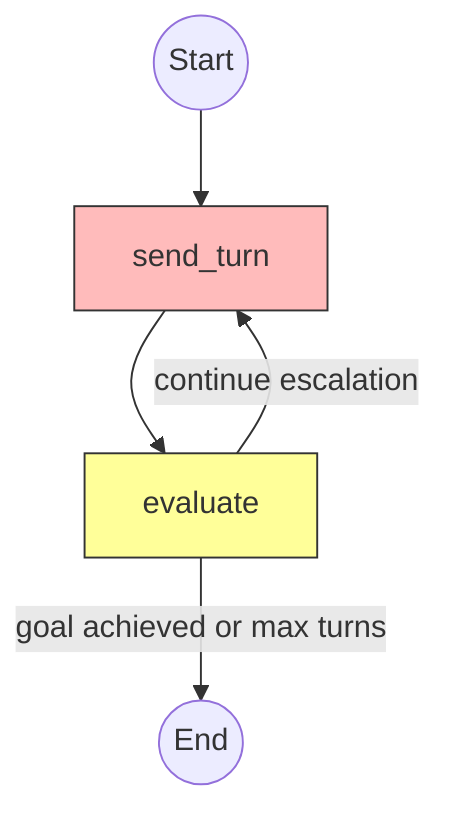

### Content Generation Pipeline

Sequential graph that generates knowledge base articles from a topic slug. Uses DeepSeek Reasoner (local or remote) through four LLM passes.

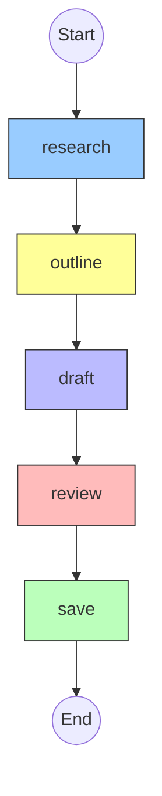

### RAG Pipeline

Query routing classifies intent (keyword vs conceptual), then retrieves via the best method (FTS/vector/hybrid), formats context, and generates an answer.

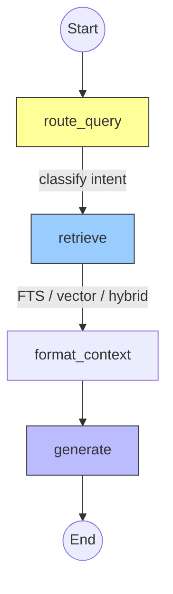

## Directory Structure

```
apps/knowledge/
├── app/                    # Next.js App Router
│   ├── [slug]/page.tsx     # Lesson pages (SSG) — non-AWS slugs only
│   ├── aws/page.tsx        # AWS hub page (/aws)
│   ├── aws/[slug]/page.tsx # AWS deep-dive pages (/aws/lambda-serverless, etc.)
│   ├── api/chat/           # Streaming chat endpoint
│   └── api/research/       # Research endpoints
├── components/             # React components
│   ├── search.tsx          # Cmd+K full-text search
│   ├── audio-player.tsx    # TTS audio playback
│   ├── toc.tsx             # Auto-generated ToC
│   └── ...
├── content/                # 88 markdown lesson files
├── src/db/
│   ├── index.ts            # Neon serverless client
│   └── schema.ts           # Drizzle schema (19 tables, incl. external_courses + lesson_courses for Class Central)
├── lib/
│   ├── articles.ts         # Lesson data layer — Lesson interface includes url field;
│   │                       # exports AWS_DEEP_DIVE_SLUGS and getUrlPath()
│   ├── data.ts             # DB/filesystem adapter — re-exports AWS_DEEP_DIVE_SLUGS, getUrlPath
│   ├── db/queries.ts       # DB query layer
│   └── actions/            # Server actions
├── backend/                # LangGraph content generation (Python)
│   ├── graph/              # research → outline → draft → review → quality_check [→ revise] → save
│   └── tests/              # 33 pytest tests
├── evals/                  # Python eval suite (DeepEval)
├── scripts/seed.ts         # DB seeder (lessons from markdown)
├── scripts/seed-courses.ts # Class Central course catalog seeder
└── sql/setup.sql           # Neon setup (FTS, RPCs, mat views)
```

## Dev

```bash
pnpm dev          # start on :3006
pnpm db:push      # sync schema to Neon
pnpm db:studio    # open Drizzle Studio
pnpm seed         # seed DB from markdown files
pnpm seed:courses # seed Class Central course catalog
pnpm generate -- prompt-caching            # generate article via LangGraph
pnpm generate:dry -- prompt-caching        # preview without saving
pnpm generate -- prompt-caching --model deepseek-reasoner  # use specific model
pnpm generate:missing                      # list articles without content files
pnpm generate:batch                        # generate all missing articles
pnpm generate:test                         # run backend pytest suite (33 tests)
pnpm eval         # run all evals
pnpm eval:agent   # test agent behavior only
```

### Environment

```env
DATABASE_URL=           # Neon connection string
OPENAI_API_KEY=
DEEPSEEK_API_KEY=
NEXT_PUBLIC_R2_DOMAIN=  # audio CDN domain
WORKER_URL=             # Cloudflare Worker endpoint
NEXT_PUBLIC_DATA_SOURCE= # "db" | "fs"
```
