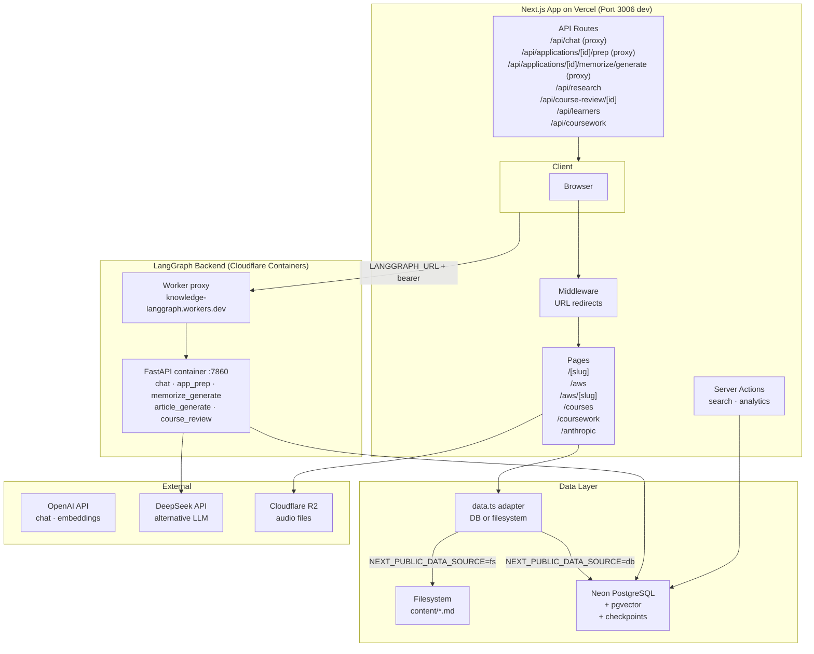
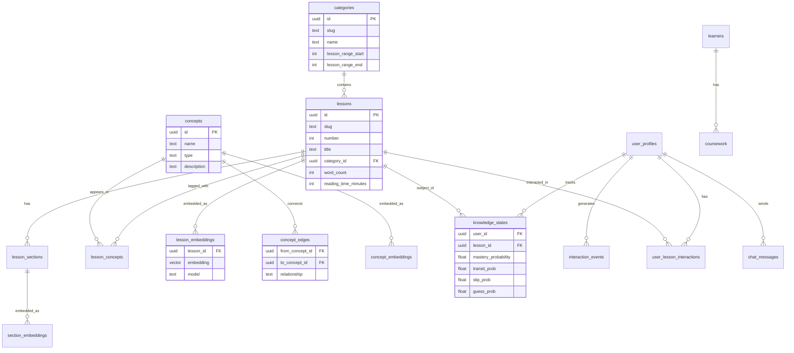
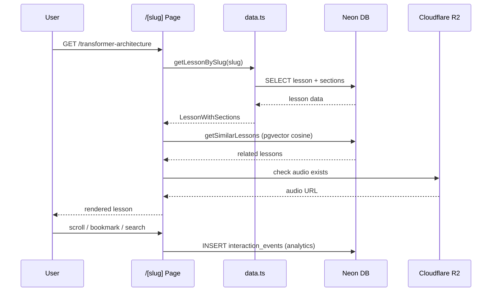
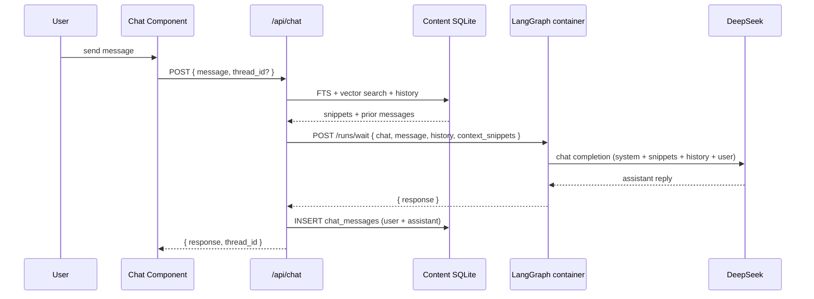
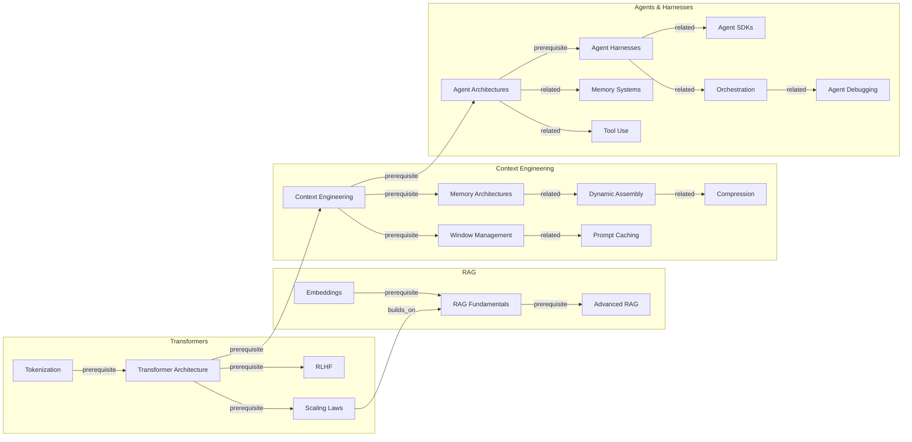
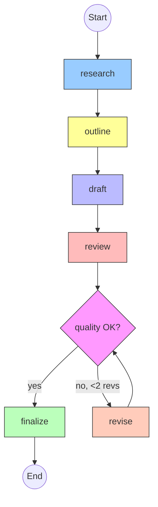
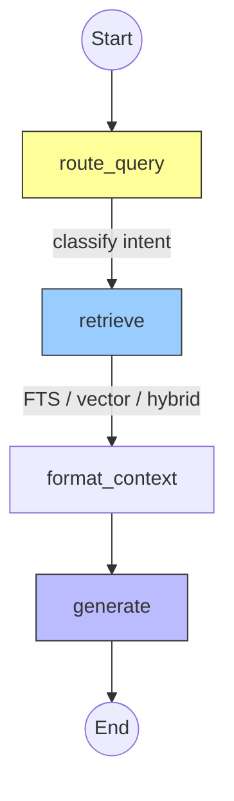
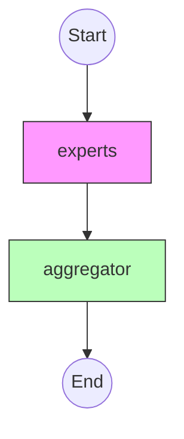

# Knowledge

AI engineering educational platform — 88 lessons across 14 categories with search, audio, knowledge graphs, and learning analytics.

## Stack

- **Framework**: Next.js 15 (App Router, Turbopack)
- **Database**: Neon PostgreSQL + pgvector
- **ORM**: Drizzle ORM
- **UI**: Radix UI Themes
- **AI**: OpenAI, DeepSeek
- **LangGraph backend**: Python FastAPI + LangGraph on Cloudflare Containers (`backend/`) — hosts all 5 graphs (`chat`, `app_prep`, `memorize_generate`, `article_generate`, `course_review`); `AsyncPostgresSaver` checkpointing on Neon
- **File Storage**: Cloudflare R2
- **Deployment**: Vercel (Next.js frontend) + Cloudflare Containers (LangGraph backend)

## Architecture



## Database Schema



## Data Flow — Lesson Page



## Data Flow — Chat



## Knowledge Graph



## LangGraph Pipelines

### Content Generation Pipeline

LangGraph graph (`backend/knowledge_agent/article_generate_graph.py`, `assistant_id: article_generate`) generates knowledge base articles from a topic slug. Uses DeepSeek through five LLM passes, with a conditional revision loop (max 2) gated by quality checks (word count, code blocks, cross-refs). Catalog context (related topics, existing articles, style sample) is resolved by the Next.js caller via `lib/article-catalog.ts` and passed as input — the container has no filesystem access to the repo.



### RAG Pipeline

Query routing classifies intent (keyword vs conceptual), then retrieves via the best method (FTS/vector/hybrid), formats context, and generates an answer.



### Course Review Pipeline

LangGraph graph (`backend/knowledge_agent/course_review_graph.py`, `assistant_id: course_review`) running ten expert evaluators concurrently via `asyncio.gather` (pedagogy, technical accuracy, content depth, practical application, instructor clarity, curriculum fit, prerequisites, AI domain relevance, community health, value proposition — at `REASONER_TEMP=0` or `FAST_TEMP=0.3` each), then an aggregator step computes a weighted score and verdict. Prompts ported verbatim from the prior Mastra workflow so output shape is unchanged.



## Directory Structure

```
apps/knowledge/
├── app/                    # Next.js App Router
│   ├── [slug]/page.tsx     # Lesson pages (SSG) — non-AWS slugs only
│   ├── aws/page.tsx        # AWS hub page (/aws)
│   ├── aws/[slug]/page.tsx # AWS deep-dive pages (/aws/lambda-serverless, etc.)
│   ├── anthropic/page.tsx  # Claude Partner Network learning path (static)
│   ├── anthropic/agent-skills/page.tsx       # "Introduction to agent skills" course overview
│   ├── anthropic/agent-skills/[lesson]/page.tsx  # Per-lesson view (static, sourced from lessons.ts)
│   ├── anthropic/claude-api/page.tsx         # "Building with the Claude API" course overview
│   ├── anthropic/claude-api/[lesson]/page.tsx    # Per-lesson view (static, sourced from lessons.ts)
│   ├── api/chat/           # Streaming chat endpoint
│   ├── api/research/       # Research endpoints
│   ├── api/course-review/[id]/  # GET fetch review · POST upsert AI review
│   ├── api/learners/       # CRUD for managed learners
│   ├── api/coursework/     # GET list coursework files
│   └── api/coursework/upload/  # FormData upload to Cloudflare R2
├── components/             # React components
│   ├── search.tsx          # Cmd+K full-text search
│   ├── audio-player.tsx    # TTS audio playback
│   ├── toc.tsx             # Auto-generated ToC
│   └── ...
├── content/                # 88 markdown lesson files
├── src/db/
│   ├── index.ts            # Neon serverless client
│   └── schema.ts           # Drizzle schema (22 tables, incl. learners, coursework, external_courses[+topic_group], lesson_courses, course_reviews)
├── src/lib/langgraph-client.ts       # Typed POST /runs/wait client (chat, runAppPrep, runMemorizeGenerate, runArticleGenerate, runCourseReview)
├── lib/article-catalog.ts            # Catalog helpers used by generate-article CLI (slugs, categories, related topics, style sample)
├── backend/                # Python FastAPI + LangGraph on Cloudflare Containers
│   ├── wrangler.jsonc      # Worker + KnowledgeContainer (standard-1 on :7860)
│   ├── Dockerfile          # python:3.12-slim, uvicorn --workers 1
│   ├── requirements.txt    # fastapi, langgraph, langgraph-checkpoint-postgres, psycopg[binary]
│   ├── app.py              # FastAPI harness — /health + /runs/wait, bearer-token middleware
│   ├── src/index.js        # Cloudflare Worker proxying to KnowledgeContainer
│   ├── package.json        # wrangler deploy script
│   └── knowledge_agent/
│       ├── llm.py                       # make_llm() + ainvoke_json() shared helpers
│       ├── state.py                     # TypedDict schemas for all 5 graph states
│       ├── chat_graph.py                # RAG chat — retrieval stays in Next.js, graph runs LLM
│       ├── app_prep_graph.py            # Derive tech_stack + interview_questions from jobDescription
│       ├── memorize_generate_graph.py   # Per-tech fan-out flashcards (8 primary, 4 secondary)
│       ├── article_generate_graph.py    # Knowledge-base article writer (research → outline → draft → review → revise)
│       ├── course_review_graph.py       # 10 parallel experts + weighted aggregator
│       └── course_review_prompts.py     # 10 expert system prompts + aggregator prompt
├── lib/
│   ├── articles.ts         # Lesson data layer — Lesson interface includes url field;
│   │                       # exports AWS_DEEP_DIVE_SLUGS and getUrlPath()
│   ├── data.ts             # DB/filesystem adapter — re-exports AWS_DEEP_DIVE_SLUGS, getUrlPath
│   ├── db/queries.ts       # DB query layer
│   ├── r2.ts               # Cloudflare R2 upload/delete helpers
│   └── actions/            # Server actions
├── scripts/seed.ts                 # DB seeder (lessons from markdown)
├── scripts/seed-courses.ts         # Udemy course catalog seeder
├── scripts/scrape-udemy-courses.ts # Playwright scraper — deep-scrapes Udemy topic pages into external_courses
├── scripts/generate-article.ts     # Mastra article generator CLI
├── scripts/review-courses.ts       # Mastra 10-expert course reviewer CLI
├── sql/setup.sql           # Neon setup (FTS, RPCs, mat views)
└── sql/add_course_reviews.sql  # course_reviews table (10-expert scores, verdict, aggregate)
```

## Dev

```bash
pnpm dev          # start on :3006
pnpm db:push      # sync schema to Neon
pnpm db:studio    # open Drizzle Studio
pnpm seed         # seed DB from markdown files
pnpm seed:courses # seed Udemy course catalog
pnpm scrape:udemy # scrape 20+ AI/ML Udemy topics → external_courses (with topic_group classification)
pnpm generate prompt-caching               # generate article via LangGraph (backend/)
pnpm generate:dry prompt-caching           # preview without saving
pnpm generate prompt-caching --model deepseek-reasoner  # use specific model
pnpm generate:missing                      # list articles without content files
pnpm generate:batch                        # generate all missing articles
pnpm generate:graph                        # print workflow as Mermaid

# Batch-review unreviewed courses (calls course_review graph):
pnpm review:courses                             # review up to 5 courses
pnpm review:courses --limit=10
pnpm review:courses --provider="DeepLearning.AI"
pnpm review:courses:dry                         # preview without calling the pipeline

# Backend (LangGraph container) scripts — run from apps/knowledge/:
pnpm backend:dev                                # uvicorn --reload on :7860 (needs .env in backend/)
pnpm backend:deploy                             # wrangler deploy from backend/
pnpm backend:tail                               # live wrangler tail
```

### LangGraph backend (`backend/`)

```bash
# Local dev (run against local Python)
cd backend
python -m venv .venv && source .venv/bin/activate
pip install -r requirements.txt
uvicorn app:app --host 0.0.0.0 --port 7860 --reload

# Local dev via Docker
docker build -t knowledge-langgraph .
docker run --env-file .env -p 7860:7860 knowledge-langgraph

# Deploy to Cloudflare Containers
wrangler deploy              # or: pnpm deploy (from backend/)
wrangler secret put DATABASE_URL
wrangler secret put DEEPSEEK_API_KEY
wrangler secret put LANGGRAPH_AUTH_TOKEN
wrangler tail                # live logs
```

Once deployed, set `LANGGRAPH_URL` + `LANGGRAPH_AUTH_TOKEN` in the Next.js Vercel environment so `/api/chat`, `/api/applications/[id]/prep`, and `/api/applications/[id]/memorize/generate` route to the container.

### Environment

```env
DATABASE_URL=           # Neon connection string (also used by backend container)
OPENAI_API_KEY=
DEEPSEEK_API_KEY=
LANGGRAPH_URL=          # http://127.0.0.1:7860 locally; workers.dev URL in prod
LANGGRAPH_AUTH_TOKEN=   # bearer token shared between Next.js and backend
NEXT_PUBLIC_R2_DOMAIN=  # audio CDN domain
WORKER_URL=             # Cloudflare Worker endpoint
NEXT_PUBLIC_DATA_SOURCE= # "db" | "fs"
R2_ACCOUNT_ID=           # Cloudflare R2
R2_ACCESS_KEY_ID=
R2_SECRET_ACCESS_KEY=
R2_BUCKET_NAME=          # defaults to "knowledge"
```
