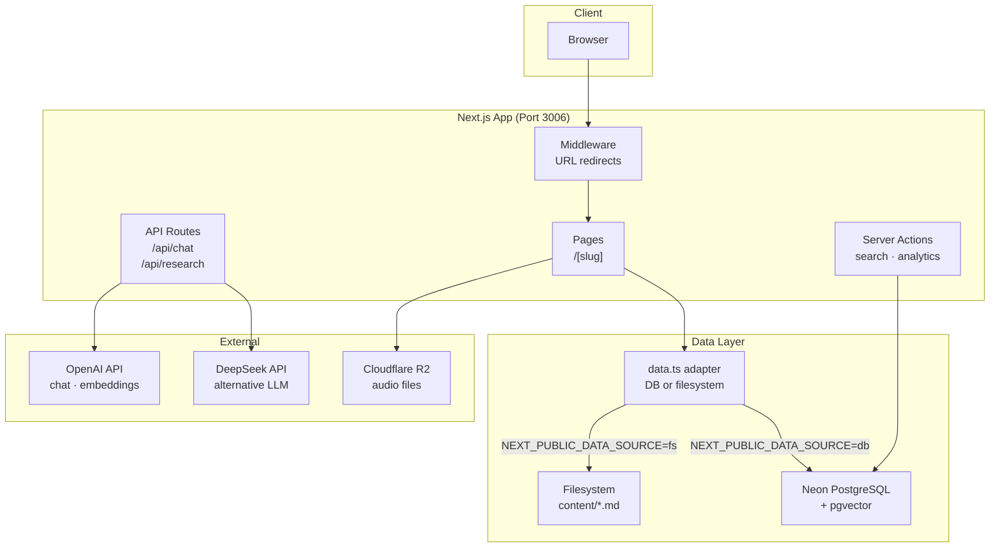
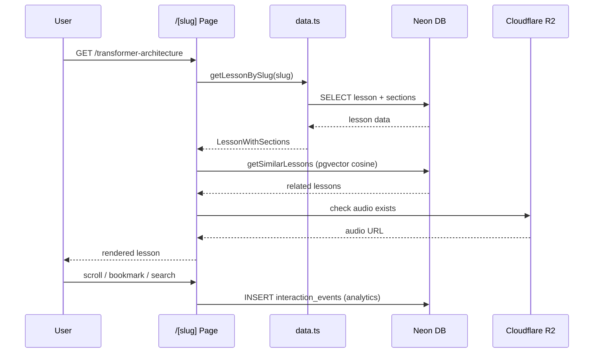
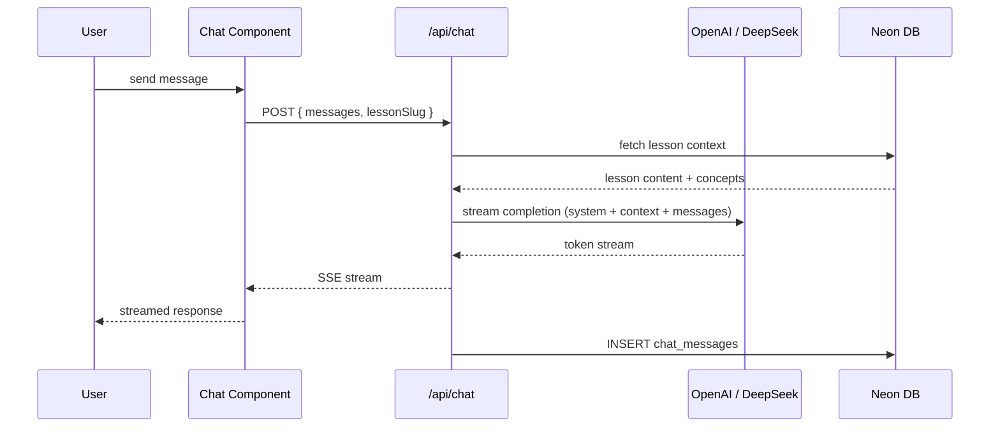
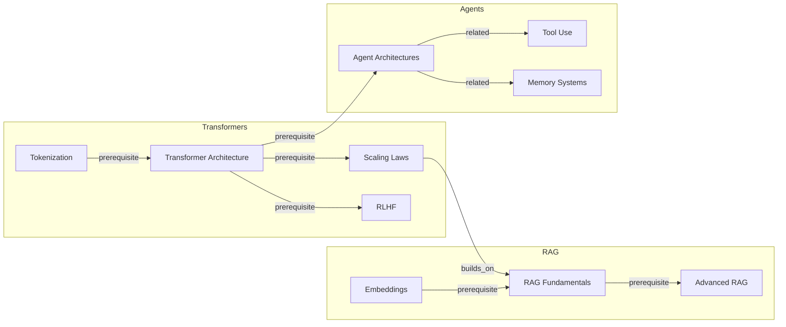
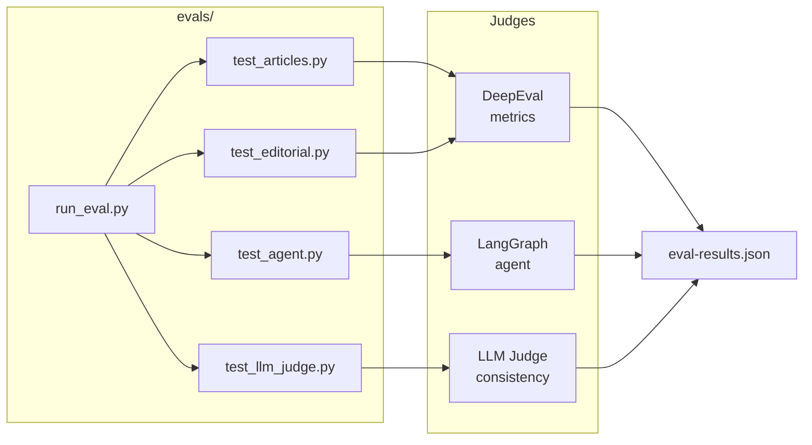

# Knowledge

AI engineering educational platform — 55 lessons across 7 categories with search, audio, knowledge graphs, and learning analytics.

## Stack

- **Framework**: Next.js 15 (App Router, Turbopack)
- **Database**: Neon PostgreSQL + pgvector
- **ORM**: Drizzle ORM
- **UI**: Radix UI Themes
- **AI**: OpenAI, DeepSeek
- **Deployment**: Vercel

## Architecture



## Database Schema


## Data Flow — Lesson Page



## Data Flow — Chat



## Knowledge Graph



## Eval Pipeline



## Directory Structure

```
apps/knowledge/
├── app/                    # Next.js App Router
│   ├── [slug]/page.tsx     # Lesson pages (SSG)
│   ├── api/chat/           # Streaming chat endpoint
│   └── api/research/       # Research endpoints
├── components/             # React components
│   ├── search.tsx          # Cmd+K full-text search
│   ├── audio-player.tsx    # TTS audio playback
│   ├── toc.tsx             # Auto-generated ToC
│   └── ...
├── content/                # 55 markdown lesson files
├── src/db/
│   ├── index.ts            # Neon serverless client
│   └── schema.ts           # Drizzle schema (17 tables)
├── lib/
│   ├── data.ts             # DB/filesystem adapter
│   ├── db/queries.ts       # DB query layer
│   └── actions/            # Server actions
├── evals/                  # Python eval suite (DeepEval)
├── scripts/seed.ts         # DB seeder
└── sql/setup.sql           # Neon setup (FTS, RPCs, mat views)
```

## Dev

```bash
pnpm dev          # start on :3006
pnpm db:push      # sync schema to Neon
pnpm db:studio    # open Drizzle Studio
pnpm seed         # seed DB from markdown files
pnpm eval         # run all evals
pnpm eval:agent   # test agent behavior only
```

### Environment

```env
DATABASE_URL=           # Neon connection string
OPENAI_API_KEY=
DEEPSEEK_API_KEY=
NEXT_PUBLIC_R2_DOMAIN=  # audio CDN domain
WORKER_URL=             # Cloudflare Worker endpoint
NEXT_PUBLIC_DATA_SOURCE= # "db" | "fs"
```
