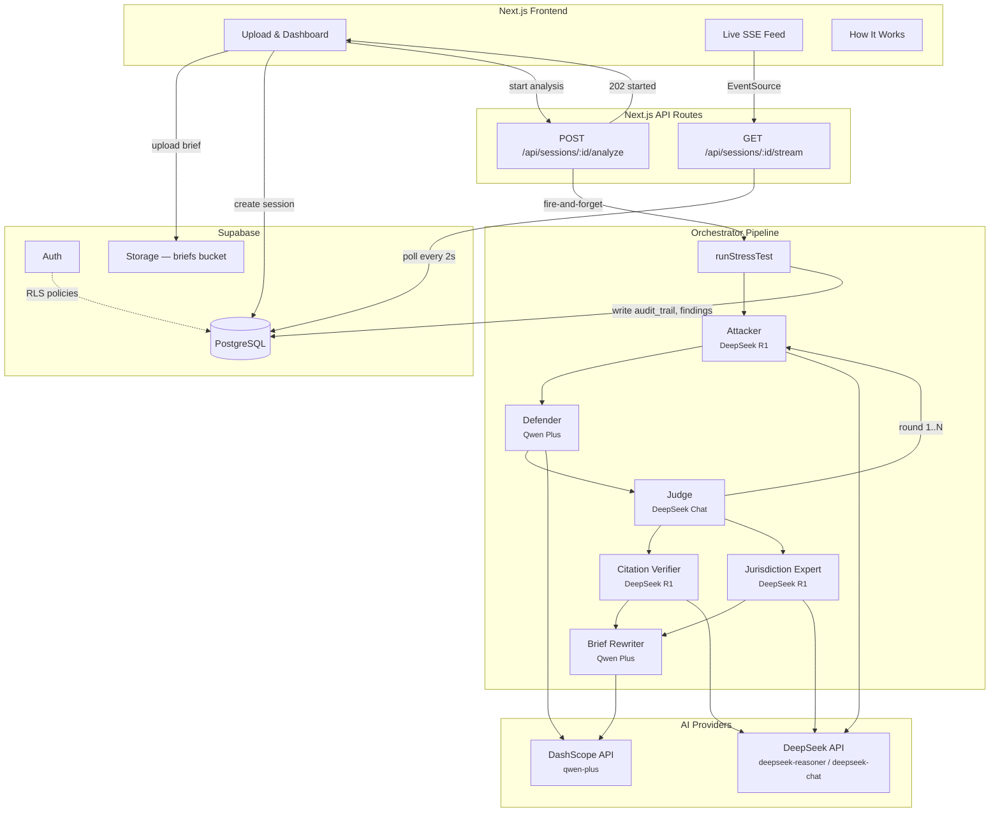
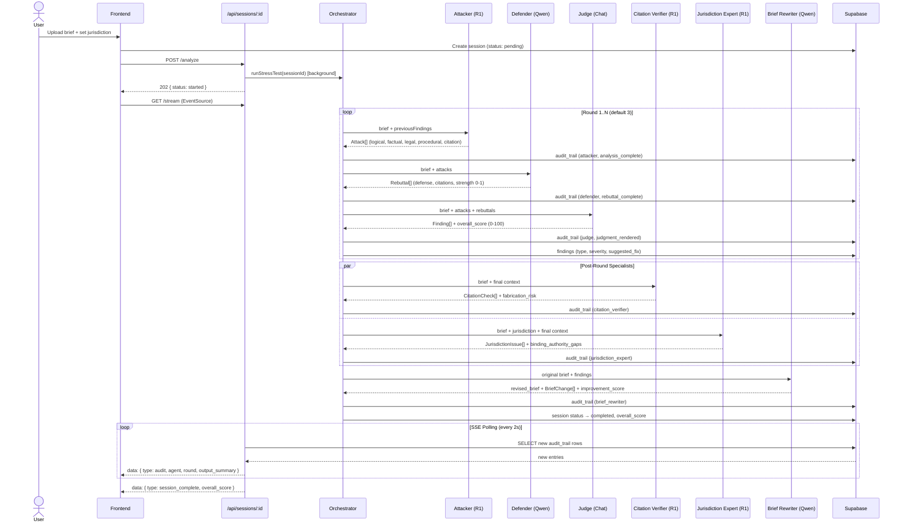

# Brief Stress-Tester

An adversarial AI pipeline that stress-tests legal briefs using a multi-agent debate: an Attacker finds weaknesses, a Defender rebuts them, and a Judge renders findings with severity scores and actionable fixes — followed by specialist agents for citation verification, jurisdiction analysis, and brief rewriting.

## System Architecture



## Pipeline Sequence



## How It Works

### The 6-Agent Pipeline

The orchestrator (`lib/agents/orchestrator.ts`) runs a multi-round adversarial debate followed by specialist analysis. Each agent has a Zod-validated output schema and writes an audit trail entry to the database on completion.

**Round 1..N — Adversarial Debate**

| # | Agent | Model | Role | Output |
|---|-------|-------|------|--------|
| 1 | **Attacker** | DeepSeek R1 (reasoner) | Exhaustive vulnerability analysis — finds logical fallacies, factual gaps, legal misstatements, procedural issues, and citation problems | `Attack[]` with type, description, evidence, severity, confidence |
| 2 | **Defender** | Qwen Plus (DashScope) | Rebuts each attack with counter-authority and honest strength assessment — acknowledges real weaknesses instead of hand-waving | `Rebuttal[]` with defense, supporting_citations, strength (0-1) |
| 3 | **Judge** | DeepSeek Chat | Weighs both sides as a senior federal appellate judge — produces structured findings with severity (critical/high/medium/low) and actionable fixes | `Finding[]` + `overall_score` (0-100) |

Each round passes `previousFindings` to the next, so the Attacker is instructed: *"This is round N. Focus on issues NOT already identified in previous rounds. Dig deeper into subtle weaknesses."*

**Post-Round — Specialist Analysis (parallel)**

| # | Agent | Model | Role | Output |
|---|-------|-------|------|--------|
| 4 | **Citation Verifier** | DeepSeek R1 (reasoner) | Detects fabricated citations, mischaracterized holdings, overruled cases, and inapposite authority — the "Mata v. Avianca" defense | `CitationCheck[]` with status (valid/fabricated/mischaracterized/overruled/distinguished/inapposite), actual_holding, fabrication_risk (0-1) |
| 5 | **Jurisdiction Expert** | DeepSeek R1 (reasoner) | Maps precedent hierarchies, local rules, standards of review, and procedural compliance for the target jurisdiction | `JurisdictionIssue[]` with category, controlling_authority, binding_authority_gaps, procedural_compliance, jurisdiction_fitness (0-100) |

**Post-Specialist — Brief Revision**

| # | Agent | Model | Role | Output |
|---|-------|-------|------|--------|
| 6 | **Brief Rewriter** | Qwen Plus (DashScope) | Produces minimal-intervention revisions addressing every finding — tracked changes with finding references, ready-to-file quality | `revised_brief` + `BriefChange[]` (rewrite/addition/deletion/citation_fix/structural) + improvement_score (0-100) |

### Real-Time Streaming via SSE

The system uses **polling-based Server-Sent Events** for simplicity:

1. `POST /api/sessions/:id/analyze` kicks off `runStressTest()` in the background (fire-and-forget) and returns `202`
2. The client opens an `EventSource` to `GET /api/sessions/:id/stream`
3. The stream endpoint polls the `audit_trail` table every 2 seconds, sending only new entries
4. Each SSE message includes the agent name, action, round number, and output summary
5. When the session status becomes `completed` or `failed`, a final event is sent and the stream closes

```
data: {"type":"audit","agent":"attacker","action":"analysis_complete","round":1,"output_summary":"Found 7 vulnerabilities..."}

data: {"type":"audit","agent":"defender","action":"rebuttal_complete","round":1,"output_summary":"Rebutted 7 attacks..."}

data: {"type":"session_complete","overall_score":72}
```

## Why These Models

| Agent | Model | Rationale |
|-------|-------|-----------|
| Attacker | DeepSeek R1 (reasoner) | Extended chain-of-thought reasoning excels at finding subtle logical, factual, and legal weaknesses in arguments |
| Defender | Qwen Plus | Broad training corpus and strong instruction-following for mounting comprehensive legal defenses with citations |
| Judge | DeepSeek Chat | Balanced, fast inference for weighing both sides impartially and producing structured severity assessments |
| Citation Verifier | DeepSeek R1 (reasoner) | Deep reasoning catches mischaracterized holdings, overruled cases, and fabricated citations |
| Jurisdiction Expert | DeepSeek R1 (reasoner) | Chain-of-thought reasoning maps precedent hierarchies and jurisdiction-specific procedural rules |
| Brief Rewriter | Qwen Plus | Strong instruction-following produces precise, minimal-intervention revisions with tracked changes |

All three providers use `@repo/deepseek` (OpenAI-compatible client). Qwen Plus is accessed via DashScope's compatible endpoint at `dashscope-intl.aliyuncs.com`.

## Evaluation Framework

The project uses [Promptfoo](https://promptfoo.dev) for systematic prompt evaluation:

- **Attacker evals** -- Verify attacks are exhaustive, correctly typed, and cite real legal principles
- **Defender evals** -- Verify rebuttals address each attack, cite valid authority, and self-assess strength honestly
- **Judge evals** -- Verify findings are balanced, severity is calibrated, and fixes are actionable
- **Citation Verifier evals** -- Verify fabrication detection, overruled case identification, and mischaracterization catching
- **Jurisdiction Expert evals** -- Verify jurisdiction-specific analysis depth, binding authority identification, and procedural compliance checking
- **Brief Rewriter evals** -- Verify revisions are legally accurate, minimal-intervention, and address all findings
- **Red-team evals** -- Test prompt injection resistance and adversarial robustness
- **Consistency evals** -- Verify same brief produces consistent scores across runs

Run evals: `npm run test:prompts:all`

## Setup

1. Clone the repo and install dependencies:
   ```bash
   pnpm install
   ```

2. Copy environment variables:
   ```bash
   cp env.example .env.local
   ```

3. Fill in your `.env.local`:
   ```
   NEXT_PUBLIC_SUPABASE_URL=...
   NEXT_PUBLIC_SUPABASE_PUBLISHABLE_KEY=...
   DEEPSEEK_API_KEY=...
   DASHSCOPE_API_KEY=...
   ```

4. Run Supabase migrations:
   ```bash
   npx supabase db push
   ```

5. Start the dev server:
   ```bash
   pnpm dev
   ```

## Testing

```bash
# Unit tests
npm test

# Prompt evals
npm run test:prompts:all
```

## What I Would Build Next

- **RAG with legal embeddings** -- Embed case law databases (CourtListener, Casetext) to ground attacker evidence and defender citations in real precedent rather than model knowledge
- ~~**Citation verification**~~ -- DONE: Citation Verifier agent detects fabricated citations, mischaracterized holdings, and overruled cases
- ~~**Brief diff mode**~~ -- DONE: Brief Rewriter agent generates revised briefs with tracked changes and finding references
- ~~**Multi-jurisdiction comparison**~~ -- DONE: Jurisdiction Expert agent performs deep jurisdiction-specific analysis with binding authority gaps and procedural compliance checking
- **Collaborative sessions** -- Allow multiple attorneys to view the same stress test in real-time, annotate findings, and mark issues as resolved
