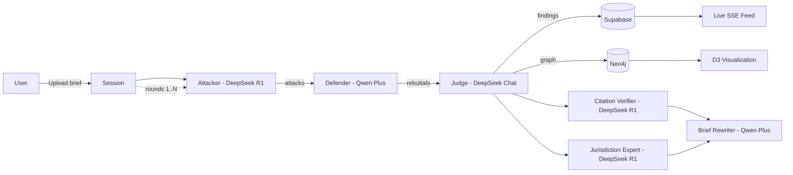

# Brief Stress-Tester

An adversarial AI pipeline that stress-tests legal briefs using a multi-agent debate: an Attacker finds weaknesses, a Defender rebuts them, and a Judge renders findings with severity scores and actionable fixes.

## Architecture



## Why These Models

| Agent | Model | Rationale |
|-------|-------|-----------|
| Attacker | DeepSeek R1 (reasoner) | Extended chain-of-thought reasoning excels at finding subtle logical, factual, and legal weaknesses in arguments |
| Defender | Qwen Plus | Broad training corpus and strong instruction-following for mounting comprehensive legal defenses with citations |
| Judge | DeepSeek Chat | Balanced, fast inference for weighing both sides impartially and producing structured severity assessments |
| Citation Verifier | DeepSeek R1 (reasoner) | Deep reasoning catches mischaracterized holdings, overruled cases, and fabricated citations |
| Jurisdiction Expert | DeepSeek R1 (reasoner) | Chain-of-thought reasoning maps precedent hierarchies and jurisdiction-specific procedural rules |
| Brief Rewriter | Qwen Plus | Strong instruction-following produces precise, minimal-intervention revisions with tracked changes |

## Why Neo4j for Argument Graphs

Legal arguments form a directed graph: claims support or attack other claims, evidence nodes back assertions, and judicial findings reference both sides. A property graph database captures these relationships naturally, enabling queries like "find all undefended critical attacks" or "trace the evidence chain for a specific finding." The D3 force-directed visualization renders this graph interactively with color-coded nodes (red = attacker, blue = defender, gold = judge) and typed edges (dashed red = attacks, solid green = supports).

## Evaluation Framework

The project uses [Promptfoo](https://promptfoo.dev) for systematic prompt evaluation:

- **Attacker evals** -- Verify attacks are exhaustive, correctly typed, and cite real legal principles
- **Defender evals** -- Verify rebuttals address each attack, cite valid authority, and self-assess strength honestly
- **Judge evals** -- Verify findings are balanced, severity is calibrated, and fixes are actionable
- **Citation Verifier evals** -- Verify fabrication detection, overruled case identification, and mischaracterization catching
- **Jurisdiction Expert evals** -- Verify jurisdiction-specific analysis depth, binding authority identification, and procedural compliance checking
- **Brief Rewriter evals** -- Verify revisions are legally accurate, minimal-intervention, and address all findings
- **Red-team evals** -- Test prompt injection resistance and adversarial robustness
- **Consistency evals** -- Verify same brief produces consistent scores across runs

Run evals: `npm run test:prompts:all`

## Setup

1. Clone the repo and install dependencies:
   ```bash
   pnpm install
   ```

2. Copy environment variables:
   ```bash
   cp env.example .env.local
   ```

3. Fill in your `.env.local`:
   ```
   NEXT_PUBLIC_SUPABASE_URL=...
   NEXT_PUBLIC_SUPABASE_PUBLISHABLE_KEY=...
   NEO4J_URI=bolt://localhost:7687
   NEO4J_USER=neo4j
   NEO4J_PASSWORD=...
   DEEPSEEK_API_KEY=...
   DASHSCOPE_API_KEY=...
   ```

4. Run Supabase migrations:
   ```bash
   npx supabase db push
   ```

5. Start the dev server:
   ```bash
   pnpm dev
   ```

## Testing

```bash
# Unit tests
npm test

# Prompt evals
npm run test:prompts:all
```

## What I Would Build Next

- **RAG with legal embeddings** -- Embed case law databases (CourtListener, Casetext) to ground attacker evidence and defender citations in real precedent rather than model knowledge
- ~~**Citation verification**~~ -- DONE: Citation Verifier agent detects fabricated citations, mischaracterized holdings, and overruled cases
- ~~**Brief diff mode**~~ -- DONE: Brief Rewriter agent generates revised briefs with tracked changes and finding references
- ~~**Multi-jurisdiction comparison**~~ -- DONE: Jurisdiction Expert agent performs deep jurisdiction-specific analysis with binding authority gaps and procedural compliance checking
- **Collaborative sessions** -- Allow multiple attorneys to view the same stress test in real-time, annotate findings, and mark issues as resolved
