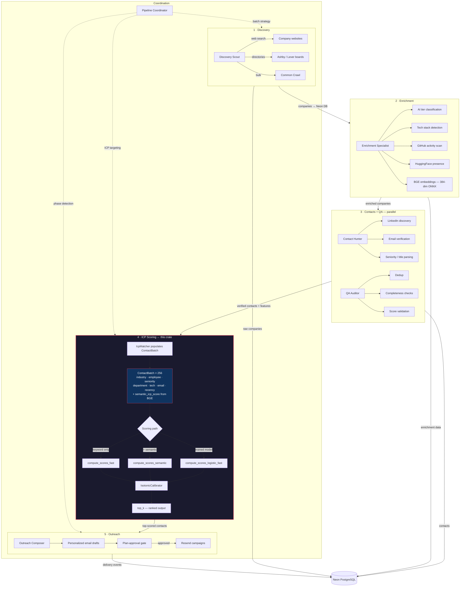
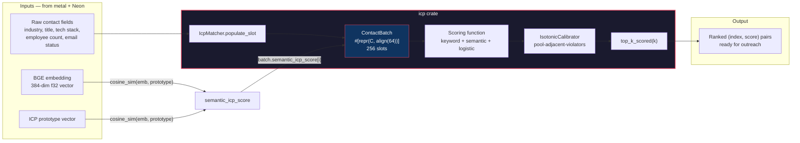
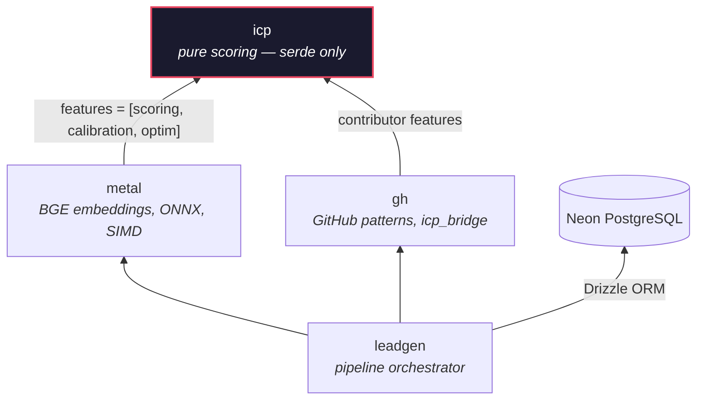

# icp

Ideal Customer Profile scoring engine for the B2B lead generation pipeline. Pure numerical library — no ML frameworks, no network calls, no vector stores. Takes pre-computed features in, outputs calibrated scores.

## Full sales pipeline



### Stage breakdown

| Stage | Agent | What happens | Storage |
|---|---|---|---|
| **Discovery** | Discovery Scout | Web search, directories, Ashby/Lever boards, Common Crawl bulk import | Raw companies → Neon |
| **Enrichment** | Enrichment Specialist | AI tier, tech stack, GitHub repos, HF models, ATS detection, BGE embeddings (384-dim, ONNX Runtime, NEON SIMD) | Enrichment data → Neon |
| **Contacts** | Contact Hunter | LinkedIn scraping, email discovery, catch-all detection, verification (parallel with QA) | Contacts → Neon |
| **QA Audit** | QA Auditor | Dedup, completeness, deliverability, score validation (parallel with Contacts) | Flags → Neon |
| **ICP Scoring** | `icp` crate (this) + `metal` | `IcpMatcher` populates `ContactBatch`, `metal` fills `semantic_icp_score` from BGE, scoring + calibration + top-k ranking | Scores → Neon |
| **Outreach** | Outreach Composer | Personalized emails via Resend, requires plan-approval before sending | Campaigns → Neon |

### Data flow through this crate



### Crate dependency graph



### Where this crate fits

The `metal` crate depends on `icp` with `features = ["scoring", "calibration", "optim"]` and re-exports its types. It populates `ContactBatch` slots from enriched data and fills `semantic_icp_score` from BGE embeddings before calling the scoring functions. The `icp` crate never touches the network, the database, or any ML framework — it is pure f32 arithmetic on cache-aligned arrays.

## Features

| Feature | Default | Contents |
|---|---|---|
| `scoring` | yes | `ContactBatch`, `IcpMatcher`, `LogisticScorer` |
| `calibration` | no | `IsotonicCalibrator` (pool-adjacent-violators) |
| `optim` | no | Grid search, SGD, Adam, threshold sweep, full `optimize()` pipeline |
| `contributor` | no | 13-feature extraction trait for GitHub contributor scoring |

## Modules

### `criteria` — ICP definitions

- **`IcpCriteria`** — target profile: industries, employee range, seniorities, departments, tech stack, locations, funding stages, GitHub signals (stars, repos, languages, activity)
- **`IcpWeights`** — 6 tunable weights for the weighted scoring formula (industry 25, seniority 25, employee 15, department 15, tech 10, email 5)
- **`CompanyIcpWeights`** — 19-feature company-level scoring (AI tier, GitHub AI score, HF presence, intent score, DM contacts, consultancy penalty, etc.)

### `scoring` — batch contact scoring

**`ContactBatch`** — cache-aligned (`#[repr(C, align(64))]`) struct-of-arrays for 256 contacts. Each contact is decomposed into parallel arrays for SIMD-friendly access:

```rust
pub struct ContactBatch {
    pub industry_match:    [u8; 256],
    pub employee_in_range: [u8; 256],
    pub seniority_match:   [u8; 256],
    pub department_match:  [u8; 256],
    pub tech_overlap:      [u8; 256],    // 0–10 fuzzy match
    pub email_verified:    [u8; 256],    // 0=unknown, 1=catch-all, 2=verified
    pub recency_days:      [u16; 256],
    pub semantic_icp_score:[f32; 256],   // filled externally by metal/BGE
    pub scores:            [f32; 256],   // output
    pub count: usize,
}
```

Four scoring paths, from simple to production:

| Method | What it does |
|---|---|
| `compute_scores_with(weights)` | Weighted sum + stepped recency bonus |
| `compute_scores_fast(weights)` | Same formula, prefetch 16 slots ahead |
| `compute_scores_semantic(weights, semantic_weight)` | Blends keyword + semantic tech overlap |
| `compute_scores_logistic_fast(scorer)` | Logistic regression with semantic, prefetched |

**`IcpMatcher`** — populates `ContactBatch` slots from raw strings (industry, seniority, title, tech stack, email status). Default targets: AI/ML/SaaS/infrastructure companies, 20–500 employees, VP/Director/CTO seniority.

**`LogisticScorer`** — 7-feature logistic regression with optional semantic weight. Ships with `default_pretrained()` weights. Supports `fit()` for online learning from labeled data.

### `calibration` — probability calibration

**`IsotonicCalibrator`** — non-parametric isotonic regression (pool-adjacent-violators algorithm). Guarantees monotonic output. Applied after scoring to convert raw scores into well-calibrated probabilities.

### `optim` — weight optimization

Full optimization pipeline for tuning ICP weights from labeled data:

1. **Grid search** — exhaustive 6D search over ICP weights (4,096 combinations with default grid `[5, 15, 25, 35]`)
2. **SGD refinement** — trains `LogisticScorer` weights via gradient descent with learning rate decay
3. **Threshold sweep** — finds optimal classification threshold by maximizing F1 score (10%–90%)
4. **Calibration** — fits `IsotonicCalibrator` on the trained scorer's outputs

Also provides standalone optimizers:
- **`MomentumSGD`** — SGD with momentum and L2 regularization, 4-wide loop unrolling
- **`AdamOptimizer`** — full Adam with bias correction, 4-wide loop unrolling

### `contributor` — GitHub contributor features

**`ContributorFeatureSource`** trait with 13 features: rising score, contribution density, novelty, breadth, realness, log-followers, log-repos, log-AI-repos, recency, 90-day contributions, strength, skill match, contribution quality. All normalized to [0, 1].

### `math` — numerical primitives

- `fast_sigmoid(x)` — bit-manipulation approximation, <2% error, branchless in [-6, 6]
- `sigmoid(x)` — exact, clamped to [-88, 88]
- `smooth_recency(days)` — exponential decay: `e^(-0.015 * days)`
- `WelfordStats` — online mean/variance (Welford's algorithm), used for feature normalization
- `clip_gradients(grads, max_norm)` — L2 gradient clipping
- `cosine_annealing(lr, step, total)` — learning rate schedule
- `prefetch_read(ptr)` — x86_64 `_mm_prefetch` / fallback volatile read

## Usage

```rust
use icp::{IcpMatcher, ContactBatch, IcpWeights, LogisticScorer};

// Populate a batch
let matcher = IcpMatcher::default();
let mut batch = ContactBatch::new();
batch.count = 1;
matcher.populate_slot(
    &mut batch, 0,
    "AI Infrastructure", 200, "CTO", "Engineering",
    "rust, python, pytorch", "verified", 3,
);

// Score with default weights
batch.compute_scores();
assert!(batch.scores[0] > 80.0);

// Or use pre-trained logistic model
let scorer = LogisticScorer::default_pretrained();
batch.compute_scores_logistic_fast(&scorer);

// Get top results
let top = batch.top_k_scored(10);
```

## Design decisions

**Why no Candle / ONNX / embedding models?** This crate is a pure scoring library. The `semantic_icp_score` field is a slot filled by the `metal` crate's BGE embedder (384-dim, ONNX Runtime, NEON SIMD). Keeping embedding generation out of the scorer preserves single responsibility and avoids pulling ~40 transitive dependencies into the scoring hot path.

**Why no LanceDB / vector store?** Scoring is stateless batch computation. The `metal` crate has its own `EmbeddingIndex` (mmap INT8, optimized for M1's 8MB SLC cache) for persistent vector storage. Adding a vector database here would duplicate that and introduce async runtime dependencies.

**Why struct-of-arrays?** Cache line utilization. When scoring 256 contacts, iterating over `industry_match[0..256]` touches contiguous memory. An array-of-structs layout would scatter each field across cache lines. The 64-byte alignment matches L1 cache lines on ARM (M1).
