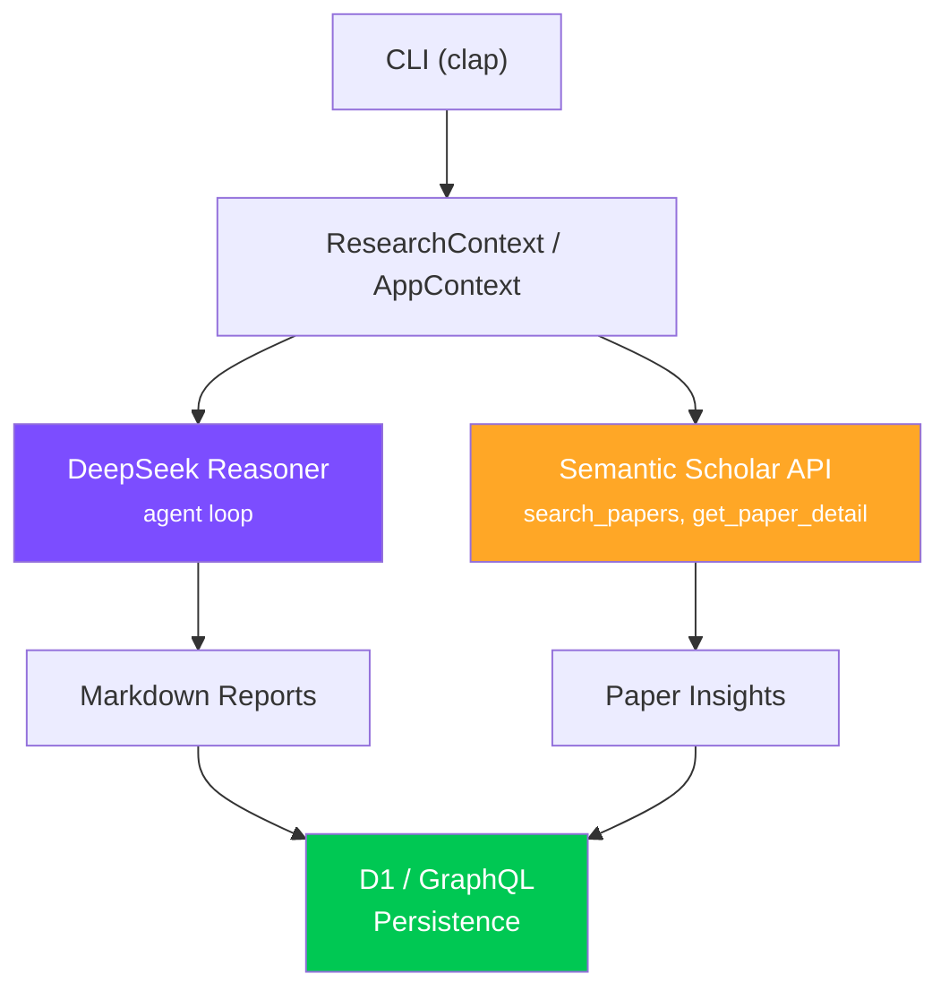

# job-prep

Interview prep, agentic coding training, and job market research via DeepSeek + Semantic Scholar.

## Architecture



The agent builds a DeepSeek Reasoner tool-use loop with Semantic Scholar paper search and detail tools from the shared `research` crate. Results are persisted to the lead-gen app via D1 or GraphQL depending on the invocation mode.

## Modules

| Module | Purpose |
|--------|---------|
| `app_context` | Application context — resolves app ID from URL or direct ID, GraphQL endpoint discovery |
| `backend` | Backend integration for persisting research results |
| `d1` | Cloudflare D1 database client for direct persistence |
| `deep_research` | Dual-model deep research workflows (DeepSeek Reasoner + Qwen Max in parallel) |
| `enhance` | Company/application enrichment — spawns parallel agents for agentic coding analysis |
| `prompts` | Domain-specific research prompts (remote work, distributed teams, global employment) |
| `regime_context` | Market regime/condition context for research framing |
| `research_context` | Research session context — topic, focus areas, agent prompt builder |
| `remote_job_search` | 15-topic parallel agent sweep for remote AI/ML job market strategies |
| `team` | Team orchestration for multi-agent coordination |

## Binaries

| Binary | Purpose |
|--------|---------|
| `job-prep` | Main CLI with all subcommands |
| `job-prep-{1..9}` | Parallel research batch runners (domain-specific partitions) |
| `job-prep-all` | Run all 9 batch runners |

## CLI Usage

```bash
# Single-topic research with Semantic Scholar
cargo run --bin job-prep -- research \
  --topic "remote work trends" \
  --focus "remote work,distributed teams,global employment"

# Enhance an application's agentic coding section (10 parallel agents)
cargo run --bin job-prep -- enhance --url http://localhost:3000/applications/11

# Full enhancement (30 parallel agents: agentic-coding + backend)
cargo run --bin job-prep -- enhance-all --app-id 11

# Backend interview prep (20 parallel agents)
cargo run --bin job-prep -- backend --url http://localhost:3000/applications/11

# Dual-model deep research (DeepSeek Reasoner + Qwen Max)
cargo run --bin job-prep -- deep-research --app-id 11

# Remote AI/ML job search strategies (15 parallel topic agents)
cargo run --bin job-prep -- remote-job-search

# Run a specific batch
cargo run --bin job-prep-3
```

## Environment Variables

| Variable | Required | Description |
|----------|----------|-------------|
| `DEEPSEEK_API_KEY` | Yes | DeepSeek API key for Reasoner model |
| `SEMANTIC_SCHOLAR_API_KEY` | No | Semantic Scholar API key (higher rate limits) |
| `QWEN_API_KEY` | For `deep-research` | Qwen Max API key for dual-model mode |

Env is loaded from `.env.local` at the repo root.

## Dependencies

| Crate | Purpose |
|-------|---------|
| `research` | Shared paper types, Semantic Scholar client, agent builder, tools |
| `deepseek` | DeepSeek LLM client with agent framework |
| `tokio` | Async runtime |
| `reqwest` | HTTP client |
| `clap` | CLI argument parsing |
| `chrono` | Timestamp handling |
| `dotenvy` | `.env.local` loading |
