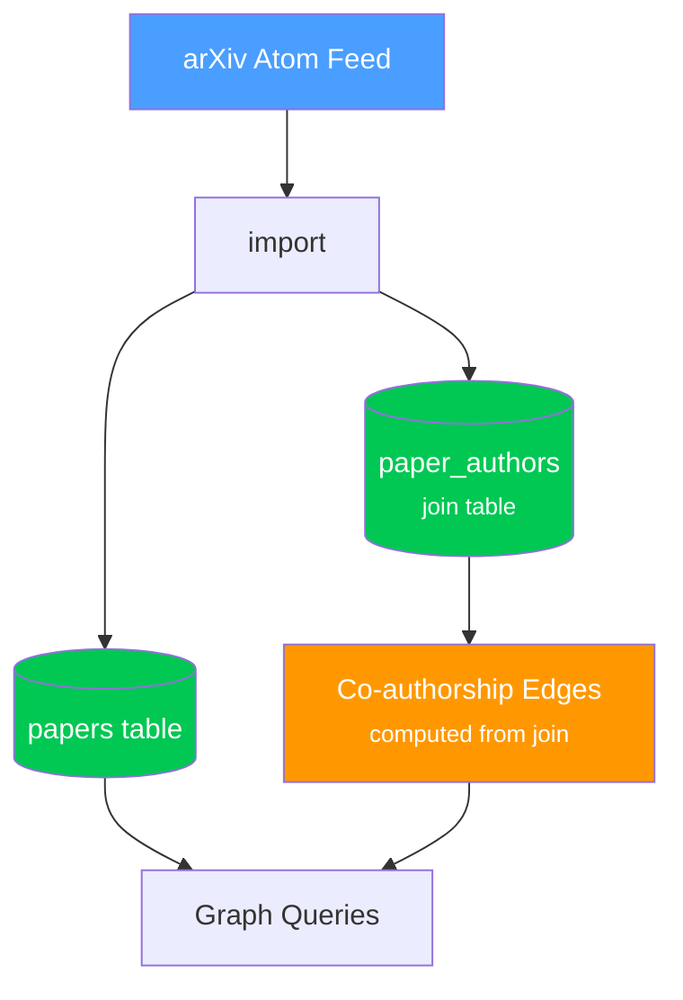

# scholar-graph

Academic paper storage and co-authorship graph backed by Neon PostgreSQL.

## Architecture



Papers are fetched via the shared `research` crate's arXiv client, normalized into the unified `ResearchPaper` type, then stored in Neon with author linkage. The `graph` module computes co-authorship edges from the join table.

## Modules

| Module | Purpose |
|--------|---------|
| `db` | Neon PostgreSQL connection via `tokio-postgres` + `rustls` TLS |
| `graph` | Co-authorship edge computation, `coauthors()`, `list_authors()`, `list_papers()` |
| `import` | Import papers from arXiv into the database with author linking |
| `migrate` | Create tables (`papers`, `authors`, `paper_authors`) in Neon |
| `seed` | Seed initial paper (arXiv 2602.15189 — ScrapeGraphAI) |
| `store` | Paper storage operations |
| `types` | Domain types (`CoauthorEdge`, import results) |

## CLI Usage

```bash
# Create tables
cargo run -- migrate

# Import a paper from arXiv
cargo run -- import arxiv 2602.15189

# Seed the first paper directly
cargo run -- seed

# List all papers
cargo run -- papers

# List all authors with paper counts
cargo run -- authors

# Show co-authors for a specific author
cargo run -- coauthors 1
```

## Environment Variables

| Variable | Required | Description |
|----------|----------|-------------|
| `NEON_DATABASE_URL` | Yes | Neon PostgreSQL connection string |

## Dependencies

| Crate | Purpose |
|-------|---------|
| `research` | Shared paper types, arXiv client |
| `tokio-postgres` + `tokio-postgres-rustls` | PostgreSQL driver with TLS |
| `clap` | CLI argument parsing |
| `unicode-normalization` | Author name normalization |
| `serde` / `serde_json` | JSON serialization |
| `tracing` | Structured logging |
