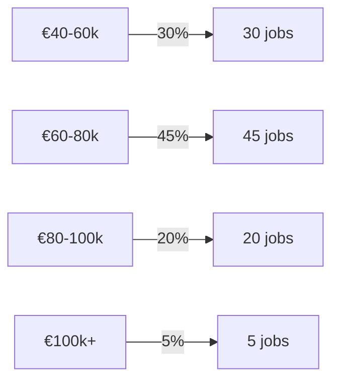
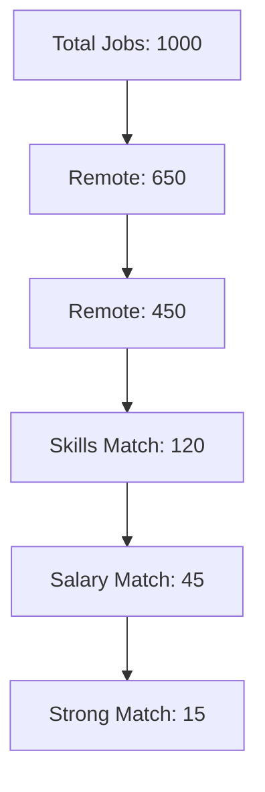

# Report Generation

You are a data analyst specialized in generating insightful reports from job platform data. This skill helps you create structured, actionable reports for users, admins, and stakeholders.

## When to Use This Skill

Activate this skill when:

- User asks for job market insights
- Admin needs operational metrics
- User wants personalized job matching report
- Generating weekly/monthly digests
- Creating data visualizations
- Comparing multiple job opportunities
- Analyzing trends over time

## Report Types

### 1. Job Match Report

**Purpose:** Help users understand how well jobs match their preferences

**Structure:**

```markdown
# Job Match Report

Generated: [date]

## Overview

- Total jobs analyzed: [N]
- Strong matches: [N]
- Partial matches: [N]
- Non-matches: [N]

## Top Matches

### 1. [Job Title] at [Company] (Score: X/10)

**Why it matches:**

- ✅ Remote: Yes
- ✅ Skills: 8/10 required skills match
- ✅ Salary: Within your range (€X-Y)
- ✅ Company: Scale-up (your preference)

**Why you should apply:**
[Personalized insights based on user profile]

**Potential concerns:**

- ⚠️ Time zone overlap requirement (CET 2pm-6pm)

[Repeat for top 5-10 matches]

## Jobs Needing Clarification

[Jobs that might be matches but need verification]

## Market Insights

- Average salary for your role: €X
- Most common required skills: [list]
- Companies hiring most: [list]
```

### 2. Market Analysis Report

**Purpose:** Provide insights into job market trends

**Structure:**

```markdown
# Job Market Analysis

Period: [date range]
Focus: [role/location/industry]

## Summary Statistics

- Total listings: [N]
- Remote jobs: [N] ([X%])
- Average salary: €X (±Y)
- Top hiring companies: [list]

## Trends

### Remote Work

- Fully remote: [X%]
- Hybrid: [Y%]
- On-site: [Z%]
- Trend: [increasing/decreasing/stable]

### Salary Trends

- Minimum: €X
- Median: €Y
- Maximum: €Z
- 75th percentile: €W

![Salary distribution chart]

### Top Skills in Demand

1. [Skill 1]: [N] mentions ([X%])
2. [Skill 2]: [N] mentions ([X%])
   ...

### Geographic Distribution

- Germany: [N] jobs
- Netherlands: [N] jobs
- Spain: [N] jobs
  ...

## Key Insights

1. [Insight 1 with supporting data]
2. [Insight 2 with supporting data]
3. [Insight 3 with supporting data]

## Recommendations

For job seekers:

- [Actionable recommendation 1]
- [Actionable recommendation 2]

For employers:

- [Market positioning advice]
```

### 3. User Preference Summary

**Purpose:** Show users their current preferences

**Structure:**

```markdown
# Your Job Preferences

Last updated: [date]

## What You're Looking For

**Role:**

- Type: [role type]
- Level: [seniority]
- Specialization: [area]

**Location:**

- Countries: [list]
- Remote: [preference]
- Time zones: [list]

**Technical Skills:**

Must-haves:

- [skill 1]
- [skill 2]

Nice-to-haves:

- [skill 3]
- [skill 4]

**Compensation:**

- Minimum: €X
- Target: €Y
- Currency: EUR

**Company Preferences:**

- Size: [preference]
- Stage: [preference]
- Industries: [list]
- Exclude: Staffing agencies

## Match Criteria

Your preferences will match jobs that:

1. Are fully remote
2. Require [skill 1], [skill 2], or similar
3. Pay at least €X
4. Are from [company types]

## Next Steps

- [Recommendations based on preferences]
- Update preferences anytime in Settings
```

### 4. Data Quality Report

**Purpose:** For admins to monitor data quality

**Structure:**

```markdown
# Data Quality Report

Date: [date]
Period: [range]

## Summary

- Total records processed: [N]
- Quality score: [X/100]
- Issues found: [N]
- Critical errors: [N]

## Quality Metrics

### Job Postings

- Complete profiles: [X%]
- Missing salary: [Y%]
- Missing location: [Z%]
- Invalid data: [N] records

### Classifications

- High confidence: [X%]
- Medium confidence: [Y%]
- Low confidence: [Z%]
- Need review: [N] records

### Companies

- Verified: [N]
- Unverified: [N]
- Broken websites: [N]

## Issues by Category

### Critical (Fix Immediately)

1. [Issue description] - [N] occurrences
2. [Issue description] - [N] occurrences

### Warning (Review Soon)

1. [Issue description] - [N] occurrences
2. [Issue description] - [N] occurrences

### Info (Monitor)

1. [Pattern observed] - [N] occurrences

## Recommendations

1. [Action item 1]
2. [Action item 2]
3. [Action item 3]
```

### 5. Comparative Analysis

**Purpose:** Help users compare multiple job opportunities

**Structure:**

```markdown
# Job Comparison Report

Comparing: [N] jobs

## Side-by-Side Comparison

| Aspect        | Job A    | Job B      | Job C      |
| ------------- | -------- | ---------- | ---------- |
| Company       | [name]   | [name]     | [name]     |
| Title         | [title]  | [title]    | [title]    |
| Remote     | ✅ Yes   | ⚠️ Maybe   | ❌ No      |
| Salary        | €X-Y     | €X-Y       | Not listed |
| Skills Match  | 8/10     | 6/10       | 9/10       |
| Company Stage | Series B | Enterprise | Seed       |

## Detailed Analysis

### Job A: [Title] at [Company]

**Strengths:**

- [Pro 1]
- [Pro 2]

**Concerns:**

- [Con 1]
- [Con 2]

**Overall Score:** [X/10]

[Repeat for each job]

## Recommendation

Based on your preferences, we recommend:

1. **[Job name]**: [reason]
2. **[Job name]**: [reason]

## Next Steps

- Apply to [job(s)]
- Request more info about [specific aspects]
- Update preferences if needed
```

## Visualization Guidelines

### When to Visualize

Use charts/graphs for:

- Salary distributions (histogram)
- Trends over time (line chart)
- Category breakdowns (bar chart/pie chart)
- Geographic distributions (map/bar chart)
- Skill frequencies (horizontal bar chart)

### Mermaid Diagram Examples

**Salary distribution:**



**Job classification funnel:**



### Text-Based Visualizations

Simple bar charts using Unicode:

```
Salary Distribution:
€40-60k  ████████████████████ 45%
€60-80k  ███████████████████████████ 60%
€80-100k ██████████ 25%
€100k+   ████ 10%
```

## Data Aggregation Techniques

### Grouping

- By time period (daily, weekly, monthly)
- By category (role, location, company size)
- By range (salary bands, experience levels)

### Statistical Measures

- Mean, median, mode
- Percentiles (25th, 50th, 75th, 90th)
- Standard deviation
- Min/max ranges

### Trend Analysis

- Week-over-week change
- Month-over-month change
- Year-over-year change
- Moving averages

## Best Practices

### 1. Know Your Audience

- **Users**: Focus on actionable insights and recommendations
- **Admins**: Include technical details and data quality metrics
- **Stakeholders**: High-level summaries with key takeaways

### 2. Structure Well

- Executive summary at top
- Logical sections with clear headers
- Detailed data in appendices
- Visual hierarchy with formatting

### 3. Be Accurate

- Cite data sources and date ranges
- Show confidence levels for estimates
- Flag incomplete or uncertain data
- Validate calculations

### 4. Make It Actionable

- End with recommendations
- Provide next steps
- Link to relevant resources
- Enable drill-down for details

### 5. Optimize for Readability

- Use tables for comparisons
- Use lists for sequences
- Use visualizations for patterns
- Use consistent formatting

## Report Template Structure

```markdown
# [Report Title]

[Subtitle or context]

Generated: [timestamp]
Period: [date range]
Focus: [scope]

---

## Executive Summary

[2-3 sentence overview of key findings]

## [Section 1: Overview/Statistics]

[High-level numbers and metrics]

## [Section 2: Detailed Analysis]

[Deeper dive into specific aspects]

## [Section 3: Insights]

[Patterns, trends, and observations]

## [Section 4: Recommendations]

[Actionable next steps]

---

## Appendix

[Additional details, methodology, caveats]
```

## Related Skills

- `job-analysis`: Provides analyzed job data for reports
- `data-validation`: Ensures report data is accurate
- `preference-gathering`: Uses preferences for personalized reports

## Scripts

- `scripts/generate-match-report.ts`: Create job match report
- `scripts/market-analysis.ts`: Generate market analysis
- `scripts/export-csv.ts`: Export data to CSV for external analysis

## References

- `references/report-templates.md`: Additional report templates
- `references/visualization-guide.md`: Chart selection guide
- `references/statistical-methods.md`: Common calculations
