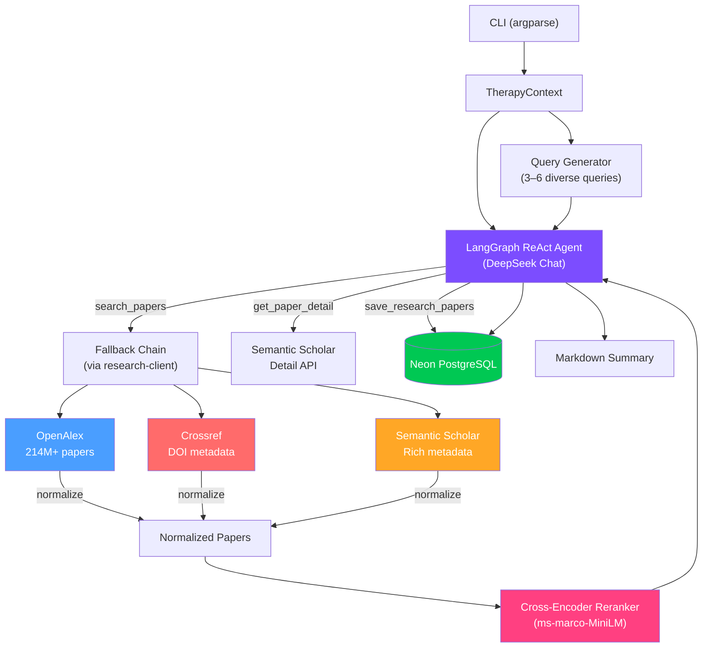
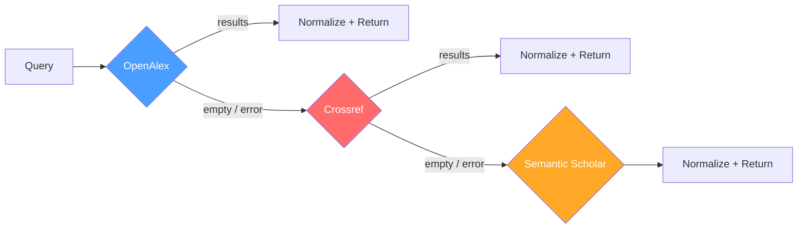
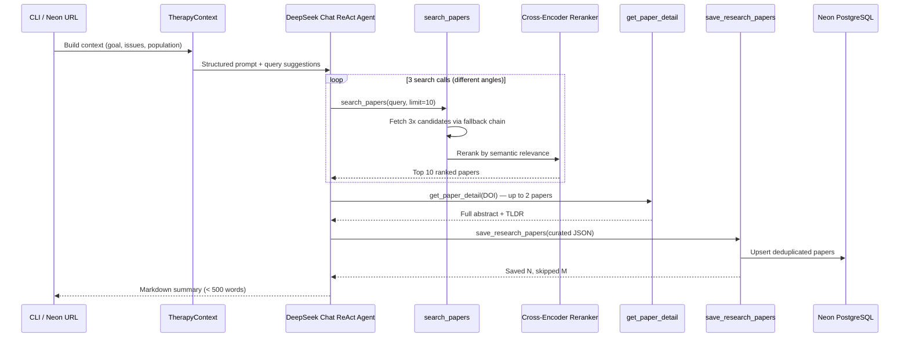
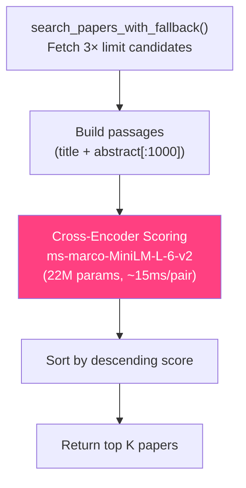
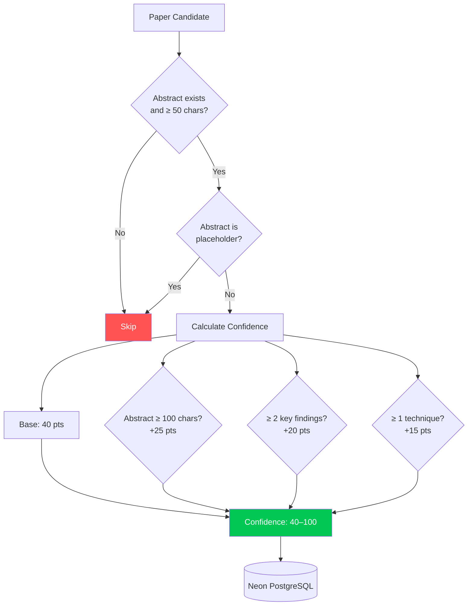
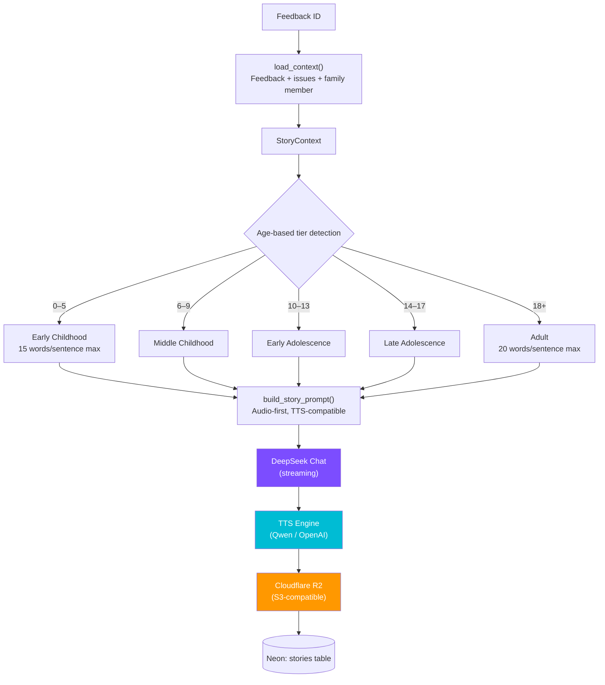
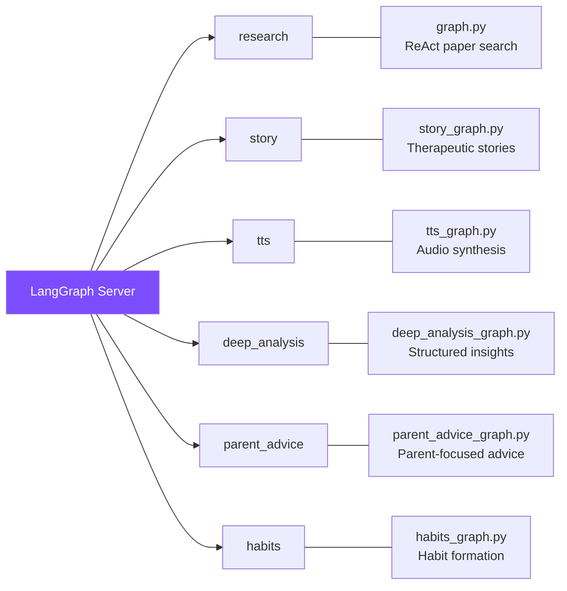
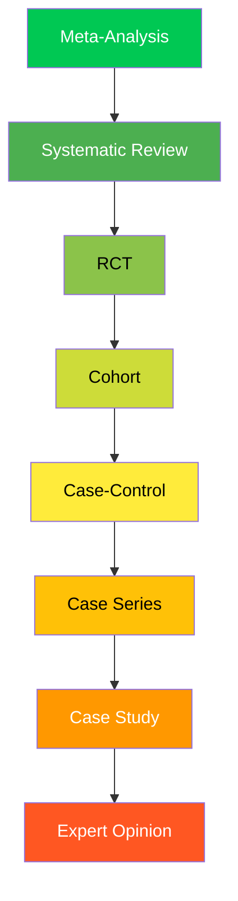

# research-thera-agent

Therapeutic research and story generation agent — LangGraph port of the Rust `research` crate, specialized for evidence-based therapeutic interventions.

## Architecture



## Provider Fallback Chain

The system queries academic databases in priority order, returning results from the first provider that responds successfully:



| Provider | Endpoint | Rate Limit | Auth | Strengths |
|----------|----------|------------|------|-----------|
| **OpenAlex** | `api.openalex.org/works` | None | None | 214M+ papers, inverted abstract index |
| **Crossref** | `api.crossref.org/works` | None | None | DOI authority, full metadata |
| **Semantic Scholar** | `api.semanticscholar.org/graph/v1` | Yes (higher w/ key) | Optional `x-api-key` | TLDRs, PDFs, fields of study |

All providers normalize to a common schema:

```python
{"title", "authors", "year", "abstract", "doi", "url", "citation_count"}
```

## ReAct Agent Workflow



## Semantic Reranking Pipeline

Papers go through a cross-encoder reranking step between search and extraction:



## Confidence & Quality Scoring

Papers are filtered and scored before persistence:



## Story Generation Flow



## LangGraph Deployable Graphs

Six independent graphs registered in `langgraph.json`:



## Modules

| Module | Purpose |
|--------|---------|
| `cli.py` | CLI entry point — subcommand dispatch (`goal`, `support-need`, `query`, `url`, `story`) |
| `graph.py` | Main LangGraph research workflow — ReAct agent (DeepSeek Chat) with paper search, extraction, persistence |
| `research_sources.py` | Thin wrapper around `research-client` — delegates search/normalization/fallback to the shared package |
| `therapy_context.py` | Domain model — `TherapyContext`, `StoryContext`, `IssueData`, query generation, age-based tier detection |
| `deep_analysis_graph.py` | Deep analysis StateGraph — collects issues, observations, journals, characteristics; uses `deepseek_client` |
| `story_graph.py` | Story generation StateGraph — loads feedback context, generates age-appropriate therapeutic audio scripts |
| `parent_advice_graph.py` | Parent-focused advice StateGraph — evidence-grounded parenting recommendations via `deepseek_client` |
| `habits_graph.py` | Habit formation StateGraph — personalized habit plans from goals, issues, and research |
| `tts_graph.py` | TTS StateGraph — Qwen (DashScope) or OpenAI synthesis, chunked text, WAV assembly, R2 upload |
| `embeddings.py` | Re-exports from `research-client` (`all-MiniLM-L6-v2`, 384 dims) + domain-specific text builders |
| `reranker.py` | Cross-encoder semantic reranking (`ms-marco-MiniLM-L-6-v2`, 22M params) |
| `neon.py` | Neon PostgreSQL operations — paper CRUD, embedding storage, deduplication, feedback/issue/story queries |
| `d1.py` | Data models (`Issue`, `FamilyMember`, `ContactFeedback`, `ResearchPaper`) and URL path parser |
| `backfill_embeddings.py` | Batch embedding generation for existing papers (batches of 50) |
| `story.py` | Story model and generation orchestration |

## Evidence Hierarchy

The agent weights papers by evidence level during research synthesis:



## CLI Usage

```bash
# Research from inline parameters
research-agent query \
  --therapeutic-type "anxiety" \
  --title "CBT for childhood anxiety" \
  --population "children"

# Research from a goal JSON file
research-agent goal --goal-file path/to/goal.json

# Research from a support need file
research-agent support-need --support-need-file path/to/need.json

# Research via Neon URL path (fetches context from DB, persists results back)
research-agent url /family/x/contacts/y/feedback/1

# Generate therapeutic story from feedback
research-agent story /family/x/contacts/y/feedback/1 \
  --language Romanian --minutes 10

# Print research to stdout as well
research-agent --stdout query --therapeutic-type "sleep" --title "Sleep hygiene"
```

## Environment Variables

| Variable | Required | Description |
|----------|----------|-------------|
| `DEEPSEEK_API_KEY` | Yes | DeepSeek API key (`deepseek-chat` model) |
| `NEON_DATABASE_URL` | For `url`/`story`/graphs | Neon PostgreSQL connection string |
| `SEMANTIC_SCHOLAR_API_KEY` | No | Semantic Scholar API key (higher rate limits) |
| `DASHSCOPE_API_KEY` | For TTS (Qwen) | Alibaba DashScope API key for Qwen TTS |
| `OPENAI_API_KEY` | For TTS (OpenAI) | OpenAI API key — TTS fallback |
| `R2_ACCOUNT_ID` | For TTS | Cloudflare R2 account ID |
| `R2_ACCESS_KEY_ID` | For TTS | Cloudflare R2 access key |
| `R2_SECRET_ACCESS_KEY` | For TTS | Cloudflare R2 secret key |
| `R2_BUCKET_NAME` | For TTS | R2 bucket name (default: `longform-tts`) |
| `R2_PUBLIC_DOMAIN` | For TTS | Public URL for audio assets |

Env is loaded from `.env` via `python-dotenv`.

## Development

```bash
# Install with dev dependencies
uv pip install -e ".[dev]"

# Run tests
pytest

# Run directly
python -m research_agent.cli query --therapeutic-type "anxiety" --title "Test"
```

## Dependencies

| Package | Purpose |
|---------|---------|
| `research-client[ml]` | Shared package — multi-source paper search (OpenAlex/Crossref/Semantic Scholar), embeddings, normalization. The `[ml]` extra pulls in `sentence-transformers` for local embeddings and cross-encoder reranking |
| `langgraph` | Graph-based agent workflows (ReAct for research, StateGraph for story/TTS/analysis) |
| `langchain` + `langchain-openai` | LLM framework — `ChatOpenAI` pointed at DeepSeek's API |
| `openai` | TTS API access (OpenAI voices) |
| `psycopg[binary]` | Neon PostgreSQL async driver |
| `boto3` | Cloudflare R2 (S3-compatible) for audio asset storage |
| `python-dotenv` | Environment variable loading |

The `deep_analysis`, `parent_advice`, and `habits` graphs also import `deepseek_client` from the monorepo's `pypackages/deepseek/` via `sys.path` injection.

Requires Python >= 3.12.
