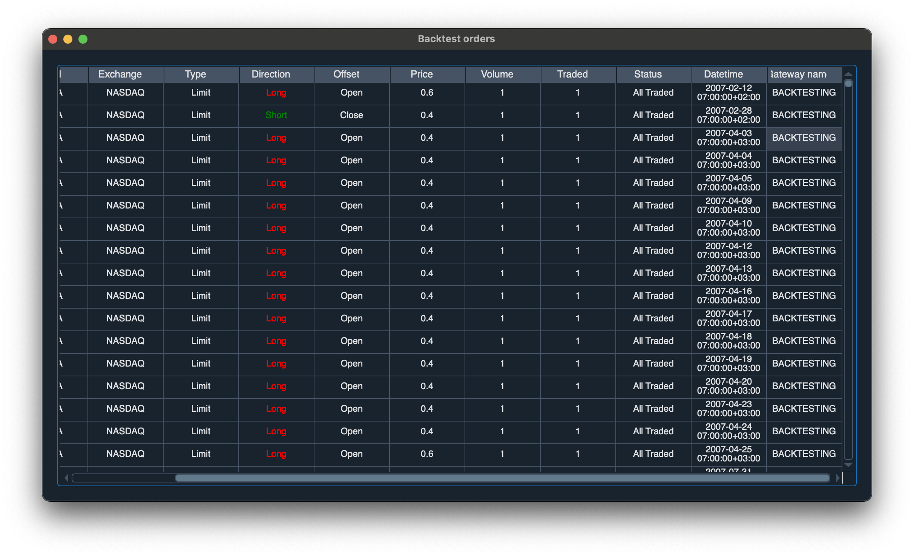
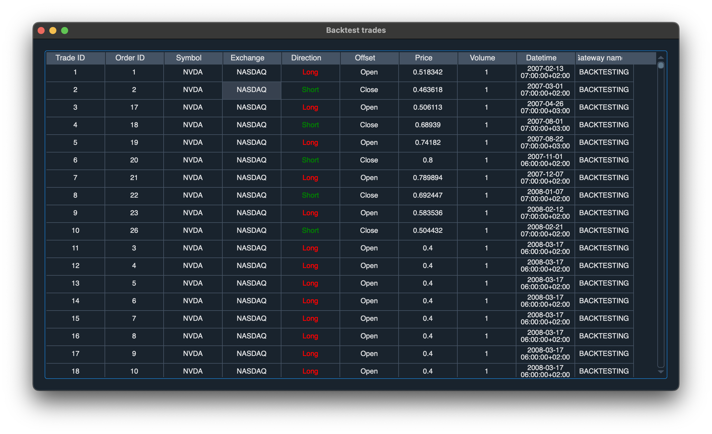
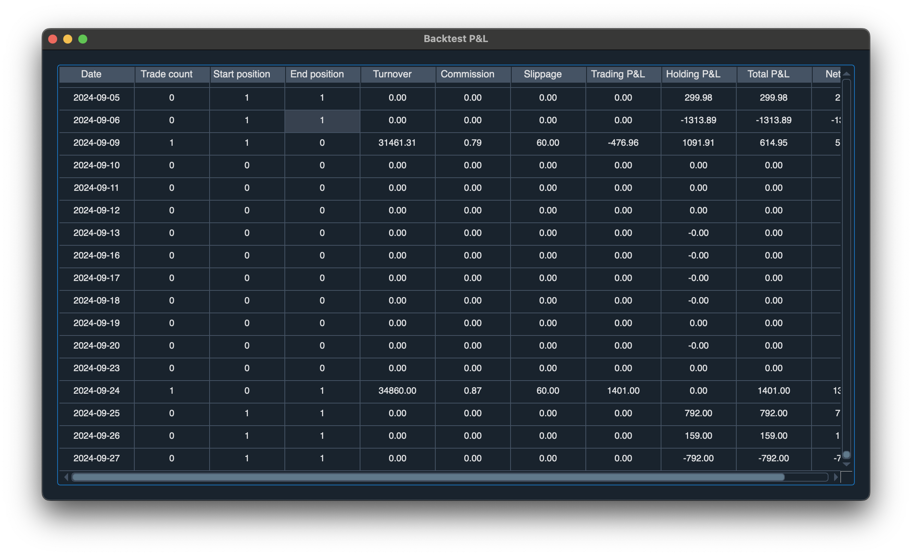
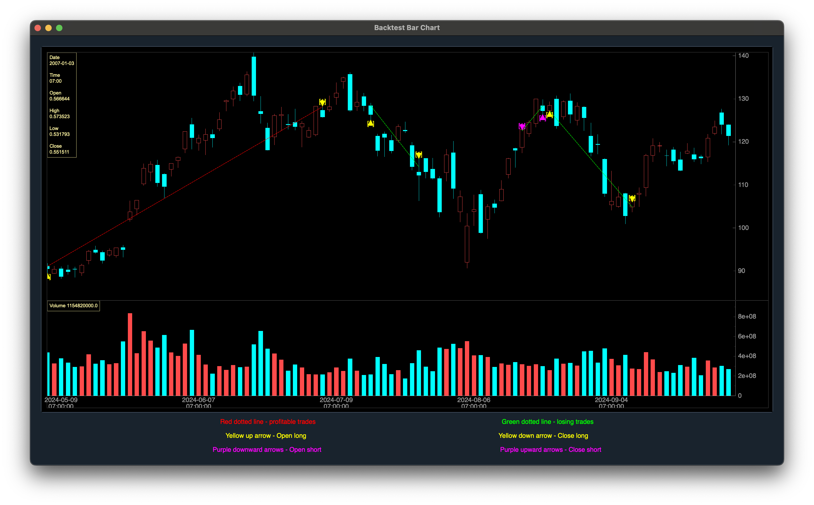

## Introduction

Backtesting is essential for validating trading strategies, especially in the high-frequency and volatile world of stocks like **NVIDIA (NVDA)**. Using VeighNa, an open-source algorithmic trading system, provides traders with the flexibility to thoroughly test strategies and optimize for performance. In this guide, we'll walk through setting up VeighNa, backtesting a simple **Moving Average Crossover** strategy on NVIDIA, explaining the strategy in detail, troubleshooting common installation issues, and optimizing your strategy.

<!-- truncate -->

## Why Use VeighNa for NVIDIA Backtesting?

VeighNa's growing popularity stems from its flexibility, open-source codebase, and ability to run complex backtests across multiple markets. Traders looking to develop custom strategies, particularly for stocks like NVIDIA, will find VeighNa ideal for:

- **Backtesting and Optimization**: Advanced analysis and strategy fine-tuning for historical data.
- **Real-time Trading**: Seamless transition from backtesting to live trading.
- **Custom Strategy Development**: Easily adjust parameters for algorithms like the **Moving Average Crossover** strategy.

With VeighNa, you can thoroughly analyze NVIDIA stock strategies before committing to live trading, reducing risk and improving profitability.

---

## Setting Up VeighNa for NVIDIA Stock Trading

### 1. Install Miniconda and Create the Python Environment

Before setting up VeighNa, ensure you have **Miniconda** installed. Once installed, create an isolated Python environment:

```bash
conda create --name veighna python=3.10
conda activate veighna
```

### 2. Install VeighNa and Its Related Modules

Next, install VeighNa and its relevant modules:

```bash
# Clone and install VeighNa
git clone https://github.com/paperswithbacktest/vnpy.git
cd vnpy
pip install -r requirements.txt
pip install .
cd ..

# Install vnpy_ctabacktester
git clone https://github.com/paperswithbacktest/vnpy_ctabacktester.git
cd vnpy_ctabacktester
pip install .
cd ..

# Install vnpy_ctastrategy
git clone https://github.com/paperswithbacktest/vnpy_ctastrategy.git
cd vnpy_ctastrategy
pip install .
cd ..

# Install vnpy_sqlite for database integration
git clone https://github.com/paperswithbacktest/vnpy_sqlite.git
cd vnpy_sqlite
pip install .
cd ..

# Install vnpy_pwb for Hugging Face data feeds
git clone https://github.com/paperswithbacktest/vnpy_pwb.git
cd vnpy_pwb
pip install .
cd ..
```

---

## Gotchas and Fixes During Installation

### 1. **Environment Issues**

Ensure that you're always in the correct Conda environment before running any commands:

```bash
conda activate veighna
python --version
```

If you’re experiencing dependency issues, clear the environment and reinstall:

```bash
pip freeze | xargs pip uninstall -y
```

Reinstall the necessary packages afterward.

### 2. **Configuring Data Sources**

Ensure your VeighNa installation can access stock market data, such as NVIDIA’s data, by configuring the `vt_setting.json` file:

```bash
mkdir ~/.vntrader
code ~/.vntrader/vt_setting.json
```

Insert the following configuration:

```json
{
  "datafeed.name": "pwb",
  "datafeed.username": "",
  "datafeed.password": ""
}
```

---

## Strategy for NVIDIA Stock Trading: Moving Average Crossover

A simple yet effective trading strategy for NVIDIA (or any stock) is the **Moving Average Crossover** strategy. Below is the implementation in VeighNa using the CTA framework.

### **Moving Average Crossover Strategy**

This strategy uses two moving averages—a fast one and a slow one. The logic is simple:

- **Buy** when the fast moving average crosses above the slow moving average (bullish signal).
- **Sell** when the fast moving average crosses below the slow moving average (bearish signal).

Here’s the code for the strategy:

```python
from vnpy_ctastrategy import (
    CtaTemplate,
    StopOrder,
    TickData,
    BarData,
    TradeData,
    OrderData,
    BarGenerator,
    ArrayManager,
)

class MaStrategy(CtaTemplate):
    author = "Trader in Python"

    fast_window = 10
    slow_window = 20

    fast_ma0 = 0.0
    slow_ma0 = 0.0

    parameters = ["fast_window", "slow_window"]
    variables = ["fast_ma0", "slow_ma0"]

    def __init__(self, cta_engine, strategy_name, vt_symbol, setting):
        super().__init__(cta_engine, strategy_name, vt_symbol, setting)
        self.bg = BarGenerator(self.on_bar)
        self.am = ArrayManager(size=self.slow_window)

    def on_init(self):
        self.write_log("Strategy initialization")
        self.load_bar(10)

    def on_start(self):
        self.write_log("Strategy started")
        self.put_event()

    def on_stop(self):
        self.write_log("Strategy stopped")
        self.put_event()

    def on_tick(self, tick: TickData):
        self.bg.update_tick(tick)

    def on_bar(self, bar: BarData):
        am = self.am
        am.update_bar(bar)
        if not am.inited:
            return

        fast_ma = am.sma(self.fast_window, array=True)
        self.fast_ma0 = fast_ma[-1]

        slow_ma = am.sma(self.slow_window, array=True)
        self.slow_ma0 = slow_ma[-1]

        if self.fast_ma0 > self.slow_ma0 and self.pos <= 0:
            self.buy(bar.close_price, volume=1)
        elif self.fast_ma0 < self.slow_ma0 and self.pos > 0:
            self.sell(bar.close_price, self.pos)

        self.put_event()

    def on_order(self, order: OrderData):
        pass

    def on_trade(self, trade: TradeData):
        self.put_event()

    def on_stop_order(self, stop_order: StopOrder):
        pass
```

### **Explanation of the Strategy**

Let's break down the strategy to understand how it works.

#### **Overview**

The `MaStrategy` class implements a moving average crossover strategy using two simple moving averages (SMAs) with different periods: a fast SMA and a slow SMA. The key idea is to:

- **Enter a Long Position**: When the fast SMA crosses above the slow SMA (indicating an upward trend).
- **Exit the Long Position**: When the fast SMA crosses below the slow SMA (indicating a downward trend).

#### **Detailed Explanation**

1. **Imports and Class Definition**

   ```python
   from vnpy_ctastrategy import (
       CtaTemplate,
       StopOrder,
       TickData,
       BarData,
       TradeData,
       OrderData,
       BarGenerator,
       ArrayManager,
   )
   ```

   - **CtaTemplate**: Base class for creating a CTA (Commodity Trading Advisor) strategy.
   - **BarGenerator**: Utility to generate bar data from tick data.
   - **ArrayManager**: Utility to manage historical bar data and compute technical indicators.

   ```python
   class MaStrategy(CtaTemplate):
       author = "Trader in Python"

       fast_window = 10
       slow_window = 20

       fast_ma0 = 0.0
       slow_ma0 = 0.0

       parameters = ["fast_window", "slow_window"]
       variables = ["fast_ma0", "slow_ma0"]
   ```

   - **fast_window** and **slow_window**: Periods for the fast and slow SMAs.
   - **parameters**: Strategy parameters that can be optimized or adjusted.
   - **variables**: Internal variables to track the latest SMA values.

2. **Initialization**

   ```python
   def __init__(self, cta_engine, strategy_name, vt_symbol, setting):
       super().__init__(cta_engine, strategy_name, vt_symbol, setting)
       self.bg = BarGenerator(self.on_bar)
       self.am = ArrayManager(size=self.slow_window)
   ```

   - **BarGenerator**: Processes incoming tick data and generates bar data.
   - **ArrayManager**: Stores historical bar data needed for SMA calculations.

3. **Lifecycle Methods**

   - **on_init**: Called when the strategy is initialized. It loads historical bar data to warm up the SMA calculations.

     ```python
     def on_init(self):
         self.write_log("Strategy initialization")
         self.load_bar(10)
     ```

   - **on_start**: Called when the strategy starts running.

     ```python
     def on_start(self):
         self.write_log("Strategy started")
         self.put_event()
     ```

   - **on_stop**: Called when the strategy stops.

     ```python
     def on_stop(self):
         self.write_log("Strategy stopped")
         self.put_event()
     ```

4. **Data Handling Methods**

   - **on_tick**: Called when new tick data arrives. It updates the BarGenerator with the new tick.

     ```python
     def on_tick(self, tick: TickData):
         self.bg.update_tick(tick)
     ```

   - **on_bar**: Called when a new bar is generated. This method contains the core logic of the strategy.

     ```python
     def on_bar(self, bar: BarData):
         am = self.am
         am.update_bar(bar)
         if not am.inited:
             return

         fast_ma = am.sma(self.fast_window, array=True)
         self.fast_ma0 = fast_ma[-1]

         slow_ma = am.sma(self.slow_window, array=True)
         self.slow_ma0 = slow_ma[-1]

         if self.fast_ma0 > self.slow_ma0 and self.pos <= 0:
             self.buy(bar.close_price, volume=1)
         elif self.fast_ma0 < self.slow_ma0 and self.pos > 0:
             self.sell(bar.close_price, self.pos)

         self.put_event()
     ```

     - **Update Bar Data**: Adds the new bar to the `ArrayManager`.
     - **Initialization Check**: Ensures there's enough data to compute SMAs.
     - **Calculate SMAs**:
       - **fast_ma**: Fast SMA array; `fast_ma[-1]` is the latest value.
       - **slow_ma**: Slow SMA array; `slow_ma[-1]` is the latest value.
     - **Trading Logic**:
       - **Buy Condition**: If the fast SMA crosses above the slow SMA and not already in a long position, place a buy order.
       - **Sell Condition**: If the fast SMA crosses below the slow SMA and currently in a long position, sell to exit.

5. **Order and Trade Callbacks**

   - **on_order** and **on_stop_order**: Currently empty but can be extended to handle order updates.

     ```python
     def on_order(self, order: OrderData):
         pass

     def on_stop_order(self, stop_order: StopOrder):
         pass
     ```

   - **on_trade**: Called when a trade is executed.

     ```python
     def on_trade(self, trade: TradeData):
         self.put_event()
     ```

#### **Summary**

- **Strategy Type**: Moving Average Crossover.
- **Objective**: Capture market trends by entering long positions during upward momentum and exiting when the momentum reverses.
- **Key Components**:
  - **Fast SMA (`fast_window = 10`)**: Represents short-term market trends.
  - **Slow SMA (`slow_window = 20`)**: Represents longer-term market trends.
- **Trading Signals**:
  - **Buy**: Fast SMA crosses above the slow SMA.
  - **Sell**: Fast SMA crosses below the slow SMA.

#### **How the Strategy Works in Practice**

1. **Initialization**: Loads the last 10 bars to start calculating SMAs.
2. **Data Processing**: Continuously updates with new bar data and recalculates SMAs.
3. **Signal Generation**: Monitors for crossover events between the fast and slow SMAs.
4. **Order Execution**: Places buy or sell orders based on the detected signals.

#### **Potential Enhancements**

- **Position Sizing**: Adjust volume based on risk management principles.
- **Stop Loss and Take Profit**: Implement risk management to limit losses and secure profits.
- **Signal Filtering**: Add additional indicators to filter out false signals (e.g., RSI, MACD).
- **Parameter Optimization**: Test different values for `fast_window` and `slow_window` to find the most effective combination.

---

## Running a Backtest on NVIDIA Stock (NVDA)

### 1. Download Historical Data

To backtest the above strategy on NVIDIA stock:

1. Open the **CTA Backtester** in VeighNa.
2. Set **Local Symbol** to `NVDA.NASDAQ`.
3. Set the **Bar Period** to `d` (daily) and configure the start/end dates (e.g., `01/01/2010` to `22/09/2023`).
4. Click **Download Data**.

### 2. Backtest Configuration

With the historical data downloaded, configure the backtest:

- **Strategy**: Use `MaStrategy` as outlined above.
- **Commission Rate**: 0.001 (0.1%)
- **Slippage**: 0.01
- **Contract Multiplier**: 1 (for stocks)
- **Price Tick**: 0.01
- **Capital**: 1000 USD

## Running a Backtest on NVIDIA Stock (NVDA)

### 1. Download Historical Data

To backtest the above strategy on NVIDIA stock:

1. Open the **CTA Backtester** in VeighNa.
2. Set **Local Symbol** to `NVDA.NASDAQ`.
3. Set the **Bar Period** to `d` (daily) and configure the start/end dates (e.g., `01/01/2007` to `30/09/2024`).
4. Click **Download Data**.

### 2. Backtest Configuration

With the historical data downloaded, configure the backtest settings:

- **Strategy**: Use `MaStrategy` as outlined above.
- **Commission Rate**: 2.5e-05
- **Slippage**: 0.2
- **Contract Multiplier**: 300.0
- **Price Tick**: 0.2
- **Capital**: 1,000,000 USD

Once you've set these parameters, click **Start Backtesting** to initiate the process.


### 3. Analyze Backtest Results

The backtest results are displayed, including:

- **Balance**: A graph showing the balance over time.
- **Drawdown**: Visual representation of drawdown throughout the backtest period.
- **Profit and Loss (P&L)**: The P&L distribution graph shows the profit or loss for individual trades.

The screenshot above shows the result of backtesting NVIDIA stock from **2007 to 2024**, with key statistics like:

- **Total turnover**: 997,534.16
- **Sharpe ratio**: -0.62
- **Return drawdown ratio**: -0.79

The results provide insight into the effectiveness of the strategy over the selected period, helping you to assess whether adjustments or optimizations are needed.

## Order Details and Execution

After backtesting, it's essential to review the specific orders generated during the simulation. This allows traders to verify whether the strategy executed trades as expected and at appropriate price levels. Below is a screenshot showing the details of the backtest orders:



### Understanding the Order Data

The **Backtest Orders** table shows critical information such as:

- **Exchange**: The exchange where the trades took place (e.g., NASDAQ).
- **Type**: Whether the trade was executed as a limit order.
- **Direction**: The direction of the trade (e.g., Long or Short).
- **Price**: The price at which the order was placed.
- **Volume**: The number of shares or contracts traded.
- **Traded**: Confirms if the trade was fully executed.
- **Status**: Shows the status of the order (e.g., All Traded).
- **Datetime**: The exact time and date when the trade was executed.

In this example, you can see the system placed multiple **Limit** orders at varying prices, primarily **Long** trades on the **NASDAQ** exchange, which were fully executed.

### Why Review Orders?

By reviewing individual orders, you can:

1. **Validate Execution**: Ensure that the trades align with the strategy logic (e.g., entering positions when the fast moving average crosses the slow moving average).
2. **Check Slippage and Costs**: Confirm that slippage, commission, and other fees were accurately accounted for.
3. **Monitor Trade Timing**: Validate that the trades were placed at optimal times according to the strategy.

Reviewing the detailed order list provides valuable insights into how efficiently the strategy executed its trades and highlights potential areas for refinement, such as adjusting entry/exit conditions or improving price execution strategies.

## Trade Details

After reviewing the orders, it's also important to look into the specific trades that were executed during the backtest. This allows you to monitor trade performance in terms of price, direction, and timing.

Below is a screenshot of the backtest trades:



### Understanding the Trade Data

The **Backtest Trades** table contains the following key details:

- **Trade ID**: A unique identifier for each trade.
- **Order ID**: The ID of the order associated with the trade.
- **Symbol**: The stock symbol being traded (e.g., NVDA for NVIDIA).
- **Exchange**: The exchange where the trade took place (e.g., NASDAQ).
- **Direction**: Whether the trade was **Long** or **Short**.
- **Offset**: Whether the trade opened or closed a position.
- **Price**: The price at which the trade was executed.
- **Volume**: The number of shares or contracts traded.
- **Datetime**: The exact time and date the trade was executed.

In this screenshot, we can observe that multiple **Long** and **Short** positions were opened and closed at different times during the backtest. Each trade shows the execution price and confirms whether the trade was made to open or close a position.

### Why Review Trades?

Analyzing trades helps you to:

1. **Evaluate Strategy Performance**: Confirm that the strategy is executing trades at appropriate times and prices according to the backtest parameters.
2. **Understand Market Behavior**: Look into the market conditions during each trade to better assess strategy performance in various market phases.
3. **Refine Entry/Exit Conditions**: Identify potential improvements in the strategy’s entry and exit points by reviewing trades.

By thoroughly examining both the **order** and **trade** details, you can fine-tune the strategy to improve its efficiency and profitability in future backtests and live trading scenarios.

## Daily Profit & Loss (P&L)

Another crucial aspect of backtesting is to review the daily Profit & Loss (P&L) data. This helps in understanding how the strategy performs on a day-to-day basis, tracking cumulative profits or losses over time.

Below is a screenshot of the **Backtest P&L** data:



### Understanding the P&L Data

The **Backtest P&L** table displays key information such as:

- **Date**: The date for each entry.
- **Trade Count**: Number of trades executed on that date.
- **Start/End Position**: The position at the start and end of the day.
- **Turnover**: Total value of the traded assets for that day.
- **Commission**: The cost incurred due to commissions for executed trades.
- **Slippage**: The estimated slippage costs from trade executions.
- **Trading P&L**: Profit or loss from trading activities.
- **Holding P&L**: Profit or loss from holding positions overnight.
- **Total P&L**: The total profit or loss for that day, including both trading and holding P&L.
- **Net P&L**: The overall profit or loss after accounting for all costs (e.g., commission, slippage).

In this example, the table reveals that the strategy has fluctuating daily P&L results. The **Total P&L** provides insight into which days were more profitable and which incurred losses.

### Why Review Daily P&L?

By reviewing the daily P&L, you can:

1. **Monitor Daily Performance**: Track how the strategy performs each day to identify profitable or unprofitable trends.
2. **Assess Volatility**: Understand the variability in daily returns and how it impacts overall strategy performance.
3. **Identify Improvement Areas**: Pinpoint specific days where the strategy performed poorly and investigate why, allowing for potential refinements.

Thoroughly analyzing daily P&L helps ensure that the strategy is consistently profitable and can reveal periods of underperformance that may require adjustment.

## Visualizing the Backtest - Bar Chart

To get a more visual representation of how trades were executed during the backtest, it’s helpful to look at the **Backtest Bar Chart**. This chart provides a clear view of the price movements, volume, and points where trades were initiated or closed, helping to analyze the efficiency of the strategy.

Below is a screenshot of the **Backtest Bar Chart**:



### Key Insights from the Bar Chart

The bar chart above illustrates:

- **Yellow Up Arrow**: The point where a **Long** position was opened.
- **Yellow Down Arrow**: The point where a **Long** position was closed.
- **Purple Downward Arrows**: Points where a **Short** position was opened.
- **Purple Upward Arrows**: Points where a **Short** position was closed.
- **Red Dotted Lines**: Indicate **profitable trades**.
- **Green Dotted Lines**: Indicate **losing trades**.

By looking at this chart, you can see where trades were made in relation to price movements and determine the overall profitability of the strategy. It also helps to visually correlate trade execution with market trends.

---

By thoroughly examining the **orders**, **trades**, **daily P&L**, and **visualizing the bar chart**, you can better understand how the strategy performs in both day-to-day operations and over the entire backtesting period. This holistic review helps identify areas for improvement, ensuring that the strategy is optimized before live trading.

## Conclusion

Backtesting strategies for NVIDIA stock using VeighNa provides a powerful, flexible environment to fine-tune and optimize trading strategies. The **Moving Average Crossover** is just one example, and with VeighNa's robust toolset, you can easily adapt it to any stock or market.

Ensure you troubleshoot common issues using the provided gotchas and fixes, and leverage the platform's powerful optimization tools to refine your trading approach.

---

This article was inspired by insights shared [here](https://blog.paperswithbacktest.com/p/backtesting-a-trading-strategy-on).
