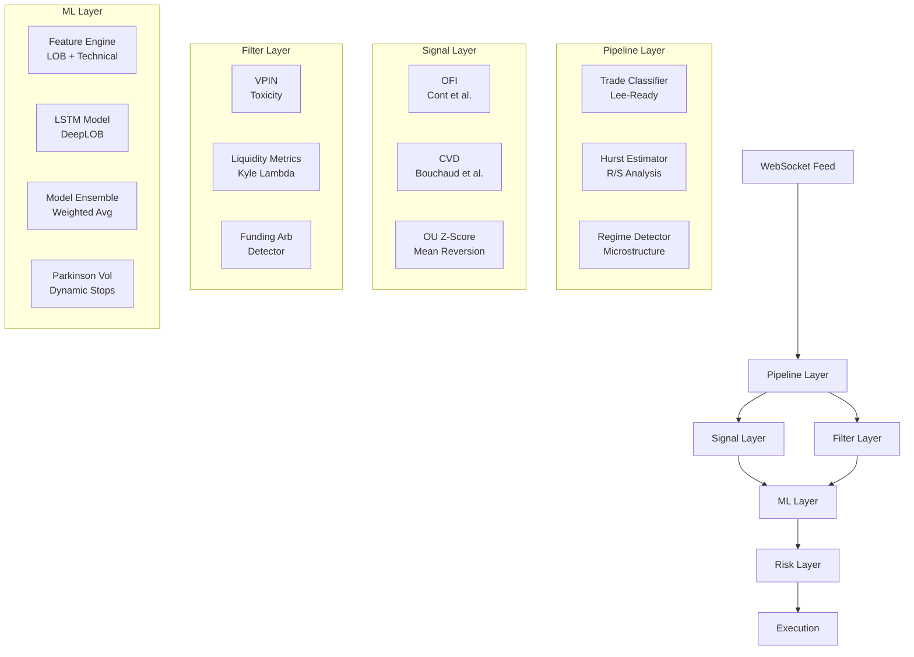
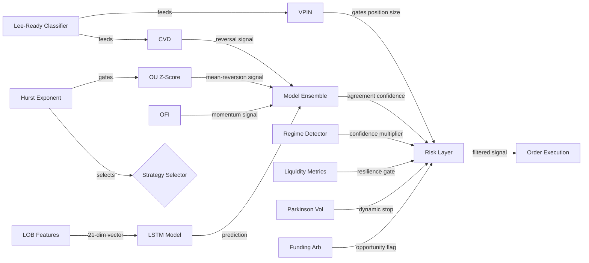

Every feature in a production trading system has an origin story — a paper, a theorem, a decades-old insight from probability theory or market microstructure. This post catalogs 14 ML features implemented in a Rust crypto scalping engine, traces each back to its foundational research, shows the actual formulas, and includes real production code. The engine processes limit order book (LOB) snapshots, trade ticks, and funding rate data in real time to generate scalping signals for crypto perpetual futures.

<!-- truncate -->

## Architecture Overview

The scalping engine is structured as a streaming pipeline. Data flows through four layers — each layer adds features that feed into the next:



All features use **Welford's online algorithm** for z-score normalization — a numerically stable, single-pass method that avoids storing the full window of values for mean/variance computation.

---

## 1. VPIN — Volume-Synchronized Probability of Informed Trading

**Paper:** Easley, D., López de Prado, M., & O'Hara, M. (2012). *Flow Toxicity and Liquidity in a High-Frequency World.* Review of Financial Studies, 25(5), 1457–1493.

### The Idea

VPIN was originally developed to predict the 2010 Flash Crash. It measures the probability that market makers are trading against informed counterparties by aggregating trades into **volume-synchronized** buckets (not time buckets) and measuring the imbalance between buy-initiated and sell-initiated volume.

### The Formula

Trades are classified using the tick rule, then accumulated into fixed-volume buckets of size $V$:

$$
\text{VPIN} = \frac{1}{N} \sum_{i=1}^{N} \frac{|V^B_i - V^S_i|}{V}
$$

where $V^B_i$ and $V^S_i$ are buy and sell volumes in bucket $i$, and $N$ is the rolling window of completed buckets.

### Production Code

```rust
/// Bucket imbalance: |V_buy - V_sell| / V_total.
fn imbalance(&self) -> f64 {
    let total = self.buy_volume + self.sell_volume;
    if total < 1e-12 {
        return 0.0;
    }
    (self.buy_volume - self.sell_volume).abs() / total
}
```

VPIN drives a regime classifier with four states — **Low**, **Medium**, **High**, and **Extreme** — that gates position sizing:

| Regime | VPIN Range | Safe to Trade | Size Multiplier |
|--------|-----------|---------------|-----------------|
| Low | < 0.3 | Yes | 1.0x |
| Medium | 0.3–0.5 | Yes | 0.5x |
| High | 0.5–0.7 | Yes | 0.25x |
| Extreme | > 0.7 | No | 0.0x |

When VPIN hits Extreme, the engine stops opening new positions entirely — a kill switch derived directly from the paper's finding that VPIN > 0.7 preceded the Flash Crash by approximately 2 hours.

### In Practice

VPIN works best on liquid perpetual futures (BTC, ETH) during volatile sessions — exactly when informed flow spikes. The volume-bucketing is key: it naturally compresses quiet periods and expands active ones, so you don't need separate time-of-day adjustments. Use it as a **filter, not a signal** — high VPIN tells you to reduce size or stand aside, not which direction to trade. Where VPIN fails: low-liquidity altcoins where a single large order dominates an entire bucket, producing false extremes. It also lags during sudden, one-shot liquidation cascades — by the time you fill enough buckets to detect the spike, the move is already over. If your bucket size is too small relative to typical volume, you'll get noisy readings; too large and you'll miss fast regime changes. Calibrate bucket size to roughly 1/50th of your rolling window's expected total volume.

---

## 2. Order Flow Imbalance (OFI)

**Paper:** Cont, R., Kukanov, A., & Stoikov, S. (2014). *The Price Impact of Order Book Events.* Journal of Financial Economics, 104(2), 293–320.

### The Idea

Cont et al. showed that price changes are almost entirely explained by order flow imbalance — the net change in bid versus ask queue sizes across book levels. Unlike simple bid-ask spread, OFI captures the *dynamics* of the book: are bids growing while asks shrink?

### The Formula

At each LOB update, across $K$ price levels:

$$
\text{OFI}_{\text{raw}} = \sum_{k=1}^{K} \left( \Delta \text{Bid}_{k} - \Delta \text{Ask}_{k} \right)
$$

where $\Delta \text{Bid}_k$ is the change in bid size at level $k$. If a price level shifts (new higher bid or lower ask), the old size is treated as fully removed and the new size as fully added:

```rust
let delta_bid = if (prev_bid_price - curr_bid_price).abs() < 1e-12 {
    curr_bid_size - prev_bid_size
} else if curr_bid_price > prev_bid_price {
    curr_bid_size   // New higher bid — full addition
} else {
    -prev_bid_size  // Bid dropped — full removal
};
```

The raw OFI is normalized to a z-score using Welford's rolling algorithm over a 100-update window.

### In Practice

OFI is the single best short-horizon predictor for liquid order books — Cont's paper showed it explains ~65% of contemporaneous price moves. It shines on 1–5 second horizons in BTC/ETH perps where the book updates hundreds of times per second and level-by-level dynamics are rich. Use OFI as your primary momentum signal for scalping entries. Where it breaks down: thin books where a single large resting order at level 3 gets pulled and re-posted, creating phantom OFI swings that don't correspond to real directional intent. It also loses predictive power during funding rate settlements and exchange maintenance windows when book dynamics become artificial. Don't bother computing OFI across more than 5 levels — the marginal signal from deeper levels is noise. And never use OFI alone in a trending market; it'll keep telling you to chase the trend until the reversal snaps back.

---

## 3. Lee-Ready Trade Classification

**Paper:** Lee, C. M. C., & Ready, M. J. (1991). *Inferring Trade Direction from Intraday Data.* The Journal of Finance, 46(2), 733–746.

### The Idea

Before you can compute VPIN or CVD, you need to know whether each trade was buyer-initiated or seller-initiated. Exchanges don't always report this. Lee and Ready's algorithm classifies trades using the quote midpoint, with a tick-rule fallback:

1. **Quote rule:** Trade price > midpoint → buy. Trade price < midpoint → sell.
2. **Tick rule:** If trade is exactly at midpoint, uptick → buy, downtick → sell.
3. **Default:** If no prior data exists, assume buy.

### Production Code

```rust
pub fn classify(&mut self, trade_price: f64, _trade_size: f64)
    -> (bool, ClassificationMethod)
{
    if self.last_mid_price > 0.0 {
        let diff = trade_price - self.last_mid_price;
        if diff.abs() > 1e-12 {
            // Quote rule
            return (diff > 0.0, ClassificationMethod::QuoteRule);
        } else {
            // Trade at mid → tick rule fallback
            return self.tick_rule(trade_price);
        }
    }
    self.tick_rule(trade_price)
}
```

The implementation tracks `ClassificationStats` (quote rule count, tick rule count, default count) to monitor data quality at runtime. Lee-Ready improves VPIN and CVD accuracy by approximately 15–20% compared to the simple tick rule alone.

### In Practice

Lee-Ready is infrastructure, not a signal — you need it before you can trust anything downstream. It works well on any asset where you have reliable quote data alongside trade prints. The quote rule handles ~80% of trades cleanly; the tick rule covers the rest. Monitor the ratio: if your tick-rule fallback rate exceeds 40%, your quote data is stale or delayed, and VPIN/CVD accuracy will degrade. Where Lee-Ready struggles: exchanges that batch-report trades (some altcoin pairs on smaller venues) or during extreme volatility when the midpoint moves between the trade timestamp and the quote timestamp. In those cases, you're classifying against an outdated midpoint. For crypto specifically, beware of wash trading on unregulated exchanges — Lee-Ready will dutifully classify fake trades, garbage in, garbage out. If you're running on a single exchange, the simple tick rule alone may be sufficient and saves you the complexity of maintaining synchronized quote state.

---

## 4. Hurst Exponent via Rescaled Range (R/S) Analysis

**Papers:**
- Hurst, H. E. (1951). *Long-term Storage Capacity of Reservoirs.* Transactions of the American Society of Civil Engineers, 116, 770–808.
- Mandelbrot, B. B., & Wallis, J. R. (1969). *Robustness of the Rescaled Range R/S in the Measurement of Noncyclic Long-Run Statistical Dependence.* Water Resources Research, 5(5), 967–988.
- Peters, E. E. (1994). *Fractal Market Analysis.* John Wiley & Sons.

### The Idea

The Hurst exponent $H$ classifies a time series as trending ($H > 0.5$), random walk ($H \approx 0.5$), or mean-reverting ($H < 0.5$). Originally developed by Harold Hurst studying Nile River flood patterns, it was brought to finance by Mandelbrot and formalized for trading by Peters.

### The Formula

For a window of returns, compute R/S at multiple sub-window sizes $n$, then regress:

$$
\log(R/S) = H \cdot \log(n) + c
$$

where $R/S$ is the rescaled range — the range of cumulative deviations from the mean, divided by the standard deviation:

$$
R/S = \frac{\max_t Y_t - \min_t Y_t}{S}, \quad Y_t = \sum_{i=1}^{t}(x_i - \bar{x})
$$

### Production Code

The estimator computes R/S at four scales ($n/8$, $n/4$, $n/2$, $n$) and fits a log-log regression:

```rust
fn compute_hurst(&self) -> f64 {
    let sizes: Vec<usize> = vec![n / 8, n / 4, n / 2, n]
        .into_iter()
        .filter(|&s| s >= 4)
        .collect();

    // For each size, compute average R/S
    for &size in &sizes {
        let rs = self.rescaled_range(&data, size);
        if rs > 1e-12 {
            log_n.push((size as f64).ln());
            log_rs.push(rs.ln());
        }
    }

    // Linear regression: slope = H
    let slope = (n_pts * sum_xy - sum_x * sum_y) / denom;
    slope.clamp(0.0, 1.0)
}
```

The Hurst value directly gates the OU Z-Score signal — when $H < 0.4$, the market is mean-reverting and the OU signal activates. When $H > 0.6$, trend-following signals take priority.

### In Practice

Hurst is your regime compass — it tells you *which strategy to run*, not what to trade. It works best on 5–30 minute windows of mid-price returns for crypto scalping. Below 0.4, lean into mean reversion (OU, Bollinger bounce). Above 0.6, lean into momentum (OFI, CVD trend-following). The dead zone around 0.5 is the most dangerous — the market is behaving randomly, and both mean-reversion and momentum strategies will chop you up. When Hurst is between 0.45 and 0.55, reduce position size or stop trading. The R/S method is noisy on short windows (under 50 samples), so don't try to compute Hurst on tick-by-tick data — you'll get meaningless oscillations. Also, Hurst is a lagging indicator by construction: it describes the *recent past*, not the next minute. It works for regime classification because regimes persist, but don't expect it to catch sudden regime flips. Crypto markets tend to cluster around H=0.55–0.65 during trending sessions and H=0.35–0.45 during range-bound Asian hours.

---

## 5. Ornstein-Uhlenbeck Z-Score

**Papers:**
- Uhlenbeck, G. E., & Ornstein, L. S. (1930). *On the Theory of Brownian Motion.* Physical Review, 36(5), 823–841.
- Elliott, R. J., Van Der Hoek, J., & Malcolm, W. P. (2005). *Pairs Trading.* Quantitative Finance, 5(3), 271–276.

### The Idea

The Ornstein-Uhlenbeck process models mean-reverting prices. It's the continuous-time formulation: $dX_t = \theta(\mu - X_t)dt + \sigma dW_t$, where $\theta$ is the mean-reversion speed, $\mu$ is the long-run mean, and $\sigma$ is the diffusion coefficient. When the z-score deviates beyond a threshold, a mean-reversion trade is signaled.

### The Formula

Parameters are estimated via OLS regression on the discrete form:

$$
X_{t+1} - X_t = a + bX_t + \varepsilon_t
$$

where $\theta = -b$ (mean-reversion speed) and $\mu = a/\theta$ (long-run mean). The z-score is:

$$
z = \frac{X_t - \mu}{\sigma}
$$

Signal generation: $z < -\text{threshold} \Rightarrow$ buy (price below mean), $z > +\text{threshold} \Rightarrow$ sell.

### Production Code

The signal is gated by the Hurst exponent — it only activates when the market is in a mean-reverting regime:

```rust
pub fn on_price(&mut self, price: f64, hurst_value: f64, hurst_threshold: f64) -> f64 {
    self.active = hurst_value < hurst_threshold && hurst_value > 0.0;

    if !self.active {
        self.signal *= 0.93; // Exponential decay when inactive
        return self.signal;
    }

    self.estimate_ou_params(&data);

    if self.sigma > 1e-12 {
        self.zscore = (price - self.mu) / self.sigma;
    }

    if self.zscore < -self.zscore_threshold {
        self.signal = 1.0;  // Mean reversion buy
    } else if self.zscore > self.zscore_threshold {
        self.signal = -1.0; // Mean reversion sell
    } else {
        self.signal *= 0.93; // Decay toward neutral
    }
    self.signal
}
```

The 0.93 decay factor ensures the signal doesn't persist indefinitely — it halves roughly every 10 updates.

### In Practice

OU Z-Score is your bread-and-butter mean-reversion signal — but only when the market cooperates. Gate it strictly with Hurst < 0.4; running OU in a trending market is how you blow up. It works best on range-bound pairs during low-volatility sessions (Asian hours for BTC, weekends for alts). The z-score threshold matters enormously: too tight (< 1.5σ) and you'll enter noisy trades that revert to noise, not to the mean; too wide (> 3σ) and you'll only catch extreme moves that often *don't* revert because they're driven by news or liquidation cascades. Start with 2.0σ and adjust per asset. The OLS parameter estimation needs at least 30–50 data points to produce stable θ and μ estimates — below that, the mean-reversion speed is unreliable. Beware of non-stationarity: if the underlying mean is drifting (trending market disguised as range), OU will keep signaling buys as price falls away from a stale μ. Re-estimate parameters frequently (every 50–100 updates) to track drift.

---

## 6. Parkinson Volatility

**Paper:** Parkinson, M. (1980). *The Extreme Value Method for Estimating the Variance of the Rate of Return.* The Journal of Business, 53(1), 61–65.

### The Idea

Close-to-close volatility (realized vol) ignores intraday price action. Parkinson showed that using high/low ranges is approximately 5x more efficient — you get the same estimation accuracy with 1/5 of the data. This matters for scalping, where you need fast-converging volatility estimates for dynamic stop placement.

### The Formula

$$
\sigma_P = \sqrt{ \frac{1}{4n \ln 2} \sum_{i=1}^{n} \left( \ln \frac{H_i}{L_i} \right)^2 }
$$

### Production Code

```rust
fn compute_vol(&self) -> f64 {
    let sum: f64 = slice.iter().sum();
    // Parkinson formula: vol = sqrt(1/(4*n*ln2) * sum (ln(H/L))^2)
    let four_n_ln2 = 4.0 * n as f64 * std::f64::consts::LN_2;
    (sum / four_n_ln2).sqrt()
}
```

The engine blends realized and Parkinson estimates using a configurable weight (default 50/50) and uses the output for dynamic stop placement: `stop = entry ± k × vol_estimate`.

### In Practice

Parkinson vol is the right choice for dynamic stop-loss placement in scalping — it converges faster than close-to-close vol because it captures intrabar extremes. Use it for setting stops relative to recent volatility rather than fixed-pip stops, which will be too tight in volatile sessions and too wide in quiet ones. The 50/50 blend with realized vol is a good default; in practice, weigh Parkinson higher (70/30) during active US/EU sessions when intrabar ranges are meaningful, and lean more on realized vol during quiet periods when high/low extremes are just noise from single ticks. Parkinson has one well-known failure mode: it systematically **underestimates** volatility when the market gaps or moves discontinuously (e.g., after a large liquidation), because it assumes continuous price paths between high and low. It also assumes no drift — in a strongly trending market, Parkinson overstates volatility relative to directional risk. Don't use it for position sizing or VaR calculations; it's specifically good for stop placement where you want to capture the *typical range* of price oscillation.

---

## 7. LSTM on LOB Features (DeepLOB)

**Papers:**
- Zhang, Z., Zohren, S., & Roberts, S. (2019). *DeepLOB: Deep Convolutional Neural Networks for Limit Order Books.* IEEE Transactions on Signal Processing, 67(11), 3001–3012.
- Sirignano, J., & Cont, R. (2019). *Universal Features of Price Formation in Financial Markets.* Quantitative Finance, 19(9), 1449–1459.

### The Idea

DeepLOB showed that a CNN+LSTM architecture on raw LOB data outperforms hand-crafted features for predicting mid-price direction at horizons of 10–100 ticks. Sirignano & Cont demonstrated that price formation follows universal patterns across markets — a model trained on one exchange transfers to another.

### Production Architecture

The implementation uses the [Burn](https://burn.dev) deep learning framework for Rust. The model accepts a sequence of feature vectors with shape `[1, seq_len, input_size]`:

```rust
// Build input tensor [1, seq_len, input_size] from actual sequence
let input_flat: Vec<f32> = sequence
    .iter()
    .flat_map(|fv| fv.iter().map(|&v| v as f32))
    .collect();

let input = Tensor::<InferBackend, 1>::from_floats(input_flat.as_slice(), &device)
    .reshape([1, seq_len, self.input_size]);

let out = model.forward(input);
```

The model outputs three values: **direction** (price will go up/down), **confidence** (model certainty), and **volatility** (predicted variance). If no trained model file is available, the system gracefully falls back to a stub that returns `tanh(mean(features))` — ensuring the engine never crashes on deployment.

### In Practice

DeepLOB-style models genuinely outperform hand-crafted features at 10–100 tick prediction horizons on liquid books — this is well-established in the literature and holds in crypto. The catch is **regime sensitivity**: a model trained on BTC during a bull market will give confidently wrong predictions during a liquidation cascade. Retrain frequently (weekly minimum) and track prediction accuracy in real time; when accuracy drops below 52%, the model is adding noise, not signal. The graceful fallback to `tanh(mean(features))` is load-bearing — treat the LSTM as an enhancement, not a requirement. LSTM inference latency matters for scalping: if your model takes >5ms per prediction on your hardware, it's too slow for sub-second signals. Use quantized weights or a smaller architecture. Don't bother with DeepLOB on illiquid pairs where the book barely updates — the model needs high-frequency LOB state changes to learn meaningful patterns. The biggest practical risk is overfitting to specific market-maker behavior that changes when a new participant enters or leaves.

---

## 8. Model Ensemble with Agreement-Based Confidence

**Papers:**
- Breiman, L. (1996). *Bagging Predictors.* Machine Learning, 24(2), 123–140.
- Hansen, L. K., & Salamon, P. (1990). *Neural Network Ensembles.* IEEE Transactions on Pattern Analysis and Machine Intelligence, 12(10), 993–1001.

### The Idea

Hansen & Salamon proved that an ensemble of diverse models outperforms any individual member. Breiman formalized this with bagging — bootstrap aggregation of multiple predictors. The key insight: **prediction agreement is a proxy for confidence.** When three models agree on direction, you can size up. When they disagree, stand aside.

### The Formula

Given models $m_1, \ldots, m_K$ with weights $w_i$, the ensemble direction is:

$$
d_{\text{ens}} = \sum_{i=1}^{K} w_i \cdot d_i
$$

Confidence is derived from prediction agreement — $1$ minus the coefficient of variation of individual directions:

$$
\text{conf} = \max\left(0, \; 1 - \frac{\sigma(d_1, \ldots, d_K)}{\overline{|d_i|}}\right)
$$

### Production Code

```rust
let confidence = if mean_abs < 1e-12 {
    0.0 // No signal from any model
} else {
    let variance: f64 = directions
        .iter()
        .map(|d| (d - mean_dir).powi(2))
        .sum::<f64>()
        / directions.len() as f64;
    let std_dev = variance.sqrt();
    (1.0 - std_dev / mean_abs).clamp(0.0, 1.0)
};
```

Trades are rejected when ensemble confidence falls below a configurable threshold (default 0.6). This is the primary gate against false signals — if the LSTM says buy but the OFI says sell, the ensemble confidence drops and no order is submitted.

### In Practice

Ensemble agreement is arguably more valuable than any individual prediction. The confidence threshold (0.6) is the single most impactful parameter in the system — it controls the trade-off between signal frequency and signal quality. Set it too low and you'll trade on noise; too high and you'll miss real opportunities. Tune it by tracking win rate vs. trade frequency on historical data: if raising the threshold from 0.6 to 0.7 cuts your trade count in half but only drops wins by 10%, the threshold was too low. The agreement approach works best with **diverse** model types — OFI (flow-based), LSTM (learned), OU (statistical). Three variations of the same momentum indicator don't give you real diversity. When all models agree, size up aggressively; the paper evidence for ensemble outperformance is strong. When they disagree, the right move is almost always to do nothing. One failure mode: during a sudden crash, all models may lag and agree on "buy the dip" simultaneously — you need VPIN and regime detection as an independent kill switch precisely because ensemble confidence can be high and wrong during black swan events.

---

## 9. Cumulative Volume Delta (CVD)

**Paper:** Bouchaud, J.-P., Gefen, Y., Potters, M., & Wyart, M. (2004). *Fluctuations and Response in Financial Markets: The Subtle Nature of "Random" Price Changes.* Quantitative Finance, 4(2), 176–190.

### The Idea

Bouchaud et al. showed that price impact is not instantaneous — it accumulates over time as order flow persistently pushes in one direction. CVD tracks this accumulation: it sums buyer-initiated minus seller-initiated volume over rolling time buckets and detects **divergence** between CVD trend and price trend.

### Divergence Detection

The most powerful signal from CVD is divergence:
- **Bearish divergence:** Price makes new high, but CVD is declining (buyers are exhausting).
- **Bullish divergence:** Price makes new low, but CVD is rising (sellers are exhausting).

```rust
fn detect_divergence(&self, cum_delta: f64) -> f64 {
    let first_half_delta: f64 = self.buckets.iter().take(half).map(|b| b.delta).sum();
    let second_half_delta: f64 = self.buckets.iter().skip(half).map(|b| b.delta).sum();
    let cvd_slope = second_half_delta - first_half_delta;

    let first_half_price = prices[..half].iter().sum::<f64>() / half as f64;
    let second_half_price = prices[half..].iter().sum::<f64>() / (n - half) as f64;
    let price_slope = second_half_price - first_half_price;

    if price_slope > 0.0 && cvd_slope < 0.0 {
        -strength  // Bearish divergence
    } else if price_slope < 0.0 && cvd_slope > 0.0 {
        strength   // Bullish divergence
    } else {
        0.0
    }
}
```

When divergence strength exceeds 0.3, it overrides the momentum signal entirely — divergence is treated as a higher-priority reversal indicator.

### In Practice

CVD divergence is one of the highest-conviction reversal signals available. When price makes a new high but CVD is declining, buyers are paying increasingly aggressive prices into thinning support — the move is exhausting. This works exceptionally well at local extremes in BTC/ETH during high-volume sessions. The raw CVD trend (non-divergence) is less useful for scalping — it mostly confirms what OFI already tells you but with more lag. Focus on divergence detection. The divergence threshold (0.3) should be calibrated per asset: more volatile pairs need a higher threshold to avoid false divergence signals from normal CVD oscillation. Where CVD divergence fails: during genuine breakouts driven by new information (exchange hack announcements, regulatory news), the divergence is real but the reversal never comes — new sellers keep appearing. Combine CVD divergence with VPIN: if VPIN is in Extreme territory, the divergence may be informed flow, not exhaustion. Also, CVD accuracy depends entirely on Lee-Ready classification quality — if your classifier is producing garbage (>40% tick-rule fallback), your CVD is measuring noise.

---

## 10. LOB Feature Engineering

**Papers:**
- Cao, C., Chen, Y., Gould, M. D., & Toke, I. M. (2009). *Empirical Analysis of an Equity Limit Order Book.* Working Paper.
- Cont, R., Stoikov, S., & Talreja, R. (2010). *A Stochastic Model for Order Book Dynamics.* Operations Research, 58(3), 549–563.

### The Idea

Cont, Stoikov & Talreja showed that order book state can be modeled as a continuous-time Markov chain, and that features extracted from the first $N$ levels of the book contain significant predictive power for short-horizon price moves. Cao et al. demonstrated empirically which features matter most.

### Feature Vector Layout

The feature engine extracts a 21-dimensional vector per LOB snapshot:

```text
[0..5]   bid_sizes at levels 0-4
[5..10]  ask_sizes at levels 0-4
[10..15] imbalance at levels 0-4 = (bid - ask) / (bid + ask)
[15]     spread = best_ask - best_bid
[16]     RSI(14)
[17]     EMA(12)
[18]     EMA(26)
[19]     ATR(14)
[20]     Bollinger Bands width (20-period, 2σ)
```

Every feature is z-score normalized using a rolling 100-sample window. The imbalance at each level captures the asymmetry identified by Cao et al. as the strongest single predictor of short-term price moves:

```rust
let imbalance = if total > MIN_STD {
    (bid_size - ask_size) / total
} else {
    0.0
};
```

### In Practice

The 21-dimensional feature vector is deliberately compact — it's the minimum you need for an LSTM to learn LOB dynamics without overfitting. The level-by-level imbalance features (indices 10–14) carry the most predictive weight; the technical indicators (RSI, EMA, ATR, Bollinger) are secondary but help the model capture medium-term context that pure LOB features miss. Stick to 5 levels of depth — going deeper adds dimensionality without adding signal on most crypto pairs, since resting orders beyond level 5 are frequently spoofed or pulled. The z-score normalization over a 100-sample window is critical: without it, the LSTM will be dominated by whichever feature has the largest absolute scale (usually raw bid/ask sizes). If you're running on multiple pairs, normalize per-pair — cross-pair normalization will corrupt the imbalance signals. One pitfall: during exchange downtimes or WebSocket reconnections, stale LOB state produces constant feature vectors that the model interprets as "no change" — which is a signal in itself (bullish in a falling market). Add a staleness check and zero out features when LOB data is older than your update interval.

---

## 11. Microstructure Regime Detection

**Paper:** Kirilenko, A. A., Kyle, A. S., Samadi, M., & Tuzun, T. (2017). *The Flash Crash: High-Frequency Trading in an Electronic Market.* The Journal of Finance, 72(3), 967–998.

### The Idea

Kirilenko et al.'s analysis of the 2010 Flash Crash showed that microstructure regimes — tight/wide spreads, thick/thin depth, active/quiet trading — are critical preconditions for crash events. The engine classifies the current regime along three axes and computes a confidence multiplier:

### Three-Axis Classification

| Axis | States | Thresholds |
|------|--------|------------|
| Spread | Tight (< 5 bps), Normal (5–20 bps), Wide (> 20 bps) | Based on `spread_bps()` |
| Depth | Thick (> $100K within 10 bps), Normal ($10K–$100K), Thin (< $10K) | Notional within 10 bps of mid |
| Activity | Active (> 10 updates/sec), Normal (1–10/sec), Quiet (< 1/sec) | Update frequency over 5s window |

### Confidence Multiplier

Each axis contributes a factor. The product scales all signal strengths before order submission:

```rust
pub fn confidence_multiplier(&self, snap: &LobSnapshot) -> f64 {
    let spread_factor = match self.spread_regime(snap) {
        SpreadRegime::Tight  => 1.0,
        SpreadRegime::Normal => 0.7,
        SpreadRegime::Wide   => 0.4,
    };
    let depth_factor = match self.depth_regime(snap) {
        DepthRegime::Thick  => 1.0,
        DepthRegime::Normal => 0.7,
        DepthRegime::Thin   => 0.4,
    };
    let activity_factor = match self.activity_regime() {
        ActivityRegime::Active => 1.0,
        ActivityRegime::Normal => 0.7,
        ActivityRegime::Quiet  => 0.5,
    };
    (spread_factor * depth_factor * activity_factor).clamp(0.2, 1.0)
}
```

Best case (Tight + Thick + Active) = 1.0. Worst case (Wide + Thin + Quiet) = 0.08, clamped to 0.2 — ensuring the engine never fully trusts signals during adverse microstructure conditions.

### In Practice

Regime detection is the most underappreciated feature in the stack — it doesn't generate signals, but it prevents you from acting on signals in bad conditions. The three-axis approach captures the key insight from Flash Crash research: crashes don't happen in normal markets, they happen when spreads widen, depth thins, and activity spikes simultaneously. The 0.2 floor prevents complete shutdown — you always maintain some ability to act, which matters for closing existing positions. Tune the spread thresholds per pair: 5 bps is tight for BTC but wide for ETH/BTC. Depth thresholds need recalibration as market conditions evolve — $100K within 10 bps was thick for BTC in 2022 but thin in 2025. The activity axis catches the dangerous scenario of a "quiet market" where the book looks deep but nobody is trading — the resting orders may be stale and will evaporate the moment you try to execute. One limitation: regime detection is backward-looking by definition. It catches a deteriorating market *after* deterioration begins. Combine it with VPIN for a forward-looking toxicity signal. Don't over-tune the thresholds — rough categories (tight/normal/wide) are more robust than precise cutoffs that overfit to recent data.

---

## 12. Funding Rate Arbitrage

**Paper:** Alexander, C., & Heck, D. F. (2020). *Crypto Basis Trading and the Bitcoin/Futures Basis Spread.* Working Paper, University of Sussex.

### The Idea

Crypto perpetual futures pay/receive funding rates every 8 hours to anchor the contract price to spot. When the funding rate deviates by more than 3 standard deviations from its historical mean, there's a high-probability mean-reversion trade. Alexander & Heck formalized the basis trading framework for crypto.

### The Formula

$$
z = \frac{r_t - \bar{r}}{\sigma_r}
$$

An opportunity is flagged when $|z| > 3$. Expected return per interval is half the excess (assumes mean-reversion halfway back):

$$
E[\text{return}] = \frac{|r_t - \bar{r}|}{2} \times 10000 \text{ bps}
$$

Annualized: $E[\text{return}] \times 1095.75$ (three 8-hour intervals per day × 365.25 days).

### Production Code

```rust
pub fn detect(tracker: &FundingTracker) -> Option<ArbOpportunity> {
    let z = tracker.z_score()?;
    if z.abs() < ARB_Z_THRESHOLD { return None; }

    let direction = if z > 0.0 { -1.0 } else { 1.0 };
    let excess = (latest.rate - mean).abs();
    let expected_per_interval = excess * 0.5;
    let annualised_bps = expected_per_interval * 10_000.0 * INTERVALS_PER_YEAR;

    Some(ArbOpportunity { z_score: z, direction, annualised_return_bps: annualised_bps, .. })
}
```

When the rate is abnormally positive ($z > 3$): short perp to receive funding. When abnormally negative ($z < -3$): long perp.

### In Practice

Funding rate arb is the closest thing to "free money" in crypto — but execution matters. The z > 3 threshold is conservative; in practice, opportunities at z > 2 are profitable if you account for slippage and position management. This works best on BTC and ETH perps where funding rates are liquid enough that the rate itself is meaningful. On low-liquidity alts, extreme funding rates often reflect genuine directional risk (upcoming token unlocks, delistings) rather than a mispricing you can arb. Timing is critical: enter before the funding timestamp, not at it. Most traders pile in 30–60 minutes before settlement, which moves the spot-perp basis and reduces your edge. The "half the excess" expected return assumption is realistic — full mean reversion rarely happens within one interval. Annualized return calculations look impressive but are misleading because these opportunities are episodic, not continuous. The biggest risk is holding a funding arb position through a sharp adverse price move that exceeds your funding profit. Always pair this with a stop-loss wider than typical scalping stops — you're harvesting funding, not speculating on direction.

---

## 13. Liquidity Metrics and Book Resilience

**Papers:**
- Kyle, A. S. (1985). *Continuous Auctions and Insider Trading.* Econometrica, 53(6), 1315–1335.
- Foucault, T., Pagano, M., & Röell, A. (2013). *Market Liquidity: Theory, Evidence, and Policy.* Oxford University Press.

### The Idea

Kyle's lambda measures price impact per unit of order flow — the cost of trading. Foucault et al. extended this to a full taxonomy of liquidity dimensions: spread, depth, resilience, and breadth. The engine tracks all four in real time.

### Metrics Computed

- **Effective spread:** `best_ask - best_bid`
- **Depth imbalance:** `bid_depth / (bid_depth + ask_depth)` — values above 0.5 signal bullish pressure
- **Weighted depth:** Size weighted by inverse distance from mid (closer levels matter more)
- **VWAP slippage:** Cost of walking the book for a given order size
- **Book resilience:** EWMA-based tracking of how fast depth recovers after depletion

```rust
fn update_resilience(&mut self, total_depth: f64) {
    match self.ewma_depth {
        Some(ewma) => {
            let alpha = self.config.resilience_alpha;
            self.ewma_depth = Some(alpha * total_depth + (1.0 - alpha) * ewma);
        }
        None => { self.ewma_depth = Some(total_depth); }
    }

    if let Some(ewma) = self.ewma_depth {
        if ewma > 0.0 {
            self.resilience = (total_depth / ewma).min(2.0) / 2.0;
        }
    }
}
```

A **depth shock** — a sudden drop in resting liquidity — triggers a defensive posture. The detector flags any drop exceeding a configurable threshold (e.g., 30%) from the EWMA baseline.

### In Practice

Liquidity metrics are your execution quality layer — they determine not *whether* to trade but *how aggressively* to execute. Depth imbalance above 0.65 is a reliable short-term bullish signal on its own, but its primary value is in sizing: trade bigger when depth is thick on your side, smaller when it's thin. Book resilience (how fast depth recovers after a sweep) is the most actionable single metric for a scalper — a resilient book means your stop-loss orders will actually fill near your price, while a fragile book means slippage risk is elevated. Use the EWMA-based resilience tracker to detect the transition from resilient to fragile *before* you enter a position. Kyle's lambda (price impact per unit flow) is theoretically elegant but hard to estimate accurately in real time — the depth-based proxies are more practical. The 30% depth shock threshold works well for BTC; tighten it to 20% for thinner pairs. Where these metrics fail: in spoofed markets where visible depth is fake. Layer-by-layer depth that appears and disappears rhythmically is usually algorithmic spoofing — treat it as noise, not signal.

---

## 14. Welford's Online Normalization

**Paper:** Welford, B. P. (1962). *Note on a Method for Calculating Corrected Sums of Squares and Products.* Technometrics, 4(3), 419–420.

### The Idea

Every feature in the engine is z-score normalized before it enters the ML pipeline. The naive approach — store all values, compute mean and variance — requires $O(n)$ memory and is numerically unstable for large $n$. Welford's algorithm maintains running mean and $M_2$ (sum of squared deviations) in $O(1)$ memory with superior numerical stability.

### The Formula

For the sliding window variant, when removing old value $x_{\text{old}}$ and adding $x_{\text{new}}$:

$$
\bar{x}_{\text{new}} = \bar{x}_{\text{old}} + \frac{x_{\text{new}} - x_{\text{old}}}{n}
$$

$$
M_2^{\text{new}} = M_2^{\text{old}} + (x_{\text{new}} - x_{\text{old}}) \cdot \left[ (x_{\text{new}} - \bar{x}_{\text{new}}) + (x_{\text{old}} - \bar{x}_{\text{old}}) \right]
$$

### Production Code

```rust
fn update(&mut self, value: f64) -> f64 {
    if self.count < self.window {
        self.count += 1;
        let delta = value - self.mean;
        self.mean += delta / self.count as f64;
        let delta2 = value - self.mean;
        self.m2 += delta * delta2;
    } else {
        let old = self.buffer[self.idx];
        let n = self.window as f64;
        let old_mean = self.mean;
        self.mean += (value - old) / n;
        self.m2 += (value - old) * ((value - self.mean) + (old - old_mean));
        if self.m2 < 0.0 { self.m2 = 0.0; } // Clamp for float safety
    }
    self.buffer[self.idx] = value;
    self.idx = (self.idx + 1) % self.window;

    let variance = if n > 1.0 { self.m2 / (n - 1.0) } else { 0.0 };
    let std = variance.sqrt().max(MIN_STD);
    (value - self.mean) / std
}
```

The `M_2 < 0$ clamp on line 7 is critical — floating-point arithmetic can produce tiny negative values for $M_2$ when the sliding window update involves values of very similar magnitude. Without this guard, you get `NaN` from `sqrt(negative)`.

### In Practice

Welford's is non-negotiable for any streaming feature pipeline — the alternative (storing full windows and recomputing mean/variance) wastes memory and is numerically unstable for large sample counts. The sliding window variant is what you want for trading: it forgets old data, which matters because the distribution of OFI or VPIN values shifts throughout the day. Window size is the key parameter: 100 samples is a good starting point for LOB features that update multiple times per second (covers ~30–60 seconds of context), but use longer windows (500–1000) for slower features like Hurst or funding rates. Too short a window and your z-scores will oscillate wildly around zero (everything looks "normal" because the normalizer adapts too fast); too long and the normalizer won't track intraday regime shifts. The `MIN_STD` floor in the z-score computation prevents division by near-zero during quiet periods — set it to the smallest meaningful standard deviation for each feature, not a universal constant. One subtle bug to watch for: if you restart your system mid-session, the Welford state resets and needs `window_size` samples to produce reliable z-scores. Either persist the state across restarts or add a warm-up period where signals are suppressed.

---

## Feature Interaction Map

The features don't operate in isolation. Here's how they interact:



Key dependencies:
- **Hurst** is upstream of everything — it determines whether the market is trending or mean-reverting, which selects the active signal set
- **Lee-Ready** is upstream of VPIN and CVD — trade classification accuracy directly impacts both
- **Welford normalization** is the substrate — every feature passes through it before entering the ML layer
- **Ensemble confidence** is the final gate — even if individual signals are strong, disagreement blocks trading

---

## Conclusion

Every feature in this engine traces to a specific research insight. VPIN came from studying the Flash Crash. OFI came from modeling order book dynamics as a continuous-time process. The Hurst exponent came from studying Nile River floods in 1951. Parkinson volatility came from optimizing statistical estimation in 1980. Welford's algorithm came from a one-page note in 1962.

The engineering work is in the connections — gating OU Z-Score by Hurst, feeding Lee-Ready into VPIN, scaling everything by microstructure regime confidence, and letting ensemble disagreement act as a kill switch. No individual feature is a trading strategy. The system is.

---

## References

1. Alexander, C., & Heck, D. F. (2020). *Crypto Basis Trading and the Bitcoin/Futures Basis Spread.* Working Paper, University of Sussex.
2. Bouchaud, J.-P., Gefen, Y., Potters, M., & Wyart, M. (2004). *Fluctuations and Response in Financial Markets.* Quantitative Finance, 4(2), 176–190.
3. Breiman, L. (1996). *Bagging Predictors.* Machine Learning, 24(2), 123–140.
4. Cao, C., Chen, Y., Gould, M. D., & Toke, I. M. (2009). *Empirical Analysis of an Equity Limit Order Book.* Working Paper.
5. Cont, R., Kukanov, A., & Stoikov, S. (2014). *The Price Impact of Order Book Events.* Journal of Financial Economics, 104(2), 293–320.
6. Cont, R., Stoikov, S., & Talreja, R. (2010). *A Stochastic Model for Order Book Dynamics.* Operations Research, 58(3), 549–563.
7. Easley, D., López de Prado, M., & O'Hara, M. (2012). *Flow Toxicity and Liquidity in a High-Frequency World.* Review of Financial Studies, 25(5), 1457–1493.
8. Elliott, R. J., Van Der Hoek, J., & Malcolm, W. P. (2005). *Pairs Trading.* Quantitative Finance, 5(3), 271–276.
9. Foucault, T., Pagano, M., & Röell, A. (2013). *Market Liquidity: Theory, Evidence, and Policy.* Oxford University Press.
10. Hansen, L. K., & Salamon, P. (1990). *Neural Network Ensembles.* IEEE Transactions on Pattern Analysis and Machine Intelligence, 12(10), 993–1001.
11. Hurst, H. E. (1951). *Long-term Storage Capacity of Reservoirs.* Transactions of the American Society of Civil Engineers, 116, 770–808.
12. Kirilenko, A. A., Kyle, A. S., Samadi, M., & Tuzun, T. (2017). *The Flash Crash: High-Frequency Trading in an Electronic Market.* The Journal of Finance, 72(3), 967–998.
13. Kyle, A. S. (1985). *Continuous Auctions and Insider Trading.* Econometrica, 53(6), 1315–1335.
14. Lee, C. M. C., & Ready, M. J. (1991). *Inferring Trade Direction from Intraday Data.* The Journal of Finance, 46(2), 733–746.
15. Mandelbrot, B. B., & Wallis, J. R. (1969). *Robustness of the Rescaled Range R/S.* Water Resources Research, 5(5), 967–988.
16. Parkinson, M. (1980). *The Extreme Value Method for Estimating the Variance of the Rate of Return.* The Journal of Business, 53(1), 61–65.
17. Peters, E. E. (1994). *Fractal Market Analysis.* John Wiley & Sons.
18. Sirignano, J., & Cont, R. (2019). *Universal Features of Price Formation in Financial Markets.* Quantitative Finance, 19(9), 1449–1459.
19. Uhlenbeck, G. E., & Ornstein, L. S. (1930). *On the Theory of Brownian Motion.* Physical Review, 36(5), 823–841.
20. Welford, B. P. (1962). *Note on a Method for Calculating Corrected Sums of Squares and Products.* Technometrics, 4(3), 419–420.
21. Zhang, Z., Zohren, S., & Roberts, S. (2019). *DeepLOB: Deep Convolutional Neural Networks for Limit Order Books.* IEEE Transactions on Signal Processing, 67(11), 3001–3012.
