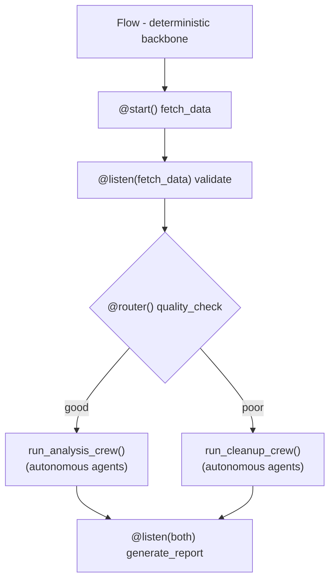
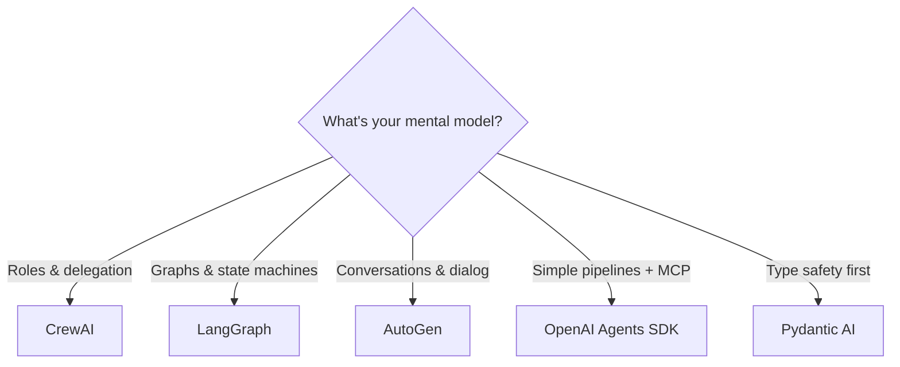

**TL;DR** — CrewAI's real uniqueness is that it models problems as _"build a team of people"_ rather than _"build a graph of nodes"_ (LangGraph) or _"build a conversation"_ (AutoGen). The **Crews + Flows dual-layer architecture** is the core differentiator. The role-playing persona system and autonomous delegation are ergonomic wins, not technical breakthroughs. The hierarchical manager is conceptually appealing but broken in practice. This post separates what's genuinely novel from what's marketing.

<!-- truncate -->

## The Mental Model That Matters

Every agent framework makes a bet on how you should think about multi-agent systems:

| Framework | Mental Model | Core Abstraction |
|-----------|-------------|-----------------|
| **CrewAI** | Build a team of people | Roles, delegation, management hierarchy |
| **LangGraph** | Build a graph of nodes | State machines, edges, typed checkpoints |
| **AutoGen** | Build a conversation | Message passing, group chat, turn-taking |
| **OpenAI Agents SDK** | Build a pipeline | Handoffs, guardrails, MCP tools |

CrewAI's bet is organizational. If your instinct when solving a problem is to think _"I need a researcher, a writer, and an editor"_ rather than _"I need node A to pass state to node B"_, CrewAI maps to your mental model natively.

But does that metaphor translate into genuinely distinct technical capabilities? Let's find out.

> **Hot take:** The "build a team of people" metaphor is CrewAI's greatest strength _and_ its ceiling. It's brilliant onboarding — product managers grok it in five minutes. But organizations aren't efficient. Real teams have politics, miscommunication, and redundant meetings. CrewAI accidentally inherited those failure modes too. The metaphor stops being helpful the moment you need your agents to do something no human org chart would describe.

## 1. The Role-Playing Persona System

Every CrewAI agent is defined with three fields — `role`, `goal`, and `backstory`:

```python
from crewai import Agent

researcher = Agent(
    role="Senior AI Research Analyst",
    goal="Uncover cutting-edge developments in multi-agent systems",
    backstory="""You are a veteran research analyst with 15 years
    in AI/ML. You have a reputation for finding non-obvious
    connections between papers and identifying hype vs substance.""",
    allow_delegation=True,
    verbose=True,
)
```

Under the hood, these fields are injected into the system prompt. The agent then uses a **ReAct loop** (Reason + Act) — generating interleaved Thought, Action, and Observation steps. The persona fields bias the LLM's reasoning toward domain-specific behavior.

**Is this novel?** No. Role-playing prompting is well-studied — the [RoleLLM paper (ACL 2024)](https://arxiv.org/abs/2310.00746) benchmarked role-playing abilities across LLMs. Any framework (or raw API call) can achieve the same effect with a system prompt.

**What CrewAI actually did:** Made it a **first-class API primitive** rather than something you do manually. This is an ergonomic win — it standardizes agent definitions, makes them readable by non-engineers, and encourages good prompt engineering practices. Other frameworks treat agents as function executors; CrewAI treats them as characters with identities.

There are no published benchmarks showing CrewAI's role/goal/backstory triple outperforms other persona approaches. The value is in the standardized structure, not in any novel mechanism.

> **Hot take:** The role/goal/backstory triple is prompt engineering with guardrails — and that's _fine_. The industry keeps looking for magic in agent definitions when the real leverage is in how agents hand off work. Nobody's production system ever failed because the backstory wasn't vivid enough. It failed because agent A hallucinated a result and agent B trusted it blindly. CrewAI's persona system solves a developer experience problem, not a reliability problem. Stop optimizing your backstories and start auditing your tool outputs.

## 2. Crews + Flows: The Strongest Differentiator

This is where CrewAI genuinely separates itself. The framework provides two orchestration layers as first-class concepts:

- **Crews** = autonomous agent teams. You define agents and tasks; the crew handles coordination.
- **Flows** = deterministic, event-driven workflow orchestration using Python decorators.



Here's what that looks like in code:

```python
from crewai.flow.flow import Flow, listen, start, router

class ContentPipeline(Flow):
    @start()
    def fetch_sources(self):
        # Deterministic: fetch data, no LLM needed
        return {"sources": scrape_urls(self.state.urls)}

    @listen(fetch_sources)
    def validate_sources(self, sources):
        # Deterministic: filter, deduplicate
        return [s for s in sources if s["quality"] > 0.7]

    @router(validate_sources)
    def route_by_quality(self, validated):
        if len(validated) > 5:
            return "deep_analysis"
        return "quick_summary"

    @listen("deep_analysis")
    def run_research_crew(self, sources):
        # Autonomous: agents decide how to analyze
        crew = Crew(
            agents=[researcher, analyst, writer],
            tasks=[research_task, analysis_task, writing_task],
            process=Process.sequential,
        )
        return crew.kickoff(inputs={"sources": sources})

    @listen("quick_summary")
    def run_summary_crew(self, sources):
        crew = Crew(
            agents=[summarizer],
            tasks=[summary_task],
        )
        return crew.kickoff(inputs={"sources": sources})
```

**Why this matters:**

- **Prototype with Crews alone**, then wrap production guardrails via Flows without rewriting
- **Deterministic control where you need it** (data fetching, validation, routing) + **autonomous reasoning where it adds value** (analysis, writing)
- Flows support `and_()` / `or_()` logical operators, FlowState (Pydantic models), and human-in-the-loop via listener resumability
- **Each task output is a natural HITL checkpoint** — in regulated industries, this gives auditors and compliance teams a clear intervention point, unlike a continuous chat stream or opaque graph state

**How competitors compare:**

- **LangGraph:** Graph-only. Everything is nodes and edges with typed state. You get fine-grained control but must model _everything_ as graph transitions — including parts that don't need LLM reasoning.
- **AutoGen:** Conversation-only (historically). Agents communicate through message passing. Less structural control over workflow ordering.
- **CrewAI:** Both layers as first-class concepts. The separation is the architectural signature.

**The trade-off:** LangGraph gives you more precise control over every state transition. If you need complex cycles, intricate error recovery, or non-linear reasoning paths, LangGraph handles these patterns more naturally. CrewAI's Flows are thinner and more opinionated.

> **Hot take:** Crews + Flows is the only feature on this page that justifies CrewAI's existence as a separate framework. Everything else — personas, delegation, YAML config — is syntactic sugar you could build in a weekend. But the _idea_ that your deterministic pipeline and your autonomous agents should live in different abstraction layers, composed together? That's a genuine architectural insight. LangGraph makes you model your data-fetching step as a graph node with typed state, which is absurd. CrewAI lets it be a Python function. The irony is that most CrewAI tutorials never even mention Flows — they stop at Crews and wonder why production falls apart.

## 3. Autonomous Inter-Agent Delegation

When `allow_delegation=True` on an agent, CrewAI converts all other agents in the crew into **tools** available to that agent. Two tools are auto-generated:

1. **`delegate_work`** — assigns a sub-task to another agent by role name, with context
2. **`ask_question`** — sends a question to another agent and gets a response

```python
researcher = Agent(
    role="Researcher",
    allow_delegation=True,
    # This agent can now delegate to any other agent in the crew
)

editor = Agent(
    role="Editor",
    allowed_agents=["Fact Checker", "Style Guide"],
    # Restricts delegation to specific agents only
)
```

The agent's LLM decides **at runtime** whether to invoke these tools during its ReAct reasoning loop. This means delegation is **emergent from the LLM's tool-calling behavior**, not pre-defined in a graph or conversation protocol.

**How this differs:**

| Framework | Routing Mechanism |
|-----------|------------------|
| **CrewAI** | Emergent — LLM decides via tool calls at runtime |
| **LangGraph** | Explicit — developer defines graph edges |
| **AutoGen** | Conversational — agents talk, manager routes |

The `allowed_agents` parameter (recently added) restricts which agents a given agent can delegate to, enabling hierarchical organizational structures and reducing "choice paralysis" from too many delegation targets.

**Known issue:** As of March 2026, [bug #4783](https://github.com/crewAIInc/crewAI/issues/4783) documents that hierarchical process delegation can fail — manager agents cannot delegate to worker agents even with `allow_delegation=True`.

## 4. Auto-Generated Manager Agent (Caveat Emptor)

When you set `process=Process.hierarchical`, CrewAI auto-creates a manager agent that coordinates the crew:

```python
crew = Crew(
    agents=[researcher, writer, editor],
    tasks=[research_task, writing_task, editing_task],
    process=Process.hierarchical,
    manager_llm="gpt-4",  # Required for hierarchical
)
```

The manager receives the overall goal and the list of available workers. It decides which agents to activate, in what order, with what context, and whether results are sufficient.

**The reality:** A detailed [Towards Data Science investigation (Nov 2025)](https://towardsdatascience.com/why-crewais-manager-worker-architecture-fails-and-how-to-fix-it/) found:

- The manager **does not selectively delegate** — CrewAI executes all tasks sequentially regardless
- The manager lacks conditional branching or true delegation enforcement
- The final response is determined by whichever task runs last, not by intelligent synthesis
- This causes incorrect agent invocation, overwritten outputs, and inflated token usage

**The workaround:** Define a custom manager agent with explicit step-by-step instructions that enforce conditional routing. The built-in auto-generated manager is too generic to handle real coordination.

The concept is appealing — describe your team and CrewAI auto-generates a coordinator. In practice, the implementation is unreliable. If you use hierarchical mode, plan to write a custom manager with detailed prompts.

> **Hot take:** The hierarchical manager is CrewAI's most telling failure. It reveals the gap between the framework's _metaphor_ and its _implementation_. In a real company, a manager who ignores delegation structure and runs every task sequentially gets fired. CrewAI's auto-generated manager does exactly that — and the framework calls it "hierarchical process." This isn't a bug to be patched; it's a sign that LLMs are bad managers. They lack the judgment to dynamically allocate work across agents. Until models get significantly better at meta-reasoning about task decomposition, "auto-generated coordination" will remain a demo feature, not a production one. Write your own manager prompt or use sequential mode. At least sequential is honest about what it does.

## 5. Zero LangChain Dependency

Starting with [version 0.86.0](https://x.com/joaomdmoura/status/1867585281177637073), CrewAI removed LangChain entirely and replaced it with **LiteLLM** for LLM provider abstraction.

**Concrete benefits:**

- **Reduced dependency tree** — LangChain pulls in dozens of transitive dependencies. Removing it makes `pip install crewai` faster and reduces version conflicts
- **Faster execution** — CrewAI claims 5.76x faster execution than LangGraph in certain QA benchmarks, partly attributed to reduced overhead
- **No version lock-in** — LangChain's rapid release cadence caused frequent breaking changes for downstream projects

**The nuance:** "Built from scratch" is somewhat marketing language — CrewAI still uses LiteLLM, ChromaDB, and other libraries. The benefit is real (removed a problematic dependency) but should be understood as a sustainability decision, not a "we wrote everything in-house" claim.

## What's NOT Unique (Despite the Marketing)

Let's be direct about what every framework does:

- **Multi-agent collaboration** — AutoGen, LangGraph, OpenAgents, Pydantic AI all do this
- **Tool integration** — every framework supports function calling and external tools
- **LLM-agnostic support** — standard across all major frameworks via LiteLLM or similar
- **YAML-based configuration** — convenient, not novel
- **Memory** — LangGraph arguably has more sophisticated state persistence with typed checkpoints

## The Memory System: Interesting but Not a Differentiator

CrewAI's unified `Memory` class uses an LLM to analyze content at save time:

| Memory Type | Backend | Purpose |
|---|---|---|
| Short-term | ChromaDB (vector) | Current session context via RAG |
| Long-term | SQLite3 (relational) | Cross-session insights |
| Entity | ChromaDB (vector) | People, places, organizations |
| Contextual | Composite | Combines all above for task injection |

The **RecallFlow** system offers adaptive depth recall — a multi-step pipeline with query analysis, parallel vector search, and confidence-based routing. Queries under 200 characters skip LLM analysis to save 1-3 seconds per recall.

**vs. LangGraph:** LangGraph has **state**, not memory. State is typed, persisted via checkpointing, and uses reducer logic for concurrent updates. It's explicit and developer-controlled. LangGraph is more powerful for workflows requiring exact state tracking. CrewAI is easier when you want agents to "remember" without managing state manually.

## Honest Limitations

1. **Higher token consumption.** Multiple sources confirm LangGraph achieves lower latency and token usage in production. CrewAI's role-playing prompts and ReAct loops add overhead. Common pattern: _prototype in CrewAI, rewrite in LangGraph when token cost matters._

2. **Hierarchical process is broken.** The auto-generated manager doesn't selectively delegate. Documented in TDS, GitHub issues, and community forums.

3. **Limited flexibility for non-task workflows.** Dynamic conversational agents, complex cycles, fine-grained state transitions — CrewAI becomes awkward. LangGraph handles these better.

4. **Debugging is painful.** Print/log statements inside tasks don't work reliably. Time spent debugging often exceeds build time. Observability has improved but lags behind LangGraph's built-in tracing.

5. **Not ideal for stateful, long-running workflows.** LangGraph's checkpoint-based persistence and durable execution model is stronger.

6. **Enterprise claims need scrutiny.** "60% of Fortune 500" is self-reported survey data. "Use" could mean a single team ran a proof-of-concept.

7. **Deployment security is an ecosystem-wide gap.** Autonomous agents that execute code need secure runtime isolation. NVIDIA's recent open-source [OpenShell](https://www.marktechpost.com/2026/03/18/nvidia-ai-open-sources-openshell-a-secure-runtime-environment-for-autonomous-ai-agents/) addresses this for any framework. CrewAI's modular task structure is easier to containerize than a bespoke graph, but the hard security problems are upstream of any framework choice.

## Where CrewAI Genuinely Wins

- **Fastest idea-to-prototype** — ~40% faster than LangGraph for getting a working multi-agent system
- **Most readable agent definitions** — role/goal/backstory is immediately understandable by non-engineers
- **Dual-layer architecture** — Crews + Flows is a genuine production pattern no other framework offers natively
- **Strongest enterprise platform** — [CrewAI AMP](https://crewai.com/amp) offers a visual builder, real-time tracing, and managed deployment (SOC2, SSO)
- **Largest community** — 44,500+ GitHub stars, 100K+ developers on learn.crewai.com
- **Named customers** — DocuSign (75% faster lead time-to-contact), PwC (10% to 70% code gen accuracy), IBM, PepsiCo, NVIDIA

## The Decision Framework



| Choose | When |
|--------|------|
| **CrewAI** | Your problem decomposes into roles. You want fast prototyping. You need Crews + Flows dual-layer for production. |
| **LangGraph** | You need precise control flow, lower token cost, complex cycles, durable execution, or fine-grained state. |
| **OpenAI Agents SDK** | You want simplicity with native MCP support and near-LangGraph efficiency. |
| **AutoGen** | Your use case is dialog-heavy — brainstorming, negotiation, customer support with emergent paths. |
| **Pydantic AI** | Type safety and multi-provider flexibility matter. You want agent logic errors caught at dev time. |

## FAQ

**Q: Is CrewAI built on top of LangChain?**
A: No. CrewAI removed its LangChain dependency entirely in version 0.86.0 and now uses LiteLLM for LLM provider abstraction. This reduced the dependency tree, eliminated version conflicts, and improved execution speed.

**Q: What is the main difference between CrewAI and AutoGen?**
A: The main difference is architectural: CrewAI uses a structured Crew-Agent-Task hierarchy with deterministic orchestration (sequential or hierarchical processes), while AutoGen relies on conversational loops between agents, which can be more flexible but less deterministic.

**Q: Can CrewAI agents use custom tools?**
A: Yes. CrewAI agents can be equipped with custom tools for web searches, API calls, code execution, and more. The framework provides built-in tools and supports custom tool definitions via Python functions.

**Q: Is CrewAI suitable for complex, stateful workflows?**
A: For highly complex, stateful workflows with intricate conditional logic and cycles, LangGraph's explicit graph-based control flow offers more granular control. CrewAI's strength is linear, collaborative processes — use Crews + Flows for production, or embed a LangGraph sub-graph for complex reasoning within a single agent.

**Q: Is CrewAI better than LangGraph for production?**
A: It depends on the workflow. For production systems involving linear, collaborative business processes where clarity and human oversight are critical, CrewAI's high-level abstraction is faster to build and easier to maintain. For systems requiring custom, non-linear state management or lower token costs, LangGraph provides the necessary control.

## The Bottom Line

Strip away the marketing, and CrewAI's genuine contribution to the multi-agent ecosystem is **one architectural insight**: separate deterministic orchestration (Flows) from autonomous reasoning (Crews), and give developers both as first-class primitives. The role-playing system is an ergonomic win. The autonomous delegation is clever but fragile. The hierarchical manager needs work.

If your problem maps to the organizational metaphor — roles, delegation, management — CrewAI will get you to a working system faster than anything else. If your problem maps to state machines, graphs, or complex control flow, look elsewhere.

The frameworks aren't mutually exclusive. A pragmatic 2026 architecture might use CrewAI Flows for high-level orchestration while embedding a LangGraph sub-graph for a particularly complex reasoning task within a single agent's execution. The ecosystems may converge, but their core architectural DNA will continue to dictate their ideal use cases.

---

_Sources: [CrewAI Documentation](https://docs.crewai.com/), [CrewAI GitHub](https://github.com/crewAIInc/crewAI), [LangGraph Documentation](https://langchain-ai.github.io/langgraph/), [AutoGen Documentation](https://microsoft.github.io/autogen/), [TDS: Why CrewAI's Manager-Worker Architecture Fails](https://towardsdatascience.com/why-crewais-manager-worker-architecture-fails-and-how-to-fix-it/), [CrewAI AMP](https://crewai.com/amp), [RoleLLM (ACL 2024)](https://arxiv.org/abs/2310.00746)_
