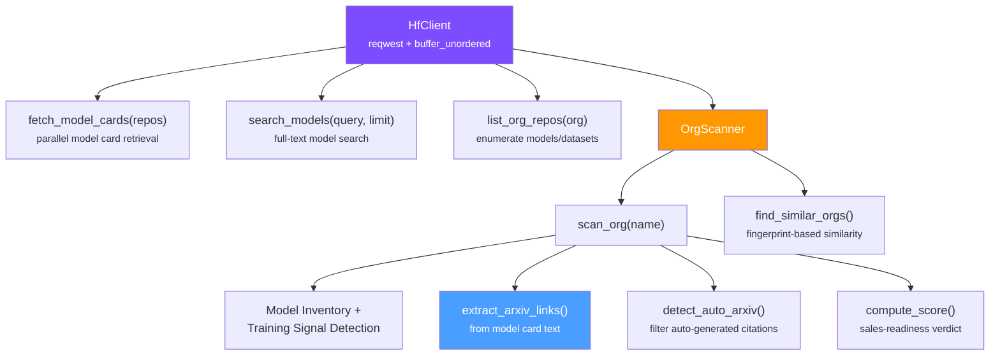

# hf

Parallel data retrieval from Hugging Face Hub API with bounded concurrency, organization profiling, arXiv paper extraction from model cards, and ML-readiness scoring.

## Architecture



## Modules

| Module | Purpose |
|--------|---------|
| `client` | Async HF API client — bounded concurrency via `buffer_unordered`, token auth, model/dataset search |
| `org` | Organization profiling — training signal detection, arXiv link extraction, maturity scoring, sales signals |
| `types` | Data structures: `OrgProfile`, `TrainingSignal`, `ModelMaturity`, `SalesSignal`, `OrgFingerprint` |
| `error` | Error types |
| `db` | SQLite cache for HF repo metadata (feature: `sqlite`) |

## Key Features

- **Bounded concurrency**: throws thousands of repo IDs without overwhelming the API (clamped 1..64)
- **arXiv extraction**: `extract_arxiv_links()` parses arxiv.org URLs and paper ID notation from model cards
- **Auto-arXiv detection**: `detect_auto_arxiv()` filters out auto-generated citations (e.g., sentence-transformers boilerplate)
- **Training signals**: detects custom architectures, pre-training, novel model types vs. standard fine-tuning
- **Sales scoring**: ML maturity + sales-readiness composite score with category classification

## Usage

```rust
use hf::{HfClient, OrgScanner};

#[tokio::main]
async fn main() -> Result<(), hf::Error> {
    let client = HfClient::new(None, 8)?;

    // Fetch model cards in parallel
    let repos = vec!["meta-llama/Llama-2-7b", "mistralai/Mistral-7B-v0.1"];
    let cards = client.fetch_model_cards(&repos).await?;

    // Full org profile with arXiv paper extraction
    let scanner = OrgScanner::new(&client);
    let profile = scanner.scan_org("meta-llama").await?;
    println!("Models: {}, arXiv papers: {}", profile.models.len(), profile.arxiv_links.len());

    Ok(())
}
```

## Features

| Feature | Default | Description |
|---------|---------|-------------|
| `sqlite` | No | Enable `db` module for local SQLite caching of HF repo metadata |

## Environment Variables

| Variable | Required | Description |
|----------|----------|-------------|
| `HF_TOKEN` | No | HuggingFace bearer token for private repos and higher rate limits |

## Dependencies

| Crate | Purpose |
|-------|---------|
| `reqwest` | HTTP client with JSON + streaming |
| `tokio` | Async runtime |
| `futures` | `buffer_unordered` for bounded parallel requests |
| `serde` / `serde_json` | JSON deserialization of HF API responses |
| `rusqlite` | SQLite cache (optional, `sqlite` feature) |
| `tracing` | Structured logging |
