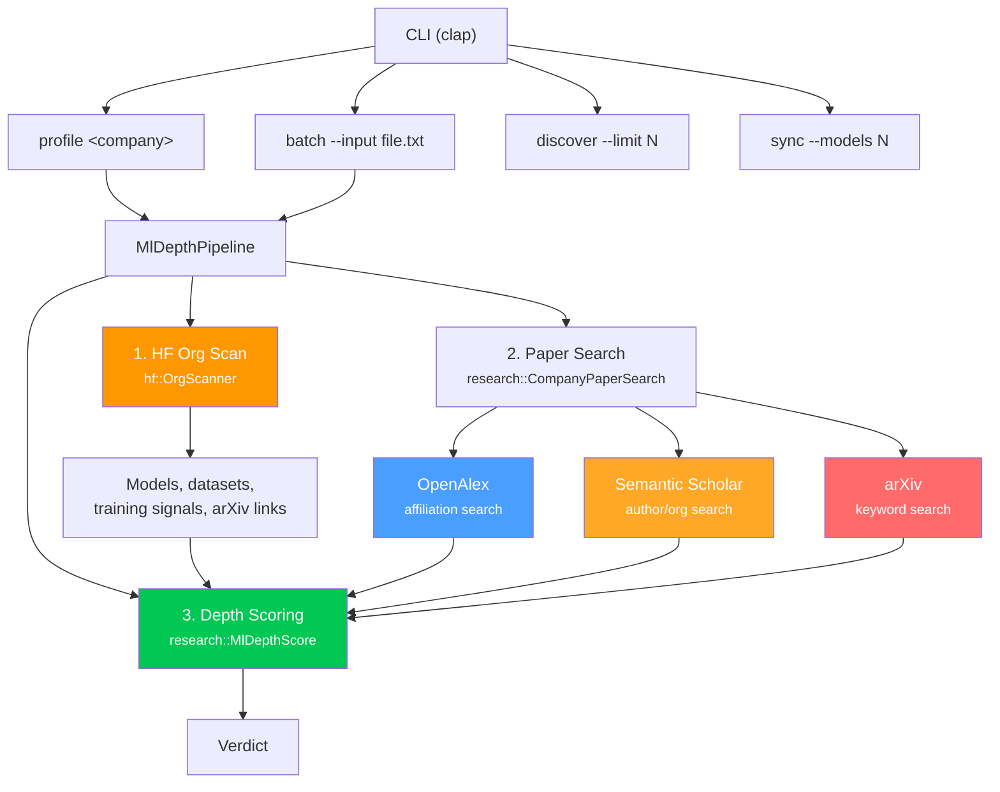

# ml-depth

Discover and validate genuine deep ML companies via HuggingFace Hub presence + academic paper output.

## Architecture



## Modules

| Module | Purpose |
|--------|---------|
| `pipeline` | Full validation pipeline: HF scan → paper search → depth scoring → `CompanyProfile` |
| `discovery` | Candidate discovery — keyword-based HF model search for ML-heavy orgs |
| `report` | Output formatting: table and CSV rendering of company profiles |

## CLI Usage

```bash
# Profile a single company
cargo run -- profile assemblyai

# Batch profile from a file (one company name per line)
cargo run -- batch --input companies.txt --format table

# Discover candidate ML orgs from HuggingFace
cargo run -- discover --limit 50

# Sync popular HF repos to local SQLite cache
cargo run -- sync --models 5000 --datasets 1000 --db hf_repos.db
```

## Environment Variables

| Variable | Required | Description |
|----------|----------|-------------|
| `HF_TOKEN` | No | HuggingFace token for private repos and higher rate limits |
| `SEMANTIC_SCHOLAR_API_KEY` | No | Semantic Scholar API key for higher rate limits |
| `OPENALEX_MAILTO` | No | Email for OpenAlex polite pool (higher throughput) |

Env is loaded from `.env.local` via `dotenvy`.

## Dependencies

| Crate | Purpose |
|-------|---------|
| `hf` (sqlite feature) | HuggingFace Hub client with org scanning and local SQLite cache |
| `research` (no default features) | Paper search clients (OpenAlex, Semantic Scholar, arXiv), ML depth scoring |
| `tokio` | Async runtime |
| `clap` | CLI argument parsing |
| `dotenvy` | `.env.local` loading |
| `tracing` | Structured logging |
