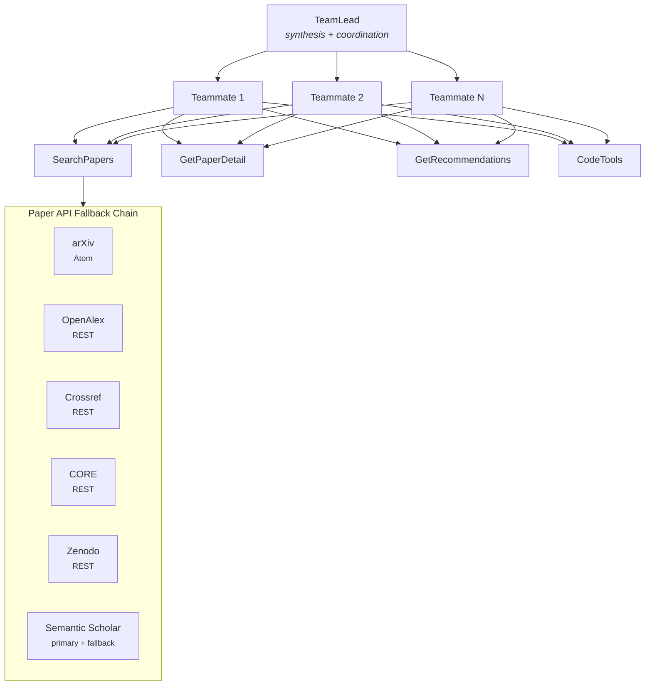
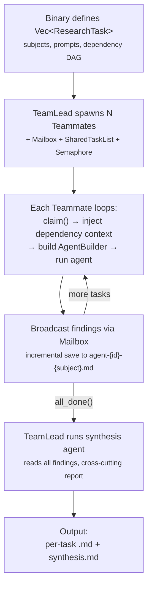
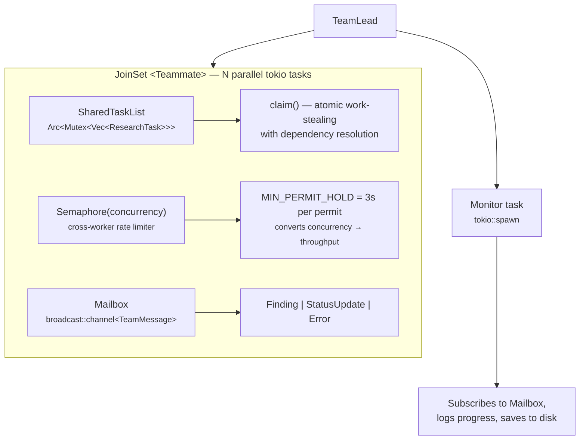
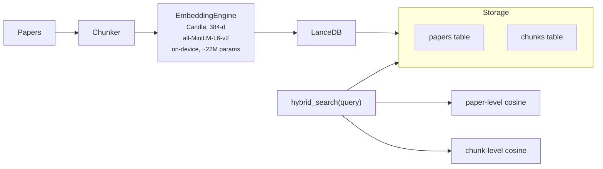
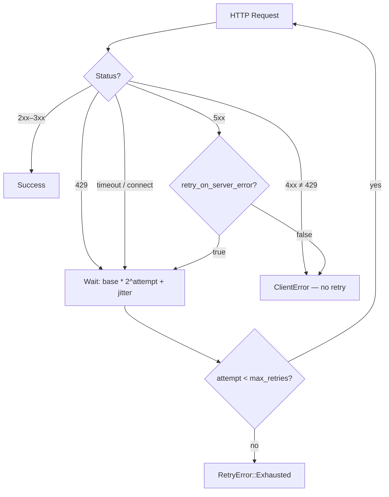
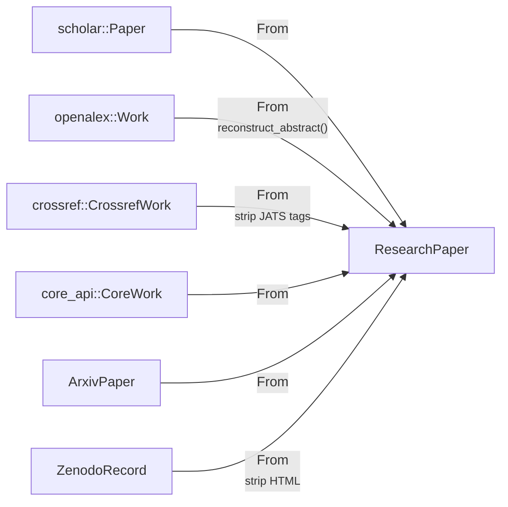
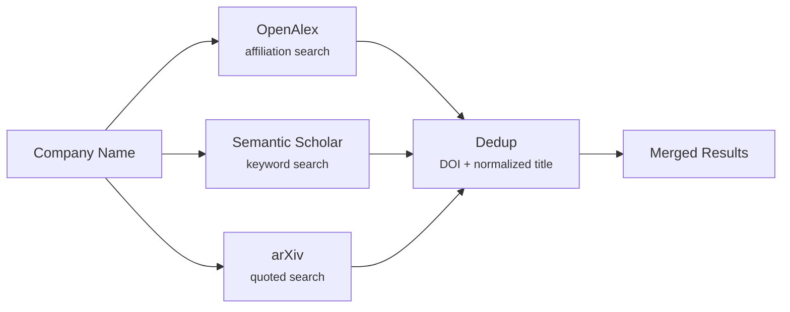
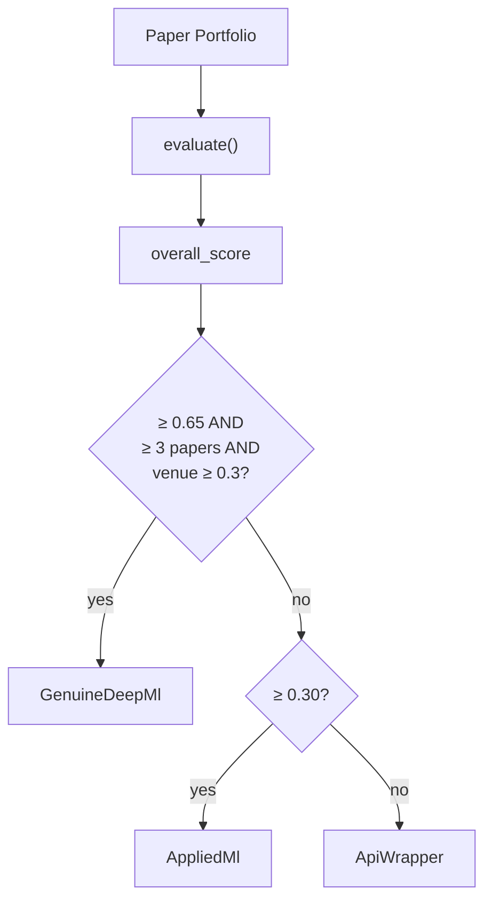
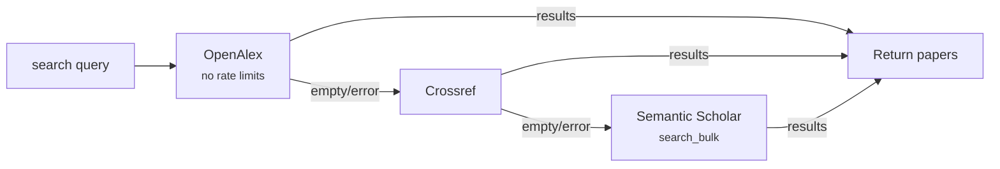

# research

Multi-model LLM research infrastructure — academic paper discovery across **6 APIs** (arXiv, Semantic Scholar, OpenAlex, Crossref, CORE, Zenodo), parallel DeepSeek + Qwen querying, distributed team-based agent orchestration, local vector search with Candle embeddings, and AST-based code analysis.

> **~32K lines of Rust** · **252 unit tests** · **19 integration test suites** · **25 binaries** · **2 feature flags**

## Architecture



### Data Flow



### Concurrency Model



### Local Vector Pipeline (feature: `local-vector`)



## Modules

### Paper API Clients

| Module | API | Auth | Rate Limit | Coverage |
|--------|-----|------|------------|----------|
| `arxiv` | arXiv (Atom feed) | None | 3s polite delay + retry w/ jitter | 2.4M+ preprints, category browsing |
| `scholar` | Semantic Scholar | Optional API key (`x-api-key`) | Semaphore-based (3s holds) + exponential backoff | 200M+ papers, citations, SPECTER2 |
| `openalex` | OpenAlex | None (mailto for polite pool) | Exponential backoff on 429 | 200M+ works, inverted-index abstracts |
| `crossref` | Crossref | None (mailto for polite pool) | Exponential backoff on 429 | 150M+ DOI records |
| `core_api` | CORE | Optional API key (Bearer) | Exponential backoff (4^n delay) | 200M+ open-access papers, full text |
| `zenodo` | Zenodo | Optional Bearer token | Exponential backoff | 3M+ records (papers, datasets, software) |

Each client provides:
- `new(api_key)` / `with_base_url(url, api_key)` — for testing with `wiremock`
- `search(query, ...)` — keyword search
- `get_work(id)` / `get_paper(id, fields)` / `get_record(id)` — single-item lookup
- All HTTP via `reqwest` with 30s timeout

#### arXiv Client

```rust
pub struct ArxivClient { .. }

impl ArxivClient {
    pub fn new() -> Self
    pub fn with_base_url(base_url: &str) -> Self

    // Search
    pub async fn search(query, start, max_results, sort_by, sort_order) -> Result<ArxivSearchResponse>
    pub async fn search_advanced(query: &SearchQuery) -> Result<ArxivSearchResponse>
    pub async fn search_all(query: &SearchQuery, total_limit: u32) -> Result<ArxivSearchResponse>  // auto-paginate

    // Single paper / batch
    pub async fn get_paper(arxiv_id: &str) -> Result<ArxivPaper>
    pub async fn fetch_batch(ids: &[String], batch_size: usize) -> Result<Vec<ArxivPaper>>
}
```

**Query builder:**
```rust
pub struct SearchQuery { .. }
impl SearchQuery {
    pub fn new() -> Self
    pub fn terms(self, terms: &str) -> Self
    pub fn category(self, cat: ArxivCategory) -> Self
    pub fn date_range(self, range: DateRange) -> Self
    pub fn sort_by(self, sort: SortBy) -> Self
    pub fn sort_order(self, order: SortOrder) -> Self
    pub fn start(self, start: u32) -> Self
    pub fn max_results(self, max: u32) -> Self
}
```

**Categories:** `CsAI`, `CsCL`, `CsLG`, `CsCV`, `CsNE`, `CsIR`, `CsSE`, `CsRO`, `CsCR`, `CsDS`, `StatML`, `MathOC`, `QuantPhysics`, `EessSP`

**Rate limiting:** 3-second polite delay after every successful request (arXiv requirement). Retry via shared `RetryConfig` with jitter.

#### Semantic Scholar Client

```rust
pub struct SemanticScholarClient { .. }

impl SemanticScholarClient {
    pub fn new(api_key: Option<&str>) -> Self
    pub fn with_rate_limiter(api_key: Option<&str>, limiter: Arc<Semaphore>) -> Self

    // Search endpoints
    pub async fn search_bulk(&self, query, fields, year, min_citations, sort, limit) -> Result<BulkSearchResponse>
    pub async fn search(&self, query, fields, limit, offset) -> Result<SearchResponse>

    // Single paper
    pub async fn get_paper(&self, paper_id, fields) -> Result<Paper>  // S2PaperId, DOI:, arXiv:, PMID:, ACL:

    // Citation graph
    pub async fn get_citations(&self, paper_id, fields, limit) -> Result<CitationsResponse>
    pub async fn get_references(&self, paper_id, fields, limit) -> Result<ReferencesResponse>

    // SPECTER2 similarity
    pub async fn get_recommendations(&self, paper_id, fields, limit) -> Result<RecommendationsResponse>
}
```

**Field constants:**
- `SEARCH_FIELDS` — for search endpoints (no `tldr` or `influentialCitationCount`)
- `PAPER_FIELDS_FULL` — for single-paper detail (includes `tldr`, `influentialCitationCount`)
- `PAPER_FIELDS_BRIEF` — lightweight subset for nested objects

#### Zenodo Client

```rust
pub struct ZenodoClient { .. }

impl ZenodoClient {
    pub fn new(access_token: Option<&str>) -> Self
    pub fn with_base_url(base_url: &str, access_token: Option<&str>) -> Self

    pub async fn search(query, page, size) -> Result<ZenodoSearchResponse>
    pub async fn search_filtered(query, resource_type, sort, page, size) -> Result<ZenodoSearchResponse>
    pub async fn get_record(id: u64) -> Result<ZenodoRecord>
}
```

**Features:** Elasticsearch query syntax, resource type filtering (`publication`, `dataset`, `software`), HTML-stripping on descriptions, PDF file URL extraction, optional Bearer auth (100 vs 60 req/min).

#### Shared Retry Logic (`retry`)

All six API clients share a configurable retry module:

```rust
pub struct RetryConfig {
    pub max_retries: u32,        // default: 3
    pub base_delay: Duration,    // default: 1s
    pub max_delay: Duration,     // default: 30s
    pub jitter: bool,            // default: true
    pub retry_on_server_error: bool, // default: true
}

pub async fn retry_get(client, url, params, config, api_name) -> Result<Response, RetryError>
```



Backoff formula: `base * 2^attempt`, capped at `max_delay`, with 50-100% random jitter.

#### Error Handling

All six clients share the same error pattern:

```rust
pub enum Error {
    Http(reqwest::Error),                    // network/connection failures
    Api { status: u16, message: String },    // non-2xx responses (except 429)
    RateLimited { retry_after: u64 },        // 429 after exhausting retries
    Json(serde_json::Error),                 // deserialization failures
}
```

### Unified Paper Model

All six API clients convert to a common `ResearchPaper` via `From` trait implementations:



```rust
pub enum PaperSource { SemanticScholar, OpenAlex, Crossref, Core, Arxiv, Zenodo }

pub struct ResearchPaper {
    pub title: String,
    pub abstract_text: Option<String>,
    pub authors: Vec<String>,
    pub year: Option<u32>,
    pub doi: Option<String>,
    pub citation_count: Option<u64>,
    pub url: Option<String>,
    pub pdf_url: Option<String>,
    pub source: PaperSource,
    pub source_id: String,
    pub fields_of_study: Option<Vec<String>>,
}
```

**Conversion details:**
- `From<scholar::Paper>` — extracts `open_access_pdf.url`, maps `paper_id` to `source_id`
- `From<openalex::Work>` — calls `reconstruct_abstract()` to rebuild from inverted index, resolves PDF via `primary_location` then `open_access.oa_url` fallback
- `From<crossref::CrossrefWork>` — strips JATS/HTML tags from abstracts, builds full names from `given`/`family`, extracts year from `published` date parts
- `From<core_api::CoreWork>` — resolves PDF via `download_url` then `source_fulltext_urls[0]`
- `From<ArxivPaper>` — maps `arxiv_id` to `source_id`, extracts `pdf_url` and categories
- `From<ZenodoRecord>` — strips HTML from description, extracts PDF via `pdf_url()` helper, maps creators to authors

### Company Affiliation Search (`affiliation`)

Multi-source paper discovery by company name or author names:

```rust
pub struct CompanyPaperSearch { .. }

impl CompanyPaperSearch {
    pub fn new(openalex, scholar, arxiv) -> Self
    pub async fn search_by_company(&self, company_name, limit) -> Result<Vec<ResearchPaper>>
    pub async fn search_by_authors(&self, author_names, limit_per_author) -> Result<Vec<ResearchPaper>>
    pub async fn fetch_arxiv_papers(&self, arxiv_ids) -> Result<Vec<ResearchPaper>>
}
```



Short titles (≤10 chars) exempt from title dedup to avoid false positives.

### LLM Provider Abstraction (`agent`)

Re-exports the `deepseek` crate's agent framework and adds provider-polymorphic builders:

```rust
pub enum LlmProvider {
    DeepSeek { api_key: String, base_url: String },
    Qwen { api_key: String, model: String },
}

pub fn agent_builder(api_key, model) -> AgentBuilder<ReqwestClient>       // DeepSeek
pub fn qwen_agent_builder(api_key, model) -> AgentBuilder<ReqwestClient>  // Qwen via DashScope
pub fn provider_agent_builder(provider: &LlmProvider) -> AgentBuilder<ReqwestClient>
```

`qwen_agent_builder` sets base URL to `https://dashscope-intl.aliyuncs.com/compatible-mode`.

Also re-exports: `Tool`, `ToolDefinition`, `AgentBuilder`, `DeepSeekAgent`, `ReqwestClient`, `HttpClient`.

### Multi-Model Research (`dual`)

Parallel multi-provider querying with automatic provider detection:

```rust
pub struct MultiModelResearcher { .. }
impl MultiModelResearcher {
    pub fn from_env() -> Result<Self>        // auto-detect DEEPSEEK_API_KEY / DASHSCOPE_API_KEY
    pub fn provider_names(&self) -> Vec<&str>
    pub async fn query(&self, system: &str, question: &str) -> Result<MultiResponse>
}

pub struct MultiResponse {
    pub question: String,
    pub responses: Vec<ModelResponse>,       // parallel results from all configured models
}

pub struct ModelResponse {
    pub model: String,
    pub content: String,
    pub reasoning: String,                   // DeepSeek Reasoner chain-of-thought (empty for others)
}
```

**Synthesis functions:**
- `format_multi_unified_synthesis(resp)` — picks the longest successful (non-error) response
- `format_unified_synthesis(resp)` — dual-model version, picks longer of two
- `format_prep_document(title, responses)` — renders all responses as Markdown with collapsible chain-of-thought

**Backward compatibility:**
```rust
pub struct DualModelResearcher { .. }        // wraps MultiModelResearcher
impl DualModelResearcher {
    pub fn from_env() -> Result<Self>
    pub async fn query(&self, system, question) -> Result<DualResponse>
    pub async fn query_all(&self, system, questions) -> Vec<DualResponse>  // sequential to avoid rate limits
}
```

### Embedding & Re-ranking

#### API-Based (`embeddings`)

Semantic re-ranking using Qwen `text-embedding-v4`:

```rust
pub trait Ranker {
    async fn rank_papers(&self, query: &str, papers: Vec<ResearchPaper>) -> Result<Vec<(ResearchPaper, f32)>>;
}

pub struct EmbeddingRanker { .. }
impl EmbeddingRanker {
    pub fn new(api_key: &str) -> Self
    pub fn with_client(client: qwen::Client) -> Self
}
impl Ranker for EmbeddingRanker { .. }
```

#### Local On-Device (`local_embeddings`) — feature: `local-vector`

384-dimensional embeddings via Candle + all-MiniLM-L6-v2 (no API calls):

```rust
pub struct EmbeddingEngine { .. }
impl EmbeddingEngine {
    pub fn new(device: Device) -> Result<Self>  // Device::Cpu or Device::Metal
    pub fn dim(&self) -> usize                  // 384
    pub async fn embed_batch(&self, texts: &[&str]) -> Result<Vec<Vec<f32>>>
    pub async fn embed_one(&self, text: &str) -> Result<Vec<f32>>
    pub fn cosine(a: &[f32], b: &[f32]) -> f32
}

pub struct LocalRanker { .. }
impl LocalRanker {
    pub fn new(engine: EmbeddingEngine) -> Self
    pub fn cpu() -> Result<Self>
}
impl Ranker for LocalRanker { .. }  // drop-in replacement for EmbeddingRanker
```

**Model:** all-MiniLM-L6-v2 (~22M params, ~100 MB download on first run, then fully offline). Mean pooling with attention mask, L2-normalized output.

### Text Chunking (`chunker`) — feature: `local-vector`

Section-aware text chunking for vector ingestion:

```rust
pub enum ChunkStrategy { Fixed, Sentence, Paragraph, Section }

pub struct ChunkerConfig {
    pub chunk_size: usize,      // default: 512
    pub overlap: usize,         // default: 64
    pub min_size: usize,        // default: 50
    pub strategy: ChunkStrategy,
}

pub fn chunk_text(text: &str, paper_id: &str, config: Option<ChunkerConfig>) -> Vec<Chunk>
```

**Section detection:** Markdown headers, LaTeX `\section{}`, numbered sections, common academic headings (Abstract, Introduction, Methods, Results, Discussion, Conclusion), table/figure markers. UTF-8 boundary safe.

### Vector Store (`vector`) — feature: `local-vector`

LanceDB-backed vector database for paper-level and chunk-level semantic search:

```rust
pub struct VectorStore { .. }
impl VectorStore {
    pub async fn connect(db_path: &str, engine: EmbeddingEngine) -> Result<Self>
    pub async fn add_papers(&self, papers: &[ResearchPaper]) -> Result<usize>
    pub async fn add_chunks(&self, chunks: &[Chunk]) -> Result<usize>
    pub async fn search(&self, query, limit, filter: SearchFilter) -> Result<Vec<SearchResult>>
    pub async fn search_chunks(&self, query, limit) -> Result<Vec<ChunkResult>>
    pub async fn hybrid_search(&self, query, papers_limit, chunk_weight) -> Result<Vec<SearchResult>>
}

pub struct SearchFilter {
    pub year_min: Option<u32>,
    pub year_max: Option<u32>,
    pub source: Option<PaperSource>,
    pub min_citations: Option<u32>,
}
```

**Schema:** Two Arrow tables — `papers` (16 fields + 384-d vector) and `chunks` (chunk_id, paper_id, chunk_index, text, section, vector). Batch ingestion at 256 records to avoid OOM.

### Search Quality Evaluation (`critique`)

Multi-dimensional scoring of research result sets:

```rust
pub struct CritiqueConfig { .. }
impl CritiqueConfig {
    pub fn evaluate(&self, papers: &[ResearchPaper]) -> Critique
    #[cfg(feature = "local-vector")]
    pub fn evaluate_semantic(&self, papers: &[ResearchPaper], embeddings: &[Vec<f32>]) -> Critique
}

pub struct Critique {
    pub quality_score: f64,              // 0.0..=1.0
    pub dimension_scores: Option<DimensionScores>,
    pub issues: Vec<String>,
    pub suggestions: Vec<String>,
}
```

**8 scoring dimensions** (9 with `local-vector`):

| Dimension | Weight | Method |
|-----------|--------|--------|
| Result count | 0.15 | sigmoid(len, 3, 10) |
| Year range | 0.12 | span / min_year_range |
| Source diversity | 0.12 | num_sources / min_sources |
| Abstract coverage | 0.12 | fraction with non-empty abstract |
| Recency bias | 0.12 | flags ≥70% from last 2 years |
| Citation network | 0.10 | Gini coefficient of citation counts |
| Authority | 0.12 | fraction above citation threshold |
| Field diversity | 0.15 | unique fields_of_study count |
| Semantic diversity | — | cosine distance matrix (local-vector only) |

### ML Research Depth Scoring (`ml_depth`)

Evaluate company ML research depth from their paper portfolio:

```rust
pub enum MlDepthVerdict { GenuineDeepMl, AppliedMl, ApiWrapper, Unknown }

pub struct MlDepthConfig { .. }
impl MlDepthConfig {
    pub fn evaluate(&self, papers: &[ResearchPaper], hf_score: Option<f32>) -> MlDepthScore
}
```

**7 scoring dimensions:** paper count, venue quality (35 top ML venues), citation impact (h-index-like), research breadth (12 ML subfields), novelty (recency-weighted), team pedigree (28 elite labs), HuggingFace signals.



### Agent Tools (`tools`)

Three `Tool`-trait implementations for the DeepSeek agent loop:

| Tool | Name | Description |
|------|------|-------------|
| `SearchPapers` | `search_papers` | Keyword search with fallback chain (OpenAlex → Crossref → Semantic Scholar), optional embedding re-ranking |
| `GetPaperDetail` | `get_paper_detail` | Full paper details by ID (S2PaperId, DOI, arXiv, PMID, ACL). DOI-based IDs try OpenAlex/Crossref first |
| `GetRecommendations` | `get_recommendations` | SPECTER2-based similar papers from Semantic Scholar |

**Search configuration:**
```rust
pub struct SearchToolConfig {
    pub default_limit: u32,              // 8
    pub abstract_max_chars: usize,       // 350
    pub max_authors: usize,              // 4
    pub include_fields_of_study: bool,   // true
    pub include_venue: bool,             // false
    pub search_description: Option<String>,
    pub detail_description: Option<String>,
}
```

**Builder pattern:**
```rust
SearchPapers::new(scholar)
SearchPapers::with_config(scholar, config)
SearchPapers::with_fallback(scholar, config, fallback_clients)
    .with_embedding_ranker(Arc::new(ranker))      // API-based or local ranker (both impl Ranker)
```

**Fallback chain:**



### Team Orchestration (`team`)

#### Task System

```rust
pub enum TaskStatus { Pending, InProgress, Completed, Failed }

pub struct ResearchTask {
    pub id: usize,
    pub subject: String,
    pub description: String,
    pub preamble: String,              // system prompt for this task's agent
    pub status: TaskStatus,
    pub owner: Option<String>,
    pub dependencies: Vec<usize>,      // task IDs this depends on
    pub result: Option<String>,
}

pub struct SharedTaskList { .. }       // Arc<Mutex<Vec<ResearchTask>>>
impl SharedTaskList {
    pub fn new(tasks: Vec<ResearchTask>) -> Self
    pub fn claim(&self, worker_id: &str) -> Option<ResearchTask>  // atomic claim of next unblocked task
    pub fn complete(&self, task_id, result)
    pub fn fail(&self, task_id, error)
    pub fn completed_findings(&self) -> Vec<(String, String)>
    pub fn completed_findings_for(&self, dep_ids: &[usize]) -> Vec<(String, String)>
    pub fn completed_tasks(&self) -> Vec<(usize, String, String)>
    pub fn all_done(&self) -> bool
    pub fn resume_from_dir(&self, dir: &str) -> usize   // load pre-existing results from disk
    pub fn reset_failed(&self) -> usize                   // retry failed tasks
}
```

**Dependency resolution:** `claim()` only returns tasks whose dependencies are all in terminal state (Completed **or** Failed). Failed tasks count as resolved so downstream synthesis can proceed with partial results. Workers poll with 2s sleep when blocked.

**Resume from disk:** Scans for files matching `agent-{id:02}-{subject}.md` or `agent-{id:03}-{subject}.md`. Non-empty files mark tasks as Completed. Enables crash recovery.

#### Teammate

```rust
pub struct TeammateConfig {
    pub provider: LlmProvider,
    pub scholar_key: Option<String>,
    pub code_analysis: Option<CodeAnalysisConfig>,
    pub tool_config: Option<SearchToolConfig>,
    pub scholar_rate_limiter: Option<Arc<Semaphore>>,
    pub fallback: Option<FallbackClients>,
}
```

**Work loop:** claim() → broadcast StatusUpdate → build context from dependency findings → truncate to 400K chars (~100K tokens) → build AgentBuilder with tools → run agent → complete/fail → loop until all_done().

#### TeamLead

```rust
pub struct TeamConfig {
    pub team_size: usize,
    pub provider: LlmProvider,
    pub scholar_key: Option<String>,
    pub code_root: Option<PathBuf>,
    pub synthesis_preamble: Option<String>,
    pub synthesis_prompt_template: Option<String>,  // {count} and {combined} placeholders
    pub tool_config: Option<SearchToolConfig>,
    pub scholar_concurrency: Option<usize>,         // Some(3) recommended with API key
    pub mailto: Option<String>,                     // polite-pool email for OpenAlex/Crossref
    pub output_dir: Option<String>,
    pub synthesis_provider: Option<LlmProvider>,    // separate model for synthesis
}

pub struct TeamResult {
    pub findings: Vec<(usize, String, String)>,
    pub synthesis: String,
}
```

#### Mailbox

```rust
pub enum MessageKind {
    Finding { task_id: usize, summary: String },
    StatusUpdate(String),
    Error(String),
}

pub struct Mailbox { .. }       // wraps broadcast::Sender<TeamMessage> (capacity: 128)
```

### Code Analysis (`code`)

AST-based code analysis via `ast-grep`:

| Tool | Name | Description |
|------|------|-------------|
| `SearchPattern` | `search_pattern` | AST patterns with meta-variable captures (`$VAR` single, `$$$VAR` variadic) |
| `AnalyzeStructure` | `analyze_structure` | Extract functions, structs, classes, traits, enums, impl blocks, type aliases |
| `FindAntiPatterns` | `find_anti_patterns` | Curated anti-patterns with rule name and remediation |

**Configuration:**
```rust
pub struct CodeAnalysisConfig {
    pub root_path: PathBuf,                         // default: "."
    pub max_file_size: usize,                       // default: 100 KB
    pub max_matches: usize,                         // default: 50
    pub allowed_languages: Option<Vec<SupportLang>>, // None = all
}
```

**17 supported languages:** Rust, TypeScript, TSX, JavaScript, Python, Go, Java, C, C++, Ruby, Swift, Kotlin, C#, JSON, YAML, HTML, CSS.

**Anti-patterns:** Rust (`unwrap_on_result`, `panic_call`, unsafe blocks), TypeScript/TSX (error handling, `console.log`).

**Modes:** File mode (walks directory tree, skips hidden/node_modules/target/dist) and inline mode (analyze code snippets directly).

## Binaries (25)

### Domain Research (Team Framework)

| Binary | Domain | Tasks | Notes |
|--------|--------|-------|-------|
| `healthcare-research` | AI in healthcare (diagnosis, treatment, clinical workflows) | Multi-tier | Stack-aware prompts |
| `therapeutic-research` | Evidence-based interventions | Per-condition | Research-Thera app support |
| `condition-research` | Mental health (anxiety, depression, ADHD) | Per-condition | Clinical focus |
| `characteristic-research` | Psychological/emotional characteristics | Per-trait | Trait analysis |
| `calm-parent-research` | Parenting + mental health strategies | Multi-topic | Parent support |
| `law-research` | AI + legal tech (contracts, discovery, compliance) | Legal landscape | — |
| `real-estate-research` | AI in real estate (valuation, PropTech, CV) | 10 domains | — |
| `knowledge-research` | AI/ML for learning (cognitive science, adaptive systems) | EdTech | — |
| `scalping-research` | High-frequency trading strategies | Trading | — |
| `bear-market-trading` | Bear market strategies | Downturn | — |
| `interview-prep` | Behavioral interview preparation | Multi-level | — |
| `code-research` | Codebase analysis + paper research hybrid | Hybrid | ast-grep + papers |
| `todo-research` | Todo app + productivity | App-focused | — |
| `todo-sdd` | SDD applied to todo app development | SDD patterns | — |
| `tts-research` | Text-to-speech technology | TTS landscape | — |
| `harness-design-research` | LLM agent harness design (8 topics) | Multi-agent | Self-eval, context mgmt |
| `kv-quant-research` | KV-cache quantization (3 topics) | Long-context | Pruning, quantization |
| `scrapus-research` | Multi-pass deep research on lead-gen modules | Per-module | Prior context, upgrade blueprints |

### Evaluation

| Binary | Purpose |
|--------|---------|
| `eval-therapeutic` | Offline eval with graders (citation accuracy, grounding) |
| `eval-characteristic` | Offline eval with Python graders (weighted scoring) |

### Paper Discovery & Aggregation

| Binary | Purpose | Feature Gate |
|--------|---------|-------------|
| `paper-discovery` | Local vector-powered discovery (ingest, search, critique) | `local-vector` |
| `last-week` | Weekly AI research digest — 6 sources, fuzzy dedup, category grouping | — |
| `hair-papers` | Hair-care/alopecia papers (100 target, 22 queries, 5 sources) | — |

### Database-Backed Research

| Binary | Purpose | Feature Gate |
|--------|---------|-------------|
| `protocol-research` | Supplement protocol research (neuropharmacology, Postgres-backed) | `neon` |

### Investigation

| Binary | Purpose |
|--------|---------|
| `qwen-investigate` | Live system state investigation (reads local FS) |

**Default binary** (`src/main.rs`): SDD (Spec-Driven Development) research — 10 tasks with dependency DAG.

**Common launch pattern:**
```rust
let lead = TeamLead::new(TeamConfig {
    team_size: 20,
    provider: LlmProvider::DeepSeek { api_key, base_url },
    scholar_key: Some(scholar_key),
    scholar_concurrency: Some(3),
    output_dir: Some("research-output/domain".into()),
    mailto: std::env::var("RESEARCH_MAILTO").ok(),
    ..Default::default()
});
let result = lead.run(research_tasks()).await?;
```

## Feature Flags

| Feature | Default | Modules Enabled | Dependencies Added |
|---------|---------|-----------------|-------------------|
| `local-vector` | **Yes** | `chunker`, `local_embeddings`, `vector` + semantic diversity in `critique` | candle-core/nn/transformers, hf-hub, tokenizers, lancedb, arrow, regex, sha2, hex, clap |
| `neon` | No | Postgres access in `protocol-research`, `hair-papers` | sqlx (postgres, rustls, uuid, chrono, json) |

**With `local-vector`:** on-device Candle embeddings (384-d), LanceDB vector store, section-aware chunking, `LocalRanker` as drop-in `Ranker` replacement, full critique scoring.

**Without `local-vector`:** API-based `EmbeddingRanker` (Qwen `text-embedding-v4`) only. No chunking, no vector store, no semantic diversity in critique.

## Environment Variables

| Variable | Used By | Required |
|----------|---------|----------|
| `DEEPSEEK_API_KEY` | Agent framework, dual-model researcher | Yes (for agent-based runs) |
| `DEEPSEEK_BASE_URL` | Agent framework | No (default: `https://api.deepseek.com`) |
| `DASHSCOPE_API_KEY` | Qwen chat + embeddings | No (enables Qwen provider) |
| `QWEN_MODEL` | Dual-model researcher | No (default: `qwen-max`) |
| `SEMANTIC_SCHOLAR_API_KEY` | Semantic Scholar client | No (1 req/s with key, shared pool without) |
| `RESEARCH_MAILTO` | OpenAlex/Crossref polite pool | No (higher rate limits when set) |
| `ZENODO_ACCESS_TOKEN` | Zenodo client | No (100 vs 60 req/min) |
| `CORE_API_KEY` | CORE client | No (enables authenticated access) |

## Implementation Details

- **6-source fallback hierarchy** — SearchPapers tries OpenAlex → Crossref → Semantic Scholar; standalone binaries fan out to all 6 sources in parallel
- **Rate limiting** — Semaphore-based permit holding (`MIN_PERMIT_HOLD = 3s`) converts concurrency into throughput throttling; arXiv uses fixed 3s polite delay
- **Shared retry module** — all six API clients use `retry_get()` with configurable exponential backoff, jitter, and status-code-aware decisions
- **Dependency-aware claiming** — failed tasks count as "resolved" so downstream synthesis can proceed with partial results
- **Context truncation** — dependency findings truncated to 400K chars (~100K tokens); each entry gets proportional budget with `[...truncated...]` suffix
- **Incremental persistence** — results saved to disk as they complete, enabling resume-from-failure via `resume_from_dir()`
- **Abstract reconstruction** — OpenAlex inverted-index abstracts rebuilt to plain text; Crossref JATS/HTML tags iteratively stripped; Zenodo HTML descriptions stripped
- **Polite pool** — OpenAlex + Crossref accept optional `mailto` for higher rate limits; user-agent: `research-crate/0.1 (mailto:{email})`
- **Synthesis provider split** — `synthesis_provider` allows using a different model for the final synthesis step
- **Multi-pass dedup** — DOI-based (case-insensitive) + normalized title + optional fuzzy trigram similarity (0.85 threshold)
- **ML depth scoring** — 35 top ML venues, 28 elite labs, 12 ML subfields for company research authenticity evaluation
- **Local vector pipeline** — Candle all-MiniLM-L6-v2 (384-d, ~22M params), LanceDB storage, section-aware chunking, hybrid paper+chunk search

## Testing

```bash
# Unit tests (252 tests — code analysis, cosine similarity, dedup, synthesis, chunking, critique, retry, etc.)
cargo test --lib

# Integration tests (requires network — hits live APIs)
cargo test --test integration -- --test-threads=1

# WireMock tests (no network)
cargo test --test wiremock_arxiv
cargo test --test wiremock_zenodo
cargo test --test wiremock_scholar
cargo test --test wiremock_openalex
cargo test --test wiremock_crossref
cargo test --test wiremock_core
cargo test --test wiremock_fallback

# Other offline tests
cargo test --test fallback
cargo test --test retry
cargo test --test provider

# All tests
cargo test
```

**Test suites (19 files):**

| Category | Files | External |
|----------|-------|----------|
| **WireMock (offline)** | `wiremock_arxiv`, `wiremock_zenodo`, `wiremock_scholar`, `wiremock_openalex`, `wiremock_crossref`, `wiremock_core`, `wiremock_fallback` | No |
| **Offline** | `fallback`, `retry`, `provider` | No |
| **Live API** | `integration`, `arxiv`, `scholar`, `openalex`, `crossref`, `core_api`, `live_smoke` | Yes (serial) |
| **Domain** | `characteristic`, `llm_integration` | Varies |
| **Unit (in-source)** | `code/tools.rs` (20+), `embeddings.rs`, `chunker.rs` (30+), `critique.rs`, `ml_depth.rs`, `retry.rs`, `arxiv/` (12), `zenodo/` (10), `affiliation.rs` | No |

## Dependencies

| Crate | Role |
|-------|------|
| `deepseek` (agent feature) | Agent framework (Tool trait, AgentBuilder, agent loop) + DeepSeek HTTP client |
| `qwen` | Qwen chat completions + text-embedding-v4 embeddings |
| `sdd` | SDD pipeline integration |
| `ast-grep-core` / `ast-grep-language` | Tree-sitter-based code pattern matching |
| `reqwest` (json) | HTTP client for all 6 paper APIs |
| `tokio` (full) | Async runtime, JoinSet, Semaphore, broadcast channel |
| `serde` / `serde_json` | Serialization for API types and tool I/O |
| `quick-xml` | arXiv Atom feed parsing |
| `chrono` | Date handling for arXiv/Zenodo queries |
| `futures` | Async utilities |
| `anyhow` / `thiserror` | Error handling (anyhow for binaries, thiserror for client errors) |
| `tracing` / `tracing-subscriber` | Structured logging |
| `walkdir` | Recursive file traversal for code analysis |
| `async-trait` | Async methods in Tool trait |
| `dotenvy` | `.env` file loading in binaries |

**Feature-gated:** `candle-core/nn/transformers` + `hf-hub` + `tokenizers` (local embeddings), `lancedb` + `arrow` (vector store), `regex` + `sha2` + `hex` + `clap` (paper-discovery CLI), `sqlx` (Postgres)

**Dev dependencies:** `tempfile`, `serial_test`, `wiremock`
