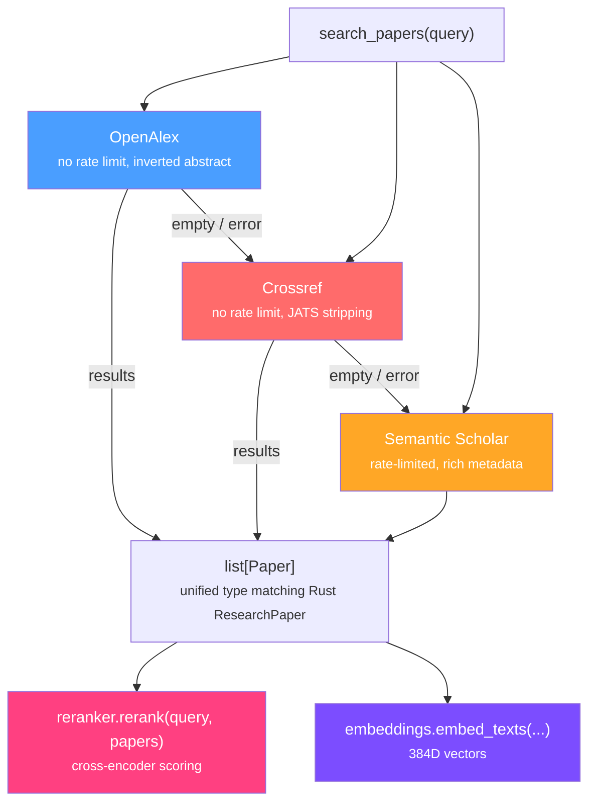

# research-client

Academic paper search, normalization, embeddings, and cross-encoder reranking. Python mirror of the Rust `crates/research/` crate — shared across all Python apps in the monorepo.

## Architecture



Fallback chain: returns results from the first source that responds. Retry with exponential backoff on 429/5xx (max 3 retries), matching the Rust crate's retry strategy.

## Usage

```python
from research_client import search_papers, Paper

# Search with automatic fallback
papers = await search_papers("CBT anxiety children", limit=10)

# Access normalized fields
for p in papers:
    print(f"{p.title} ({p.year}) — {p.citation_count} citations")
    print(f"  DOI: {p.doi}, Source: {p.source}")

# Legacy dict format (backward compat)
dicts = [p.to_dict() for p in papers]
```

### Embeddings (requires `ml` extra)

```python
from research_client.embeddings import embed_text, aembed_texts

vec = embed_text("therapeutic interventions for anxiety")  # 384D
vecs = await aembed_texts(["paper 1 abstract", "paper 2 abstract"])
```

### Reranking (requires `ml` extra)

```python
from research_client.reranker import rerank

ranked = await rerank("CBT for childhood anxiety", papers, top_k=5)
for r in ranked:
    print(f"{r.paper.title}: {r.score:.3f}")
```

## Install

```bash
# Core (search clients only — httpx)
pip install -e pypackages/research

# With ML extras (embeddings + reranker — adds sentence-transformers)
pip install -e "pypackages/research[ml]"
```

## Paper Type

```python
@dataclass
class Paper:
    title: str
    authors: list[str]
    year: int | None
    abstract_text: str | None
    doi: str | None
    citation_count: int | None
    url: str | None
    pdf_url: str | None
    source: str | None           # "openalex", "crossref", "semantic_scholar"
    source_id: str | None
    fields_of_study: list[str] | None
    published_date: str | None
    venue: str | None
```

Matches the Rust `ResearchPaper` struct in `crates/research/src/paper.rs`.

## Modules

| Module | Purpose |
|--------|---------|
| `types` | `Paper` dataclass — unified representation across all sources |
| `openalex` | OpenAlex client with retry, inverted abstract reconstruction |
| `crossref` | Crossref client with retry, JATS tag stripping |
| `semantic_scholar` | Semantic Scholar search + detail with retry |
| `search` | `search_papers()` — multi-source fallback orchestration |
| `embeddings` | `all-MiniLM-L6-v2` embeddings (384D, local) |
| `reranker` | `ms-marco-MiniLM-L-6-v2` cross-encoder reranking |

## Environment Variables

| Variable | Required | Description |
|----------|----------|-------------|
| `SEMANTIC_SCHOLAR_API_KEY` | No | Higher rate limits for Semantic Scholar |

## Dependencies

| Package | Extra | Purpose |
|---------|-------|---------|
| `httpx` | core | Async HTTP client for all API calls |
| `sentence-transformers` | ml | Embeddings and cross-encoder reranking |
